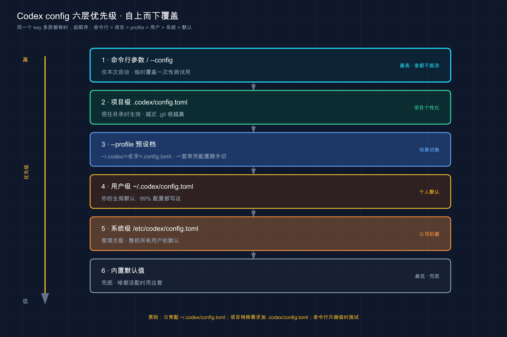
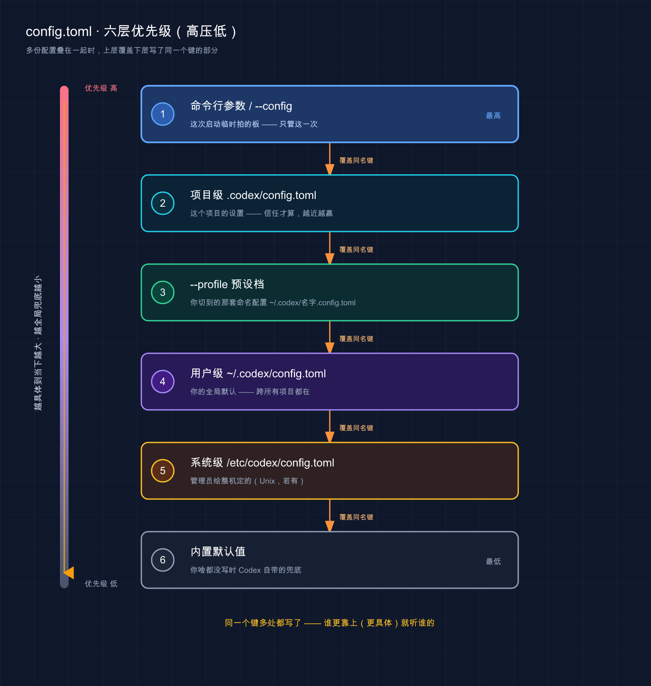

# 18 · config.toml 配置详解：一个文件管住所有旋钮

> 📚 **系列导航**：上一篇 [17 · 电脑操控与浏览器（Computer Use）](17-computer-use.md) 让 Codex 长出了手——能看屏幕、点桌面、开浏览器。这一篇从图形界面收回到一个朴素的文本文件——`config.toml` 。前面十几篇里你零零散散见过它好几回（写沙箱、开 Memory、配模型），这篇把它系统讲清：**这文件放哪、长什么样、哪个键管什么、几个文件叠起来时谁说了算**。

都说配置文件是「装好之后再说」的东西、能跑就别碰——**说句实话，这话用在 Codex 上正好说反了**。

我自己的经历是这样：2026 年 3 月刚上手那阵，我压根没动过 `config.toml` ，每次开 Codex 都手动 `/model` 切模型、`/permissions` 调权限、临时敲 `--search` 开联网，一天下来同样的几个动作要重复七八遍。直到有天我数了数——光「切到强模型 + 放开工作区写权限」这套组合，那个礼拜我手动敲了不下三十次。**那一刻才反应过来：我把一个「写一次、永久生效」的事，活生生干成了「每次重来」。**

`config.toml` 的价值恰恰在这——它不是给高手炫技的，是给**所有嫌麻烦的人**省事的。你越懒得每次配，越该花十分钟把它写明白。

更关键的是，它还藏着一个新手最容易栽的坑：**同一段配置，写在你家目录和写在项目里，效果可能完全不同，甚至项目里那份压根不生效**。这篇就把这套「文件放哪、谁压谁」的规则掰开揉碎，让你写配置时心里有数。

**看完这一篇，你会拿到：**

- 一句话讲明白 `config.toml` 是什么、它跟 `AGENTS.md` 到底分什么工（别再混）
- 用户级 `~/.codex/config.toml` 和项目级 `.codex/config.toml` 各自放哪、管谁、该写什么
- 一张「谁压谁」的优先级表，外加一条新手必栽的安全限制（项目配置有些键写了也白写）
- 你最常会动的七八个配置项（`model`、`approval_policy`、`sandbox_mode`、`web_search`、`[features]`…）分别干嘛、默认是什么
- 一份能照抄的最小配置 + `-c` 临时改一次的命令 + `--profile` 切多套配置的实战，跑完自己就能验证

---

## 01 先搞懂：config.toml 是什么，跟 AGENTS.md 分什么工

先给结论：**`config.toml` 是 Codex 的「行为旋钮总成」——用 TOML 格式管模型、审批、沙箱、MCP、功能开关这些工具行为；它跟 `AGENTS.md` 是两套东西，一个管「怎么干活」，一个管「记住什么」。**

很多人一上来就把这俩搞混。你在 [11 · AGENTS.md](11-agents-md.md) 那篇写了一路项目说明，又在 [15 · 权限沙箱审批](15-permissions.md) 里调了沙箱——**前者落在 `AGENTS.md` 里，后者落在 `config.toml` 里**，装的是完全不同的内容。

**类比：汽车的「驾驶手册」和「中控台旋钮」。** `AGENTS.md` 像手套箱里那本**驾驶手册**——写的是「这辆车用 95 号油」「冬天先热车再走」这类**给人（给 Codex）看的、自然语言的叮嘱**，它每次开工被读进去当背景知识。`config.toml` 不一样，它是中控台上那一排**实体旋钮**——空调几度、座椅加热开不开、默认运动模式还是经济模式，**一个个明确的、机器照着执行的开关**。手册是「讲给它听的话」，旋钮是「替它拧死的行为」。

TOML（Tom's Obvious Minimal Language，一种给人读写的配置文件格式）是这文件的格式，长这样：顶层是 `key = value` ，分组用 `[表名]` 。先扫一眼就懂：

```toml
# ~/.codex/config.toml
model = "gpt-5.5"
approval_policy = "on-request"
sandbox_mode = "workspace-write"
```

官方把它的定位说得很干脆：

> Codex stores user-level configuration at `~/.codex/config.toml`.（Codex 把用户级配置存在 `~/.codex/config.toml` 。）

落到你会遇到的真实场景，`config.toml` 管的就是这几类事：

- **「我每次都想用某个模型，别老让我手动切」**——写 `model`
- **「这台机器上，默认就给我工作区写权限 + 出圈才问」**——写 `sandbox_mode` + `approval_policy`
- **「联网搜索我要实时的，别用缓存」**——写 `web_search`
- **「把那个实验功能给我开开 / 关关」**——写 `[features]`

这些都不是「讲给 Codex 听」的话，而是**实打实改变它运行行为的旋钮**。这就是 `config.toml` 跟 `AGENTS.md` 的根本分工。

> 💡 一句话总结：`AGENTS.md` 是「讲给 Codex 听的自然语言叮嘱」，`config.toml` 是「替它拧死机器行为的旋钮总成」——**前者管记住什么，后者管怎么干活**，别混着用。

---

## 02 文件放哪：用户级一份、项目级一份

`config.toml` 最该先搞懂的，不是有哪些键，而是**它至少有两个落脚点：一份在你家目录（管全局），一份可以塞进项目里（只管这个项目）**。开头说的那个坑，根子就在没分清这两处。

**类比：家里的总开关箱 vs 房间里的墙壁开关。** 你家有个**总配电箱**（一般在玄关），管的是全屋默认——比如「夜间总闸限流」。每个房间墙上还有**自己的开关**，只管这间屋，而且优先级更高——书房想开大灯，按书房墙上那个就行，不影响别的屋。`config.toml` 就是这两层：家目录那份是总配电箱（跨所有项目），项目里那份是房间开关（只管这个项目、还压总闸）。

官方定义的位置，看这张表：

| 层级 | 文件位置 | 影响谁 | 该放什么 | 一个前提 |
|------|---------|--------|---------|---------|
| **用户级（User）** | `~/.codex/config.toml` | 你，跨你**所有**项目 | 个人默认：惯用模型、默认权限档、MCP、通知 | 无 |
| **项目级（Project）** | `<repo>/.codex/config.toml` | 在这个仓库里干活时 | 项目专属：这个项目该用的模型、该有的沙箱档 | **项目被信任**才加载 |

这里有三个**新手必须记牢**的点：

**第一，家目录那份的路径是固定的：`~/.codex/config.toml` 。** 这个 `~/.codex` 目录叫 `CODEX_HOME` ，是 Codex 存所有本地东西（配置、登录凭据、历史记录、日志）的地方，默认就在你家目录下。文件不存在就自己建一个，Codex 读得到。

**第二，项目级那份要放进仓库里的 `.codex/` 子目录**（注意是 `.codex/config.toml` ，带个点的隐藏目录，跟家目录那个 `~/.codex` 同名但不是一处）。它只在你**在这个项目里干活**时才叠加上来。

**第三，也是最容易忽略的——项目级配置只有「项目被信任」时才加载。** 这是 Codex 的安全设计：怕你随便 clone 一个陌生仓库，它里头藏的 `.codex/config.toml` 偷偷给自己放权。官方写得很直白：

> If you mark a project as untrusted, Codex skips project-scoped `.codex/` layers, including project-local config, hooks, and rules.（如果你把项目标记为不信任，Codex 会跳过项目级 `.codex/` 层，包括项目本地配置、hooks 和 rules。）

换句话说：**你在一个没信任的项目里写了 `.codex/config.toml` ，它一行都不会生效**——但你家目录那份照常加载。第一次配项目级配置发现「怎么没反应」，先想想这个项目你信任了没（信任是 Codex 第一次进新项目时问你的那一下）。

### 实战里怎么分：一条配置该放哪

判断一条配置该放家目录还是放项目里，脑子里过一个问题就够：**「这条只跟我这个人有关，还是跟这个项目有关？」**

- **「我所有项目都想要」→ 用户级**（`~/.codex/config.toml`）。比如「我习惯默认用 `gpt-5.5`」「我的 MCP 服务器」「桌面通知脚本」，配一次，开任何项目都在。
- **「就这个项目该这么干」→ 项目级**（`<repo>/.codex/config.toml`）。比如「这个老项目得用某个特定模型」「这个项目默认收紧到只读」。它跟着仓库走，进 Git 后队友拉下来也有同一套（前提是队友也信任了这个项目）。

我自己的分法很简单：**家目录那份写「我这个人的习惯」，项目里基本不写、留空**——只有极少数项目有特殊脾气（比如一个我只敢让它只读看、绝不能动手的客户代码库），我才在它的 `.codex/config.toml` 里单独写一行 `sandbox_mode = "read-only"` 兜底。这样既不用每次手动收紧，也不会把这条限制误带到别的项目上。

> 💡 一句话总结：用户级 `~/.codex/config.toml`（在 `CODEX_HOME` ，管你所有项目）、项目级 `<repo>/.codex/config.toml`（只管这个项目、**且项目得被信任才加载**）；判断口诀「跟我这个人走 vs 跟这个项目走」。

---

## 03 谁压谁：优先级，外加一条新手必栽的安全限制

两处都能写同一个键。那问题来了：**用户级说用 `gpt-5.5`、项目级说用别的，到底听谁的？** 这就是「优先级（precedence）」要管的事，也是 `config.toml` 最容易绕晕人的地方。

而且实际不止两层——加上命令行临时参数、`--profile` 选的预设档（profile，命名配置文件）、系统级配置，一共能叠到六层。先给官方的完整排序，从**高到低**（高的压低的）：

| 优先级 | 来源 | 说人话 |
|--------|------|--------|
| 1（最高） | **命令行参数 / `--config`** | 你这次启动临时拍的板，只管这一次 |
| 2 | **项目级** `<repo>/.codex/config.toml` | 这个项目的设置（信任时才算，从根目录到当前目录、**越近的越赢**） |
| 3 | **`--profile` 选的预设档** `~/.codex/<名字>.config.toml` | 你切到的那套命名配置 |
| 4 | **用户级** `~/.codex/config.toml` | 你的全局默认 |
| 5 | **系统级** `/etc/codex/config.toml`（Unix，若有） | 管理员给整机定的 |
| 6（最低） | **内置默认值** | 你啥都没写时 Codex 自带的 |

这个「从高到低」的压制关系，画成一张图你会更有体感——**上面的层盖住下面的层里写了同一个键的部分**：





这张图把六层配置按优先级从高到低竖着摞起来：最上面「命令行参数 / `--config`」最具体、压力最大，往下依次是项目级、`--profile` 预设档、用户级、系统级，最底下是兜底的内置默认值——**上层会盖掉下层写了同一个键的部分**，所以越靠上、越「具体到当下」的设置就越说了算。

一句话记牢这个顺序：**越「具体到当下」的越大，越「全局兜底」的越小**。命令行（就这一次）压项目（就这项目），项目压预设档，预设档压用户全局，用户压系统，系统压内置兜底。官方点了句最实用的用法：

> Use that precedence to set shared defaults in `config.toml` and keep profile files focused on the values that differ.（用这套优先级把共享默认放在 `config.toml` ，让 profile 文件只装那些不一样的值。）

也就是说——**家目录写「大多数时候的我」，profile 写「偶尔切过去的那套差异」，命令行管「就这一次的特例」**。这正好印证了上一篇结尾埋的那个悬念：想让某个偏好「一开机就生效」，写进 `config.toml`（多半是用户级那份）就对了。

### 那条新手必栽的限制：项目配置有些键，写了也白写

上面说项目级压用户级。但**有一类键是例外——你在项目级 `.codex/config.toml` 里写它们，Codex 直接无视，还会在启动时给你打一行警告**。这是 Codex 故意拦的安全红线，新手十有八九会撞。

为啥拦？想想看：要是一个陌生仓库的 `.codex/config.toml` 能偷偷改你连的模型服务地址、改你的认证方式、塞个通知命令在你机器上跑——那就太危险了。所以官方把这类「会动到机器级安全」的键，**锁死在只能写用户级**。官方原文点了名：

> Codex ignores `openai_base_url`, `chatgpt_base_url`, `apps_mcp_product_sku`, `model_provider`, `model_providers`, `notify`, `profile`, `profiles`, `experimental_realtime_ws_base_url`, and `otel` when they appear in a project-local `.codex/config.toml`.（当 `openai_base_url`、`chatgpt_base_url`、`apps_mcp_product_sku`、`model_provider`、`model_providers`、`notify`、`profile`、`profiles`、`experimental_realtime_ws_base_url` 和 `otel` 出现在项目本地的 `.codex/config.toml` 里时，Codex 会忽略它们。）

翻成大白话，这些键写进项目级会被忽略，得放用户级：

| 这类键 | 管什么 | 为啥只能写用户级 |
|--------|--------|----------------|
| `model_provider` / `model_providers` | 模型服务商、接入地址 | 防陌生仓库把你的请求引到别处 |
| `openai_base_url` / `chatgpt_base_url` | 内置服务的基础 URL | 同上，改 URL 等于改数据去向 |
| `notify` | 任务完成时跑的外部命令 | 防仓库在你机器上偷偷执行命令 |
| `otel` | 遥测 / 日志导出 | 防把你的运行数据外发 |
| `profile` / `profiles` | 选哪套配置预设 | 配置档要靠 `--profile` 命令行选，不让仓库替你选 |

**所以记住这条对照：模型服务、通知、遥测、选 profile 这些「机器级」的键，统统写家目录那份；项目级只配 `model`、`sandbox_mode`、`approval_policy` 这类「这个项目本地怎么干活」的键。** 你要是把 `model_providers` 写进项目级发现没生效，别怀疑语法——它就是被官方拦了。

> 💡 一句话总结：优先级口诀「**越具体到当下的越大**」（命令行 > 项目 > profile > 用户 > 系统 > 内置）；但**项目级配置碰不了 `model_provider`、`notify`、`otel`、`profile` 这类机器级键**——写了被忽略还报警告，它们只认用户级。

---

## 04 最常动的几个配置项：干嘛用、默认是什么

层级和优先级理清了，来看你**实际最常会去动**的那几个键。`config.toml` 官方支持的键有上百个（完整清单在官方 Config Reference），但 90% 的人日常碰的就这么几个。我挑出来，每个讲清「干嘛的、默认是什么」——**默认值尤其重要，知道默认是什么，你才知道哪些根本不用写**。

| 配置键 | 干嘛的 | 默认值（以官方为准） | 常见写法 |
|--------|--------|---------------------|---------|
| `model` | 默认用哪个模型 | 跟随 Codex 内置默认 | `model = "gpt-5.5"` |
| `approval_policy` | 啥时候停下来问你 | `on-request` | `approval_policy = "on-request"` |
| `sandbox_mode` | 能动多大（文件 / 网络） | `workspace-write`（git 仓库，见下注） | `sandbox_mode = "workspace-write"` |
| `model_reasoning_effort` | 推理使多大劲 | 跟随模型 / 预设 | `model_reasoning_effort = "high"` |
| `web_search` | 联网搜索模式 | `cached`（缓存） | `web_search = "live"` |
| `personality` | 沟通风格 | `friendly`（示例值） | `personality = "pragmatic"` |
| `file_opener` | 引用文件点击用哪个编辑器打开 | `vscode` | `file_opener = "cursor"` |

> **关于 `sandbox_mode` 默认值的一点澄清**：直接裸跑 `codex` 走的是 Auto 预设——**git 仓库里默认 `workspace-write`**（能读写工作区文件），**非 git 目录默认 `read-only`**（只读）。官方把「`workspace-write`」称为「the default sandbox mode」，指的就是最常见的 git 仓库场景。

逐个说几句你最该知道的细节：

### model / model_reasoning_effort / approval_policy / sandbox_mode

这四个是**重头戏，但前面篇章已经讲透了，这里不重复**：模型选择在 [05 · 第三方模型](05-third-party-models.md)，审批策略（approval policy，`approval_policy` 键）和沙箱模式（sandbox mode，`sandbox_mode` 键）在 [15 · 权限沙箱审批](15-permissions.md) 用「档位和限速」讲过。本篇你只需记住一件事：**它们都在 `config.toml` 里有对应的键，写进去就是把那套行为定成默认**，不用每次 `/model` 或 `--sandbox` 临时调。

`model_reasoning_effort` 是推理强度，官方给的档位是 `minimal | low | medium | high | xhigh`（`xhigh` 看模型支不支持）。简单活儿调低省时间省额度，硬骨头调 `high`。

### web_search：联网搜索，注意默认是「缓存」不是「实时」

这个键有个**反直觉的默认**，我第一次就栽了。Codex 默认开着联网搜索，但用的是 `cached`（缓存）模式——查的是 OpenAI 维护的一个网页索引，**返回的是预先收录好的结果，不是当场去抓实时网页**。官方解释这么设计是为了降低提示注入（prompt injection）风险：缓存内容比任意实时页面安全些。

我去年有次让 Codex 查「某个库的最新版本号」，它给的数对不上——折腾半天才发现是缓存模式给的旧索引。**要查实时的，得显式改**：

```toml
web_search = "live"   # 实时抓取，等价于命令行 --search
# web_search = "cached"   # 默认：走缓存索引
# web_search = "disabled" # 彻底关掉搜索工具
```

有个例外要知道：**如果你用了 `--yolo` 或别的完全访问沙箱，`web_search` 会自动变成 `live`**。

### personality：让 Codex 换个说话风格

`personality` 调沟通风格，官方给的值是 `none | friendly | pragmatic`（友好 / 务实）。会话里也能临时用 `/personality` 切。我自己常驻 `pragmatic`——少点寒暄，直接给结论，对老手更顺。

### file_opener：让引用的文件能点开

Codex 输出里经常带 `某文件.py:42` 这种引用。`file_opener` 决定点它用哪个编辑器跳转，默认 `vscode` ，可选 `vscode-insiders | windsurf | cursor | none` 。用 Cursor 的把它改成 `cursor` ，引用就变成可点击的链接，直接跳到那一行。

### 一个 TOML 的小坑：根键必须写在表前面

这是写 `config.toml` 最常见的语法错。TOML 规定：**所有顶层的 `key = value`（根键）必须写在所有 `[表]` 的前面**。官方示例配置文件的注释里也特别提醒了这条：

> Root keys must appear before tables in TOML.（在 TOML 里，根键必须出现在表之前。）

啥意思？看个对错对比就懂：

| ❌ 错的（根键混在表后面） | ✅ 对的（根键全在前、表全在后） |
|------------------------|------------------------------|
| `[features]`<br/>`hooks = true`<br/>`model = "gpt-5.5"` ← 报错 | `model = "gpt-5.5"`<br/>`[features]`<br/>`hooks = true` |

记法：**先写所有不带 `[]` 的单行键（`model`、`approval_policy`…），再写所有 `[表]` 段。** 顺序反了，TOML 解析直接报错，而且报错信息常让新手摸不着头脑。

> 💡 一句话总结：高频键就这几个——`model`、`approval_policy`、`sandbox_mode`、`model_reasoning_effort`、`web_search`（默认 `cached` 不是实时！）、`personality`、`file_opener`；**默认值心里有数，没特殊需求就别写**；还有个 TOML 铁律——根键必须写在所有 `[表]` 前面。

---

## 05 [features]：实验和可选功能的总开关

有一类配置单拎出来说——`[features]` 表，它是 Codex **所有可选 / 实验功能的总开关板**。前面好几篇提到的功能（Memory、hooks、子代理协作）开不开，根子都在这。

**类比：手机「实验室 / 开发者选项」里那一排开关。** 系统稳定功能默认就开着，但还有一格「实验室」，里头一排可以手动拨的开关——有的默认开、有的默认关，拨一下某个新功能就生效或失效。`[features]` 就是 Codex 的这格实验室：**每个功能一个布尔开关，写 `true` 开、写 `false` 关、不写就用它自己的默认**。

写法就是一个 `[features]` 表，底下列功能名：

```toml
[features]
memories = true          # 开启 Memory（记忆）
shell_snapshot = true    # 快照 shell 环境、加速重复命令
hooks = false            # 关掉生命周期 hooks
```

官方列了一批功能开关，挑几个你可能会动的，**默认值以官方为准**：

| 功能键 | 默认 | 成熟度 | 干嘛的 |
|--------|------|--------|--------|
| `hooks` | `true` | 稳定 | 生命周期 hooks（事件触发脚本） |
| `multi_agent` | `true` | 稳定 | 子代理协作工具 |
| `shell_snapshot` | `true` | 稳定 | 快照 shell 环境、加速重复命令 |
| `fast_mode` | `true` | 稳定 | 快速响应模式（节省等待时间） |
| `shell_tool` | `true` | 稳定 | 内置 shell 工具（执行终端命令） |
| `personality` | `true` | 稳定 | 沟通风格选择控件 |
| `memories` | `false` | 稳定 | Memory（记忆系统，下一篇讲） |
| `codex_git_commit` | `false` | 实验性 | 让 Codex 自动生成 git commit 信息 |
| `apps` | `false` | 实验性 | ChatGPT Apps / 连接器支持 |
| `undo` | `false` | 稳定 | 用 git ghost 快照支持撤销 |
| …… | — | — | 更多键见官方 Config Reference |

> ⚠️ **实验性功能，可能随版本变化。** 上表带「实验性」的（以及没列出的更多开关）默认值、成熟度都可能随版本调整，开之前**以官方 Config Reference 和你本地实际为准**，别照我这表写死。

注意一个**容易踩的坑**：有些老写法（比如在 `[features]` 里用 `codex_hooks = true` 开 hooks）已经过时了——官方现在的规范键名是 `hooks` ，`codex_hooks` 只是个被弃用的别名。**以官方现行键名为准**，别跟着旧资料抄。

开关三种动法，官方都给了：

- **`config.toml` 里**：在 `[features]` 下写 `功能名 = true`（或 `false`）。
- **命令行临时开**：`codex --enable 功能名` ，多个就 `--enable a --enable b` 。
- **关掉**：在 `[features]` 里把那个键设成 `false` 。

我的建议：**新手别一上来把实验功能全拨开**。Memory 这种（[19 篇](19-memory.md) 专讲）想试就 `memories = true` 开一个，其余保持默认。开太多实验功能，出了怪问题你都不知道该怪谁。

> 💡 一句话总结：`[features]` 是「可选 / 实验功能总开关板」，每个功能一个布尔值，写 `true`/`false` 改、不写用默认（`hooks`/`multi_agent`/`shell_snapshot` 默认开，`memories`/`apps` 默认关）；命令行可用 `--enable` 临时开；**键名以官方现行为准，旧资料的 `codex_hooks` 已弃用**。

---

## 06 临时改一次 vs 切一整套：-c 和 --profile

有两类需求 `config.toml` 单靠「写文件」满足不了：**这次就想改一个键、下次还原**，和**我有好几套配置想随时切**。Codex 给了两个工具。

### 临时改一次：-c / --config（不动文件）

不想为了试一个值专门去改文件，命令行直接覆盖：

```bash
# 优先用专属 flag（有的话）
codex --model gpt-5.4

# 没有专属 flag 的键，用 -c / --config 通用覆盖（值是 TOML 写法，不是 JSON）
codex --config model='"gpt-5.4"'
codex -c log_dir=./.codex-log
```

**两个容易踩的点**，官方专门提醒了：

- **`-c` 的值按 TOML 解析**，不是 JSON。所以字符串值要带引号（像上面 `model='"gpt-5.4"'` 外层单引号给 shell、内层双引号给 TOML），拿不准就把值整个引起来，免得 shell 按空格拆开。
- **嵌套键用点号**写，比如 `codex -c mcp_servers.context7.enabled=false` 。

这招最适合「试一下某个值好不好使」——满意了再写进文件，不满意拍拍屁股走人，文件没动过。

### 切一整套：--profile（预设档）

[15 篇](15-permissions.md) 提过 profile（配置预设档），这里补全它的机制。**一个 profile 就是 `CODEX_HOME` 下一个单独的文件**，名字是 `<档名>.config.toml` ：

```toml
# ~/.codex/deep-review.config.toml
model = "gpt-5.5"
model_reasoning_effort = "xhigh"
approval_policy = "on-request"
```

用 `--profile` 选它：

```bash
codex --profile deep-review
codex exec --profile deep-review "review this change"
```

机制是：Codex 先读你的用户级 `~/.codex/config.toml` ，再把 `~/.codex/deep-review.config.toml` 盖上去。所以**profile 文件里只写「跟基础配置不一样的那几个键」就行**，相同的不用重复。

这里有个**版本变动的坑要标清**：

> ⚠️ **以官方为准的版本差异。** 官方说明：在 Codex 0.134.0 及以后，`--profile` **不再**读 `config.toml` 里的 `[profiles.档名]` 这种写法，顶层的 `profile = "档名"` 选择器也不再支持。老配置得把 `[profiles.x]` 段的内容**搬到单独的 `~/.codex/x.config.toml` 文件**里。你装的版本不同行为可能不同，**具体以你本地版本和官方文档为准**。

我自己常驻两套 profile：一套 `quick`（轻模型 + 只读，看代码用），一套 `build`（强模型 + 工作区写，真干活用）。开 Codex 时一句 `codex --profile build` 就进对了档，比每次手动调四五个键省事太多——**这正是我开篇说「每周手动配三十次」那个蠢事的解药**。

> 💡 一句话总结：临时改一个键用 `-c key=value`（值按 TOML 解析、字符串要引号、嵌套用点号），不动文件；要切一整套配置，把差异写进 `~/.codex/<名字>.config.toml` 用 `--profile <名字>` 选——**注意 0.134.0+ 不再支持 `[profiles.x]` 旧写法，以官方为准**。

---

## 07 动手：写一份配置 → 临时覆盖 → 切 profile，全验一遍

光看不练假把式。下面带你把这一篇的「写文件 → 临时覆盖 → 切 profile」整条链路跑通。全程最小示例，不依赖你已有的复杂环境。命令、参数严格按官方，**涉及具体模型名我用占位 `gpt-5.5` ，你照自己能用的型号换**。

**第一步：看一眼你的用户级配置在哪**（在终端）

```bash
ls -la ~/.codex/config.toml
```

**预期**：要么列出这个文件，要么提示不存在。不存在不要紧，下一步建。

**第二步：写一份最小用户级配置**

把下面这份贴进 `~/.codex/config.toml`（注意根键全在前、`[表]` 在后）：

```toml
# ~/.codex/config.toml
model = "gpt-5.5"
approval_policy = "on-request"
web_search = "cached"

[features]
memories = false
```

**预期**：保存后，这份就是你的全局默认。下一步验证它被读到。

**第三步：进会话，用 /status 确认配置生效**

```bash
codex
```

进去后敲：

```text
/status
```

**预期**：在弹出的状态信息里，能看到当前会话用的模型、审批策略等——和你刚写的对得上，说明 `config.toml` 被成功读到了。（`/status` 在 [12 篇](12-slash-commands.md) 见过，是查当前会话状态的命令。）

**第四步：用 -c 临时覆盖一个键，不动文件**

退出会话，这次启动时临时把搜索改成实时：

```bash
codex -c web_search='"live"'
```

进去再 `/status` 看一眼。

**预期**：这一次会话的搜索模式应是 `live` ，但你**文件里那行 `web_search = "cached"` 一个字没变**。退出再普通 `codex` 进去，又变回 `cached` 。**看到这个「临时改、自动还原」= 第 06 节那条「命令行压配置文件、只管这一次」验证成功**。

**第五步：建一个 profile，体验「切一整套」**

新建文件 `~/.codex/quick.config.toml`（只写跟基础配置的差异）：

```toml
# ~/.codex/quick.config.toml
model = "gpt-5.5"
sandbox_mode = "read-only"
approval_policy = "untrusted"
```

用它启动：

```bash
codex --profile quick
```

进去 `/status` 确认。

**预期**：这一次的沙箱应是 `read-only` 、审批是 `untrusted`（比你家目录那份更严）——因为 profile 盖在用户级之上。**看到这套更严的配置生效 = 第 06 节「profile 是单独文件、用 `--profile` 切」验证成功**。不带 `--profile` 普通进去，又回到你用户级那份。

跑通这五步，你就把 `config.toml` 最核心的能力亲手验了一遍：**写文件定默认、`/status` 确认加载、`-c` 临时覆盖、`--profile` 切整套**。以后配任何键、任何层，本质都是这套流程。

> 💡 一句话总结：动手就练「**写用户级配置 → `/status` 验加载 → `-c` 临时覆盖且文件不变 → `--profile` 切一整套更严配置**」——亲手跑通这条链路，「写死默认、临时覆盖、整套切换」三件事立刻就通了。

---

## 08 小结

这一篇我们把 Codex 那块「旋钮总成」`config.toml` 从里到外理清了——**从「它是什么」到「放哪、谁压谁、哪些键常动、怎么临时改和切套」，把配置这件事规规矩矩安顿明白**。

把核心要点串起来回顾：

| 你想搞清的事 | 答案 | 一句话关键点 |
|------------|------|-------------|
| 它跟 AGENTS.md 啥关系 | 两套东西 | AGENTS.md 管「记住什么」，config.toml 管「怎么干活」 |
| 文件放哪 | 两处 | 用户级 `~/.codex/config.toml`、项目级 `<repo>/.codex/config.toml`（**信任才加载**） |
| 冲突听谁的 | 越具体越大 | 命令行 > 项目 > profile > 用户 > 系统 > 内置 |
| 新手必栽的限制 | 项目级有禁区 | `model_provider`/`notify`/`otel`/`profile` 等只认用户级 |
| 常动哪几个键 | 七八个 | `model`/`approval_policy`/`sandbox_mode`/`web_search`（默认缓存）/`[features]` 等 |
| 临时改 / 切整套 | `-c` / `--profile` | `-c` 改一次不动文件，`--profile` 切一整套预设 |

**你现在应该能：** 分清 `config.toml` 和 `AGENTS.md` 各管什么、知道一条配置该写用户级还是项目级、看懂六层「谁压谁」的优先级以及「项目级碰不了机器级键」这条安全限制、认识 `model`/`approval_policy`/`sandbox_mode`/`web_search`/`[features]` 这几组高频配置和它们的默认值，并且会用 `-c` 临时覆盖、`--profile` 切整套。**这套「一个文件管住所有旋钮」的能力，是你把 Codex 从「每次手动配」调成「一开机就贴合你习惯」的那把扳手。**

开篇那个「每周手动配三十次」的蠢事，根子就一句话——**我没把该写一次的事写进 `config.toml`**。这一篇之后，你能少走一大圈：**重复在做的配置动作，停下来想想「这是不是该写进配置文件」，再决定放用户级还是项目级。**

---

下一篇 **19「记忆系统（Memories 与 Chronicle）」**——你刚在 `[features]` 里见过一个默认关着的 `memories` 开关，还记得吗？下一篇就专门讲它：**怎么让 Codex 把你的习惯、项目的脉络「记住」**，从每次都像新来的，变成跟你跨会话的老搭档。留个小思考：上一篇它长出了「看屏幕的眼睛」，这一篇它要长出「记得住的脑子」——一个能看、又能记的助手，跟你现在用的，差的是哪一截？
