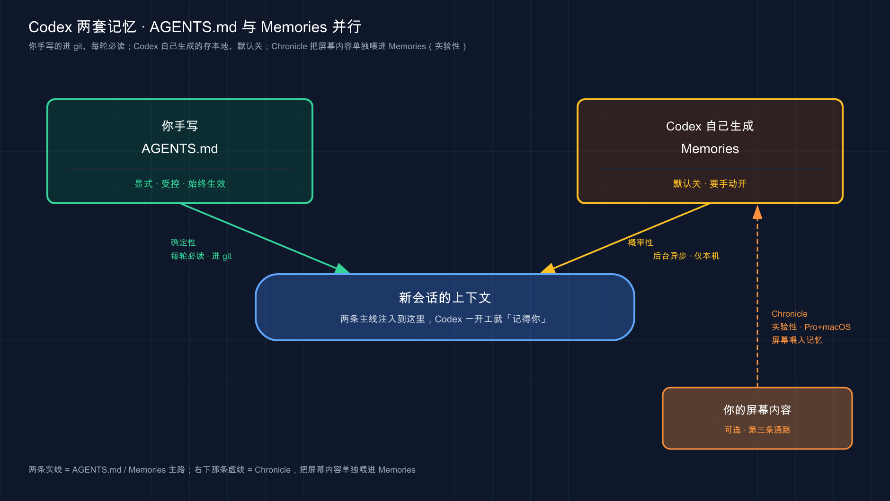
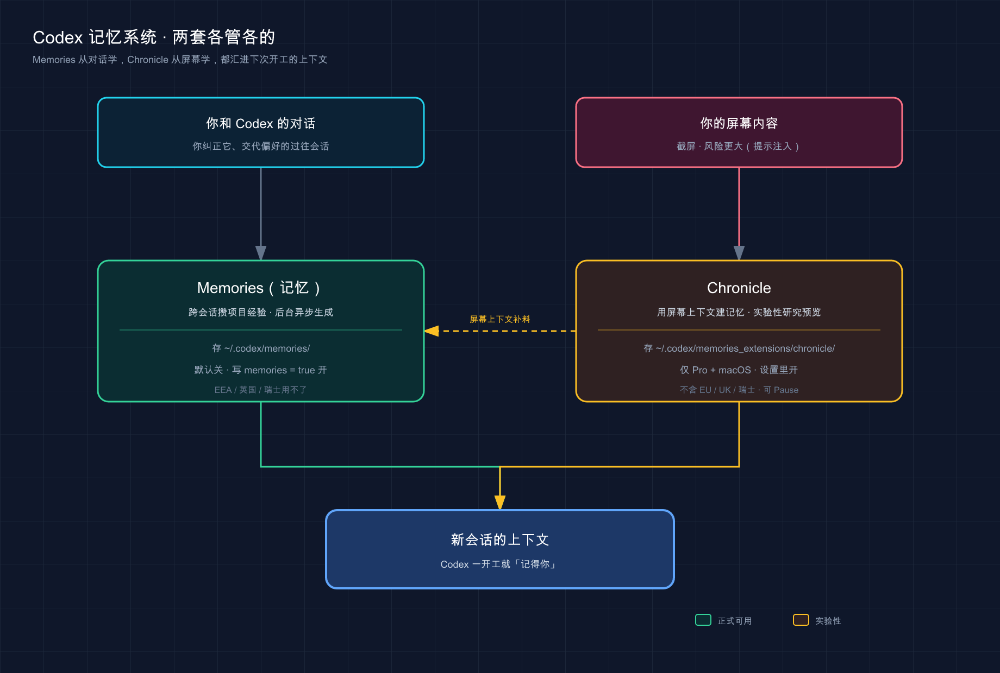

# 19 · 记忆系统（Memories 与 Chronicle）：让 Codex 跨会话记住你

> 📚 **系列导航**：上一篇〔[18 config.toml 配置详解](18-config.md)〕把那一摞行为旋钮一次拧明白了——模型、沙箱、审批全在一个文件里。这一篇聊一件更底层的事：**怎么让 Codex 跨会话记住你**。不光是你手写进 `AGENTS.md` 的规矩，还有它干活时自己攒下的那本「私人笔记」——你纠正它一次、它在后台悄悄记下来，下回开工自动想起。再往后还有个 Codex 独有、用**屏幕内容**喂记忆的实验性玩意儿 Chronicle，一并讲透。

先上个我跟同事的真实对话片段。

> 同事：「你那个 Codex 不是开了记忆吗？我刚跟它说『以后这项目都用 pnpm』，它怎么转头又给我 `npm install`？」
> 我：「你是不是刚说完就指望它记住了？」
> 同事：「对啊，它界面都没报错。」
> 我：「记忆不是实时写的，它得等你这个会话**闲下来一阵**才在后台总结——你前脚说完后脚就考它，它当然还没记。再说这种『必须每次都生效』的死规矩，本来就该写进 `AGENTS.md` ，别赌记忆。」

这段对话里藏着新手对 Codex 记忆最常见的两个误会：**一是以为记忆是「说完立刻生效」的，二是以为记忆能替代 `AGENTS.md`** 。两个都不对，而且都会让你在关键时刻栽跟头。这一篇就把 Codex 这套记忆系统从头捋清——它到底什么时候记、记到哪、怎么管、哪些事压根不该交给它。

> **看完这一篇，你会拿到：**
>
> - Codex 的「记忆」到底分哪两套：你写的 `AGENTS.md` vs 它自己写的 **Memories（记忆）**，谁管啥一张表看明白
> - Memories **默认开没开、哪些地区用不了**、怎么开、存到哪个目录、为啥不是实时更新
> - 用 `/memories` 逐个会话控制「这次要不要用记忆、要不要拿来生成记忆」，外加 `config.toml` 里那几个真用得上的旋钮
> - 一张「该记 vs 不该记」清单，外加一条**绝对不能碰的红线**
> - **Chronicle**——Codex 独有、用屏幕内容喂记忆的实验性能力：它能干啥、有哪些**硬限制（仅 Pro + macOS、不含 EU/UK/瑞士）**、官方明说的**三条隐私警告**
> - 一套照着敲就能开起来、并验证记忆真生效的动手流程

> ℹ️ 跟 Claude Code 的记忆机制对照着看：那边「自动记忆」默认开着、按 git 仓库分目录、开局读回 `MEMORY.md` 前 200 行或 25KB（以先到者为准）；**Codex 这套不一样**——默认**关着**、有地区限制、走后台异步生成、存放路径和控制方式都另一套。下面差异处我会一一点出来。

---

## 01 先分清：记忆其实是两套，不是一套

先给结论：**Codex 跟「记东西」相关的，是两套各管各的系统——一套你手写（`AGENTS.md`），一套它自己写（Memories）。** 很多人一提「让 Codex 记住」只想到 Memories，其实那只是一半，而且往往是没那么靠谱的那一半。

**类比：球队的「战术板」和「球探笔记」。** 教练赛前在战术板上写得清清楚楚——这场怎么站位、谁盯谁、定位球怎么跑，**全队都得照着打**，这是 `AGENTS.md` ：你定的、白纸黑字、每场（每轮开工）都重看一遍。另一套是球探坐在看台上随手记的小本子——「这个对手左路防守软」「那个前锋习惯往内切」，这些**没人要求他记、他自己边看边攒**，下次遇到同一个对手翻出来就用，这就是 Memories 。两套都有用，但一套是「我命令你这么干」，一套是「我自己摸出来的门道」。

官方把这两套的定位讲得很明白，整理成一张对照表——**这是本篇最该先记住的一张**：

| 维度 | `AGENTS.md` | Memories（记忆） |
|------|-------------|-----------------|
| **谁写的** | 你（手动写） | Codex（自己生成） |
| **装什么** | 必须每次生效的指令和规则 | 它从过往会话里学到的稳定上下文 |
| **典型内容** | 构建 / 测试命令、代码约定、禁区 | 你的技术栈、项目惯例、反复出现的工作流、踩过的坑 |
| **默认开关** | 一直生效（放进仓库就读） | **默认关着**，得手动开 |
| **可靠性** | 确定性——每轮都读 | 概率性——后台异步生成、不保证记到 |
| **进不进 git** | 进，全队共享 | 不进，**机器本地**、生成的状态文件 |

看出关键区别没？**`AGENTS.md` 是「你想让它每次都怎么干」，Memories 是「它自己从过去摸出来的、帮你省得重复交代的上下文」。** 官方一句话定了调，你必须先吃透：

> 把必须始终生效的团队规矩，留在 `AGENTS.md` 或签入仓库的文档里。把记忆当成一个有用的本地回忆层，而不是那些必须永远生效的规则的唯一来源。

翻成人话：**Memories 是锦上添花，不是兜底保险。** 我开头那个同事的坑就是典型——「依赖只用 pnpm」这种铁律，你赌它记进 Memories ，迟早翻车（它可能还没记、可能这个会话没注入、可能被合并时挤掉了）；正确做法是写进 `AGENTS.md` ，那是确定性的、每轮必读的。[11 项目说明书 AGENTS.md](11-agents-md.md) 那篇已经把 `AGENTS.md` 怎么写讲细了，这篇专攻另一半——它自己写的那本笔记。

把这两条记忆通路画出来，它们最后都汇进「新会话的上下文」：



左边是你手写、放进仓库每轮必读的 `AGENTS.md`（确定性那条）；右边是 Codex 工作时自己往 `~/.codex/memories/` 攒、后台异步生成的 Memories（概率性那条，**默认关着**）；图里**那条单独标注 Chronicle 的虚线**是可选的第三条通路——用你的**屏幕内容**给 Memories 补料（第 05 节细讲）。两条主线最后都进「新会话的上下文」，让它一开工就「记得你」。

> 💡 **一句话总结**：Codex 的「记忆」是两套——**`AGENTS.md` 你手写、确定性、每轮必读、进 git 全队共享**；**Memories 它自己生成、概率性、默认关着、机器本地**；必须永远生效的死规矩写进 `AGENTS.md` ，别赌 Memories 替你兜底。

---

## 02 Memories：它自己写的那本笔记，怎么开、存哪、怎么转

重点来了——**Memories（记忆），Codex 干活时给自己生成的那本笔记**。它解决的痛点很实在：你不想每开一个新会话，都把「我用 TypeScript、不写分号、测试这么跑」从头交代一遍。开了 Memories ，它能把这些**稳定的偏好、惯例、技术栈、踩过的坑**带到后面的工作里。

**类比：跟久了的老搭档攒下的默契。** 新来的实习生你得反复教；跟你三年的老搭档，很多事一个眼神就懂——因为他**记着**你的习惯，不用你天天提。Memories 就是把 Codex 从「新来的」往「老搭档」上带：你正常干活、正常纠正，它在背后默默攒，攒成下次开工就有的默契。

### 先开它（默认是关的）

这是 Codex 跟 Claude Code 最大的不同之一，单独拎出来强调：

> Memories 默认关闭，并且在**欧洲经济区（EEA）、英国、瑞士**于上线时不可用。在 Codex 设置里开启，或在 `~/.codex/config.toml` 的 `[features]` 段里写 `memories = true` 。

两种开法，挑一种：

**法一，配置文件开**（写进 `~/.codex/config.toml` ，长期生效）：

```toml
[features]
memories = true
```

**法二，在 Codex App 设置里把 Memories 打开**（图形界面，点一下的事）。

> ⚠️ 地区限制这条是**功能层面按区域关掉的**，不是网络问题——人在 EEA / 英国 / 瑞士，哪怕魔法上网也不一定能开。这点跟下面 Chronicle 的地区红线一个道理，OpenAI 在这俩功能上都划了地理线。

### 它怎么实际写进去的——关键：后台异步，不是实时

这是开头那段对话的解药，也是 Codex 记忆**最反直觉**的一点。官方写得很清楚，我把机制拆成三条：

**第一，它从「够格的过往会话」里提炼，不是每次都记。** 开了之后，Codex 会把**有用的过往会话**转成本地记忆文件；但它会**跳过还在进行中的、太短命的会话**，免得把你还没干完的活儿瞎总结一通。

**第二，它在后台更新，而且会等你「闲够久」。** 官方原话——记忆**不会在会话一结束就立刻更新**，Codex 会**等这个会话空闲足够长时间**，确认你不是还在干，才在后台总结。所以我同事「刚说完就考它」必然落空：那会儿会话还热着，它压根没到写记忆的时候。

**第三，配额紧张时它会跳过这一轮。** 当你的 Codex 速率限制（rate-limit）剩余百分比**低于配置阈值**时，后台这趟记忆生成会被跳过——免得你都快撞限额了它还在花配额记笔记。

**还有一条安全设计**：生成记忆时，Codex 会**对记忆字段里的密钥做脱敏（redact）**。但注意——这是「它尽量帮你擦」，不是「你可以放心往里塞密钥」，红线那节细说。

### 它存在哪

官方定死了存放位置，**机器本地**：

以下是示意结构，实际文件名由 Codex 自动生成：

```text
~/.codex/memories/
├── (摘要文件)
├── (持久条目文件)
├── (近期输入文件)
└── (过往会话佐证文件)
```

几个要点：

**它在你的 Codex 主目录（home）下。** 默认就是 `~/.codex` ；如果你设了 `CODEX_HOME` 环境变量指到别处，就跟着走。主要的记忆文件在 `~/.codex/memories/` 下，里头有摘要、持久条目、近期输入、以及来自过往会话的佐证。

**当成「生成的状态」看待。** 官方专门叮嘱：这些文件是 Codex 生成的状态，你**排查问题时、或在分享 Codex 主目录之前可以去看**，但**别把「手动改这些文件」当成你主要的控制手段**——想控制记忆行为，用下一节的 `/memories` 和配置项，别去硬抠这些文件。这点又跟 Claude Code 不一样：那边鼓励你直接 `/memory` 开文件夹读改删，Codex 这边更倾向「你管开关和策略，文件交给它生成」。

把两套记忆的「开关 / 存放 / 可靠性」并排看，差别一目了然：

| | `AGENTS.md` | Memories |
|--|-------------|----------|
| 默认状态 | 一直读 | **默认关，手动开** |
| 写入时机 | 你保存即生效 | **会话闲够久后，后台异步生成** |
| 存放 | 仓库里，进 git | `~/.codex/memories/` ，**本地、不进 git** |
| 你该怎么管 | 直接编辑文件 | **用 `/memories` 和配置项**，别手抠文件 |

> 💡 **一句话总结**：Memories 是 Codex 自己生成的本地笔记——**默认关着**（`memories = true` 或设置里开），存在 `~/.codex/memories/` ；它**不是实时写的**，得等会话闲够久在后台总结，配额紧张还会跳过；密钥会脱敏，但别当保险；这些文件是「生成的状态」，靠开关和配置管、别硬抠。

---

## 03 `/memories` 和那几个旋钮：怎么管它记不记、用不用

开了 Memories ，下一个问题就是——**这个会话我想不想让它用已有记忆？想不想拿这个会话去生成新记忆？** 比如你在调一段一次性的实验代码，根本不想它学进去；或者你在干一件敏感活儿，不想它注入任何旧记忆。Codex 给了两层控制：会话级的 `/memories` ，和全局的配置项。

**类比：录音笔上的「录」和「放」两个独立按钮。** 「放」是「这次要不要听之前录的」（用不用已有记忆），「录」是「这次要不要录进去」（拿不拿这个会话生成记忆）。两个键互相独立——你可以只听不录（用旧记忆但这次别学）、只录不听、或者俩都关。`/memories` 就是这台录音笔的面板。

### 会话级：`/memories`

在 Codex App 和 Codex TUI（终端界面）里敲 `/memories` ，**只管当前这个会话**：

```text
/memories
```

敲完它让你选——**这个会话要不要用已有记忆、要不要拿这个会话去生成未来的记忆，或者干脆这个会话把记忆行为关掉**。官方明确：**会话级的选择不改你的全局设置**，只影响手头这一个会话。下次开新会话，还是按你的全局配置来。

这个设计特别实用。我自己的习惯：**干「正经项目活」时让它正常记，干「一次性脏活 / 实验 / 敏感操作」时，进去先 `/memories` 把这个会话的生成关掉**——免得它把一堆临时垃圾或敏感上下文学进那本长期笔记。

### 全局级：config.toml 里的旋钮

想长期、全局地定规矩，写进 `~/.codex/config.toml` 的 `[memories]` 段。下面这几个是真用得上的：

> ⚠️ **默认值以官方配置参考为准，可能随版本变化**，直接套用前先对照官方文档确认。

| 配置项 | 作用 | 默认值 |
|--------|------|--------|
| `memories.use_memories` | 设 `false` 则不把已有记忆注入未来会话 | `true` |
| `memories.generate_memories` | 设 `false` 则新会话不被拿去当生成记忆的输入 | `true` |
| `memories.disable_on_external_context` | 设 `true` 则用过 MCP / 网页搜索 / 工具搜索等**外部上下文**的会话不参与记忆生成 | `false` |
| `memories.min_rate_limit_remaining_percent` | 速率限额剩余低于这个百分比就不启动记忆生成 | `25` |
| `memories.extract_model` | 覆盖「逐会话记忆提取」用的模型 | 不设则用默认 |
| `memories.consolidation_model` | 覆盖「全局记忆合并」用的模型 | 不设则用默认 |

举个最常用的——**只想让它「用」旧记忆、但别再「学」新的**（比如记忆已经够好了，不想它继续乱长）：

```toml
[memories]
generate_memories = false
use_memories = true
```

> ℹ️ `memories.disable_on_external_context` 有个历史别名 `memories.no_memories_if_mcp_or_web_search` ，官方说**老键名仍然接受**——你在别人的旧配置里看到那个长名字，别慌，是同一个东西。等到 [20 用 MCP 接外部工具](20-mcp.md) 那篇你接了 MCP，会更理解这个开关：用过外部工具的会话上下文不一定干净，把它挡在记忆生成外面是稳妥的默认。

> 💡 **一句话总结**：会话级用 `/memories` 控「这次用不用旧记忆、生不生成新记忆」（不改全局）；全局级在 `config.toml` 的 `[memories]` 段拧——`use_memories` / `generate_memories` 是两个主开关，`disable_on_external_context` 把用过外部工具的会话挡在生成之外（默认关），`min_rate_limit_remaining_percent` 默认 25。

---

## 04 该记什么、不该记什么：附一条绝对红线

机制讲完，落到最实在的判断——**啥适合交给 Memories ，啥碰都别碰。** 好消息是 Memories 天生就比较克制（只盯「稳定、可复用」的上下文，会跳过短命会话）；但你得知道边界在哪，尤其是那条红线。

先用一张对照表把「适合 vs 不适合」摆清，**左边塞了会后悔，右边才是它的主场**：

| ❌ 别指望它记（该写 AGENTS.md / 一次性 / 敏感） | ✅ 它的主场（稳定 / 复用 / 它能自学） |
|--------------------------------------------|----------------------------------|
| 「依赖只用 pnpm，禁用 npm」（**必须每次生效→写 AGENTS.md**） | 你常用的技术栈（TypeScript + PostgreSQL + pytest） |
| 「这次先用 8081 端口」（一次性，过两天就是误导） | 反复出现的工作流（提 PR 前习惯先跑 lint） |
| 「我现在在调登录页」（这次的临时状态） | 项目惯例（这个 repo 的测试得先起本地服务） |
| 数据库密码 / API key / token（**敏感！红线！**） | 踩过的坑（上次那个偶发 bug 根因是时区没设） |

三条判断原则：

**一是「必须每次生效吗」。** 这是 Codex 特有、最该先过的一关。**凡是「必须每次都生效」的死规矩，写进 `AGENTS.md`，不要赌 Memories。** 因为 Memories 是概率性的——它可能还没生成、这个会话可能没注入、合并时可能被挤掉。我同事那个 pnpm 的坑，本质就是把「必须生效」的规矩交给了「可能生效」的系统。

**二是「会不会变 / 能不能复用」。** 只服务这一次、很快会变的信息，不要交给 Memories，比如临时端口号、临时变量名、这次的调试状态；下次、下下次还用得上的信息，才适合让它攒下来，比如技术栈、项目惯例、反复踩过的坑。

**三是「敏不敏感」——这条是红线，加粗三遍：**

> 不要在记忆里存储密钥。Codex 会对生成的记忆字段做脱敏，但在分享你的 Codex 主目录或生成的记忆产物之前，你仍然应该检查记忆文件。

注意官方这句话的分寸：**它「会脱敏」不等于「你可以乱放」。** 记忆是**不加密的明文 markdown** 存在你硬盘上的，脱敏是兜底、不是许可。所以——**密码、token、API key 绝对不进任何记忆文件**，这跟全局安全约束完全一致：敏感信息不进代码、不进 commit、不进日志，自然也不进记忆。再加一条 Codex 特有的习惯：**在把 `~/.codex` 目录分享给别人、或导出记忆产物之前，先去 `~/.codex/memories/` 扫一眼**，确认没有不该外传的东西。

> 💡 **一句话总结**：过三关——**必须每次生效的→写 `AGENTS.md` 别赌记忆**；会变的 / 一次性的→不必记；**密钥绝对别进记忆**（明文落盘，脱敏只是兜底）；分享 `~/.codex` 前先扫一遍 `memories/` 。Memories 的主场是「稳定、可复用、它能自学」的那些上下文。

---

## 05 Chronicle：让 Codex「看屏幕」来攒记忆（实验性）

这一节讲 Codex **区别于 Claude Code 的一个特色能力**——Chronicle 。Claude Code 那边没有对应物。

> ⚠️ **实验性，可能变化。** Chronicle 是「需主动开启的研究预览（opt-in research preview）」，下面凡涉及入口、菜单名、默认行为，一律**以你界面里看到的和 [Codex 官方文档](https://developers.openai.com/codex/memories/chronicle) 为准**，后续版本可能调整。

### 它是什么、能干啥

一句话：**普通 Memories 从你和 Codex 的「对话」里学，Chronicle 更进一步，从你「屏幕上的内容」里学。** 它拿最近的屏幕上下文去喂记忆，让 Codex 更懂你在指什么、该用哪个源、依赖哪些工具和工作流。

**类比：一个能瞟你显示器的助手。** 普通助手只能听你嘴上说的；Chronicle 这个助手还能瞟一眼你的屏幕——「哦你正盯着这个报错」「你刚在这个 PR 里改东西」——于是不用你从头复述。官方给的三个典型好处：**用上你正在看的内容**（省得切来切去解释）、**补全你没说全的上下文**（不用从零精心组织背景）、**记住你用的工具和工作流**（学着学着就省了你解释「该用哪个工具干这活」）。

有个细节很关键：**Chronicle 不一定自己「消化」屏幕内容，更多是当「线索」用。** 官方说，当有更合适的源时（具体那个文件、那条 Slack、那个 Google Doc、那个仪表盘、那个 PR），Chronicle 会**用屏幕上下文先认出该用哪个源，再直接去用那个源**。

### 硬限制：地区 + 平台，比 Memories 还硬

把最扫兴的放最前面，这几条**直接决定你能不能用**：

> Chronicle **仅对 ChatGPT Pro 订阅者、且仅在 macOS 上可用**，并且在 **EU、英国、瑞士尚不可用**。

拆开就是三道门槛，缺一不可：

- **订阅**：必须是 **ChatGPT Pro**（普通 Plus 不行）。
- **平台**：**只有 macOS**（Windows、Linux 都没有——Codex 桌面 App 本身也没 Linux 版，[07 桌面 App](07-desktop-app.md) 提过）。
- **地区**：**EU、英国、瑞士不支持**（跟 Memories 的地区红线一致）。

另外它要两项 macOS 系统权限：**屏幕录制（Screen Recording）** 和 **辅助功能（Accessibility）**——前者让它看见你屏幕，后者参与系统交互。开启路径：Codex App 设置 → **Personalization** → 确认 **Memories** 已开 → 在底下把 **Chronicle** 打开 → 看完同意弹窗点 **Continue** → 按提示授予那两项权限。

### 三条隐私警告：开之前必须看懂

这是本节的命门。官方在开头就把话挑明——启用前请先理解当前风险。**三条警告，一条都别跳：**

1. **吃配额很快。** Chronicle 靠在后台跑沙箱代理、从截屏里生成记忆，**这些代理目前消耗速率限额很快**。换句话说，开着它，你的配额掉得比平时猛。
2. **增加提示注入（prompt injection）风险。** 用 Chronicle 会**加大来自屏幕内容的提示注入攻击风险**——比如你浏览了一个藏着恶意 agent 指令的网站，Codex 可能会跟着那些指令走。这跟 [16 安全与风险边界](16-security.md) 讲的提示注入是同一类坑，只是这里风险面更大，因为它读的是你**控制不了的屏幕内容**。
3. **记忆不加密存在本地。** Chronicle 生成的记忆跟其它 Codex 记忆一样，是**不加密的 markdown 文件**存在你电脑上。

把这三条和「方便」摆一起，自己掂量。我的态度跟 [02 核心概念](02-core-concepts.md) 里一致：**尝鲜可以，但面对敏感屏幕内容（密码、私信、客户数据、会议画面）务必先暂停它**。怎么暂停——用 **菜单栏的 Codex 图标**，选 **Pause Chronicle**（恢复用 **Resume Chronicle**）。官方专门叮嘱：**开会前、看敏感内容时，先 Pause**；还有一条硬规矩——**未经他人同意，别拿 Chronicle 去记录跟别人的会议或沟通**（它不碰你的麦克风和系统音频，但截屏会拍到画面里的东西）。

### 数据存哪、传不传给 OpenAI

官方讲得很细，捡你最该知道的：

- **屏幕截图是临时的**：只短暂存在你电脑上，运行时可能出现在 `$TMPDIR/chronicle/screen_recording/` 下，**超过 6 小时的会在运行中被删掉**。
- **生成的记忆存在本地**：在 `$CODEX_HOME/memories_extensions/chronicle/`（通常是 `~/.codex/memories_extensions/chronicle` ）下，是你能读、能改的 markdown 文件。想让它忘掉某事，**删掉对应文件、或选择性编辑 markdown 删掉那段**即可；但官方提醒——**别手动往里加新信息**。
- **截图怎么处理**：为生成记忆，Chronicle 会起一个临时的 Codex 会话，可能处理选中的截图帧、从截图里 OCR 出的文字、时间信息、相关时段的本地文件路径。**截图在 OpenAI 服务器上处理完即弃**——除非法律要求，处理后不留存，**也不用于训练**。

> 💡 **一句话总结**：Chronicle 是 Codex 独有、用**屏幕内容**喂记忆的**实验性**能力，**仅 Pro + macOS、不含 EU/UK/瑞士**，要屏幕录制 + 辅助功能权限；开之前看懂三条警告——**吃配额快、提示注入风险大、记忆明文存本地**；敏感内容前用菜单栏 **Pause Chronicle** ；截图临时存（6 小时清）、记忆在 `~/.codex/memories_extensions/chronicle/` 、服务器处理完即弃且不训练。

把这两套记忆并排画出来，谁从哪学、存哪、怎么开，一张图就清楚了：



这张图把 Codex 的两套记忆摆在一起：左边 **Memories** 从你和 Codex 的对话里学、存 `~/.codex/memories/` 、默认关（写 `memories = true` 开）；右边 **Chronicle** 从你的屏幕内容里学、存 `~/.codex/memories_extensions/chronicle/` 、是仅 Pro + macOS 的实验性能力——两条最后都汇进「新会话的上下文」，让 Codex 一开工就「记得你」。

---

## 06 动手：开 Memories、攒一条、验证它生效

光看不练不算会。下面带你走一遍**最小流程**：开 Memories → 让它在一个会话里学到点东西 → 验证文件真生成了 → 用 `/memories` 控制行为。全程不依赖复杂环境。

> 平台差异先说清：下面 `mkdir` 等命令在 **Mac / Linux** 直接用；**Windows** 建议在 Git Bash 或 WSL 里敲。路径里的 `~` 指用户主目录，Windows 对应 `C:\Users\你的用户名\` 。另外——**人在 EEA / 英国 / 瑞士的话 Memories 开不了**，这步做不了别以为是 bug。

**第一步：开启 Memories**

编辑 `~/.codex/config.toml` ，加上（没有这个文件就新建）：

```toml
[features]
memories = true
```

**预期**：保存即可。也可以走 Codex App 设置里把 Memories 打开，二选一。

**第二步：建个玩具项目，启动 Codex**

```bash
mkdir memory-demo
cd memory-demo
codex
```

**预期**：进入 Codex 会话界面。

**第三步：在会话里「喂」一条稳定的偏好**

在会话里干点正经活、并明确说出一条值得长期记的偏好。比如：

```text
这个项目以后统一用 pytest 跑测试,提交前先跑一遍。记住这个习惯。
```

**预期**：Codex 正常响应、照做。**但注意——这条不会立刻落进记忆文件。** 回想第 02 节：记忆是后台异步生成的，得等这个会话**空闲足够久**（官方默认 `min_rollout_idle_hours` 是 6 小时）、Codex 确认你不是还在干，才在后台总结。所以**别指望你下一句就能在文件里看到它**——这正是开头我同事踩的那个坑，亲手感受一下。

**第四步：用 `/memories` 控制当前会话的行为**

想立刻能验证的，是会话级控制。在会话里敲：

```text
/memories
```

**预期**：弹出选项，让你选**这个会话要不要用已有记忆、要不要拿来生成新记忆，或把记忆行为关掉**。选一个看看——比如把「生成」关掉。官方说这只影响当前会话、不动全局设置。**这一步是即时生效、能当场看到反馈的**，不像记忆生成那样要等后台。

**第五步：过段时间，去看记忆文件真生成了没**

记忆生成是异步的，所以这步得**隔一阵再来**（让那个会话凉透）。去看存放目录：

```bash
ls ~/.codex/memories/
```

**预期**：里头出现 Codex 生成的记忆文件（摘要、持久条目等）。**看到文件 = Memories 这套真的在替你攒上下文了。** 想读内容直接打开那些 markdown 即可（纯文本）——但记住官方的话，**这些是「生成的状态」，看可以、别把手抠当主要控制手段**，要改行为回去用 `/memories` 和 `config.toml` 。

> ⚠️ 如果隔了很久 `~/.codex/memories/` 还是空的，挨个排查：① `[features]` 里 `memories` 是不是真的 `= true` ；② 你是不是在 EEA / 英国 / 瑞士（那就用不了）；③ 那个会话是不是太短被跳过了（官方会跳过短命会话）；④ 你的速率限额剩余是不是低于阈值（默认 25%，低了它就不生成）。这四条对着官方文档查，基本能定位。

跑通这套，你就把「开记忆 → 喂上下文 → 理解它为啥不是立刻生成 → 用 `/memories` 当场控制 → 隔段时间确认落盘」整条链路亲手摸了一遍。

> 💡 **一句话总结**：`config.toml` 里 `memories = true` 开 → 会话里喂一条稳定偏好（**别指望立刻落盘，后台异步**）→ `/memories` 当场控制本会话用不用 / 生不生成 → 隔段时间 `ls ~/.codex/memories/` 看文件真生成了没；空的就照「开关 / 地区 / 会话太短 / 配额」四条排查。

---

## 07 小结

这一篇把 Codex 的「记忆系统」从头捋清了——**它不是一套，是两套；而且 Codex 这套跟 Claude Code 差异不小。**

把核心要点串起来回顾：

| 你要搞清的事 | 结论 |
|-------------|------|
| 记忆分几套 | 两套：**`AGENTS.md` 你手写规矩**（确定性）+ **Memories 它自己生成**（概率性） |
| Memories 默认开没开 | **默认关**，`memories = true` 或设置里开；**EEA / 英国 / 瑞士用不了** |
| 怎么写进去 | **后台异步**，等会话闲够久才总结；配额紧张会跳过；密钥脱敏（不是许可） |
| 存哪 | `~/.codex/memories/` ，**机器本地、不进 git**，是「生成的状态」 |
| 怎么控制 | 会话级 `/memories`（不改全局）+ `config.toml` 的 `[memories]` 旋钮 |
| 该记 vs 不该记 | **必须每次生效的→写 `AGENTS.md`**；会变 / 一次性的别记；**密钥绝对别进** |
| Chronicle | 实验性、用屏幕喂记忆；**仅 Pro + macOS、不含 EU/UK/瑞士**；三条警告：**吃配额快、提示注入风险、明文存本地** |

**你现在应该能：** 分清 `AGENTS.md` 和 Memories 各管什么、为啥死规矩得交给前者；把 Memories 开起来、知道它为啥不是实时生成、文件存哪；用 `/memories` 和配置项控制它记不记、用不用；判断一条信息该不该交给它、哪条是绝对碰不得的红线；以及搞懂 Chronicle 这个 Codex 特色能力的能耐和那三条隐私代价。**说白了——你能让 Codex「记住该记的、别碰不该碰的」，而不是把『必须生效』的规矩赌在『可能生效』的系统上。**

记忆这套，本质是让 Codex「记住已经发生过的上下文」——你纠正它、它积累。**但要让它真正长本事、接上你本地没有的外部世界，靠的是另一套东西。**

> 💡 **一句话总结**：两套记忆通路——`AGENTS.md` 确定性兜底、Memories 概率性补充——用好 `/memories` 和 `config.toml` 控制开关；Chronicle 是 Pro + macOS 独有的屏幕喂记忆实验性能力，开之前先看三条警告。

---

下一篇 **20「用 MCP 接外部工具」**——记忆让 Codex「更懂你」，MCP（Model Context Protocol）则让它「够得着更多」：把数据库、API、第三方服务这些**它本地碰不到的外部系统**，通过一个统一协议接进来，让它能查、能调、能操作。本篇第 03 节那个 `disable_on_external_context` 开关，到时你就彻底明白它在防什么了。留个小思考：同样是「给 Codex 补充它不知道的信息」，你觉得「让它记住一条偏好」和「给它接一个能实时查的外部工具」，分别该在什么时候用？
