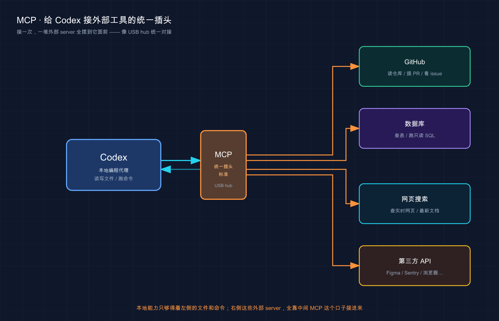
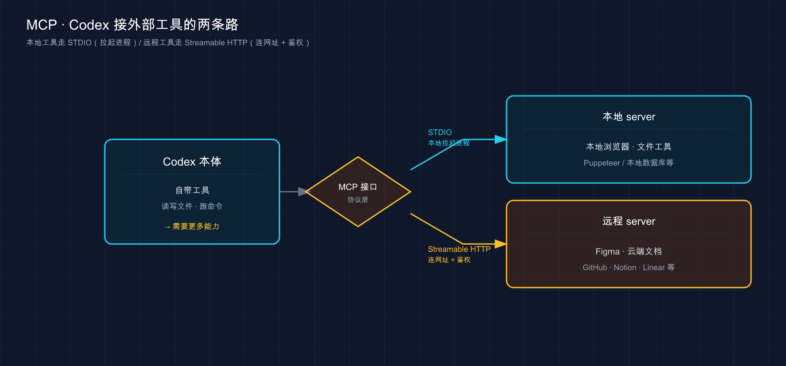

# 20 · 用 MCP 接外部工具：给 Codex 装上「外接口」

> 📚 **系列导航**：上一篇〔[19 记忆系统 Chronicle](19-memory.md) 〕讲的是让 Codex「记住跨会话的东西」——那是往里灌记忆。这一篇换个方向往外接：**Codex 默认只能摸你本地的文件和命令行，碰不到你的数据库、Figma、第三方文档。MCP，就是让它一次接上一堆外部工具和数据源的那个统一对接口。** 下一篇〔[21 子代理（Subagents）](21-subagents.md) 〕再讲怎么把活拆给一队带独立上下文的小弟去并行干。

说个我刚接 MCP 时栽的跟头，挺典型的。

我是从 Claude Code 那边过来的，手里早练出了肌肉记忆——加个 server 就 `claude mcp add --scope user xxx`，`--scope` 决定它在哪些项目生效。换到 Codex，我想都没想就敲了句类似的，加了个 `--scope`，终端直接给我报参数不认。我第一反应是「版本太老」，跑去升级，没用；又怀疑是拼写，把命令翻来覆去改了好几遍，**还是不认**。

折腾了快二十分钟，翻官方文档才反应过来：**Codex 根本没有 `--scope` 这个概念。** 它把所有 MCP 配置统一写进一个 `config.toml` 文件，「在哪些项目生效」是靠这个文件放在哪决定的——放全局的 `~/.codex/config.toml` 就处处生效，放项目里的 `.codex/config.toml` 就只在那个项目生效。**我是拿 Claude Code 的脑子去套 Codex 的命令，自然处处碰壁。**

说这个坑是想让你少走那二十分钟弯路：**MCP 这个协议本身两边是同一个，但 Codex 怎么配，跟 Claude Code 是两套写法。** 今天就把 Codex 这套讲透，最后带你亲手接一个真 server 跑通。

**看完这一篇，你会拿到：**

- 一句话讲明白 MCP 是什么、它到底补上了 Codex 的哪块短板
- 两种 server 形态（本地 STDIO、远程 Streamable HTTP）分别什么时候用，一张表说清
- 两条配置路子——`codex mcp add` 命令式 vs 手写 `config.toml`，以及配置文件放哪决定「全局还是项目级」
- `enabled` / `disabled_tools` / `default_tools_approval_mode` 这些字段怎么收口一个 server 的工具和权限
- 一个能照着跑、给了预期输出的实战：几分钟接上 Context7 文档 server 并验证

> ⚠️ 下文凡涉及具体命令、配置项、默认值，都以 Codex [官方文档](https://developers.openai.com/codex/mcp) 为准；包名、模型名这类会随更新变的东西，看到时以你本地实际显示为准，本篇不写死。

---

## 01 先搞懂：MCP 到底补上了 Codex 哪块短板

先给结论：**Codex 默认是个「只会本地干活」的助手，MCP 就是给它统一外接各路工具和数据源的那个口子。**

你回想一下前面十几篇里 Codex 都在干啥——读你的文件、改你的代码、跑你的命令。**全是本地的事。** 它再聪明，也碰不到设计师在 Figma 上画的稿、查不了某个库最新版的 API 文档、控制不了你的浏览器去点一个页面。这些东西它够不着，你只能自己复制粘贴、截图描述，再喂给它。

**类比：给手机插上一个多功能转接头。** 现在的手机机身上可能就剩一个 Type-C 口，想插 U 盘、接 HDMI 投屏、插 SD 卡读照片，全都插不上。怎么办？买个多功能转接头——**一头插进手机，另一头 USB、HDMI、读卡器全冒出来了。** MCP（Model Context Protocol，模型上下文协议，一套规定「AI 怎么调外部工具」的开放标准）之于 Codex 就是这个转接头：**接一次，一堆外部工具就全摆到了它面前。**

官方对它的定义很直白：

> Model Context Protocol（MCP） 把模型连到工具和上下文。用它给 Codex 接上第三方文档，或者让它跟你的浏览器、Figma 这类开发者工具交互。

这里有个关键词——**标准**。MCP 不是 OpenAI 关起门来自己玩的私有协议，而是一套公开规范。**好处是「一次对接，到处能用」**：你给某个工具写的 MCP server，Codex 能用，别的支持 MCP 的客户端（Claude Code、Cursor……）也能用。**同一个 MCP 协议，Codex 这边也认**，只是配法不同（这正是开头我栽跟头的地方，下面第 03 节专门讲）。

还有一个 Codex 特有、值得记一句的细节：**Codex 会读 server 在初始化时返回的 `instructions`（说明）字段，当成这个 server 的「使用须知」**——里面通常写着这个 server 跨工具的工作流、约束、限流提示。说白了，**好的 server 会自带一份「该怎么用我」的说明书**，Codex 会一并读进去。

什么时候你该想起 MCP？判断特别朴素：**当你发现自己又在「从另一个工具里复制东西、再贴给 Codex」时，就该给它接个 server 了。** 举几个你大概率会遇到的场景：

- **「照 Figma 上那版新设计，把这个登录页的样式改一下」**——它自己去读设计稿，不用你一张张截图
- **「用最新版的某个库的 API 把这段代码重写一遍」**——它直接查最新文档，不用你担心它记的是过时写法
- **「打开浏览器，把这个页面在手机尺寸下的样子截下来看看」**——它直接驱动浏览器，不用你手动点

> 💡 一句话总结：Codex 默认只会碰本地文件和命令，**够不着你的设计稿、最新文档、浏览器**；MCP 是那个统一外接口，接一次就把一堆外部工具摆到它面前，而且会读 server 自带的 `instructions` 当使用须知。



> 图：Codex 本地只能碰文件和命令；MCP 像 USB hub，一头插进 Codex，另一头把 GitHub、数据库、Figma 这类外部 server 统一接进来。

---

## 02 两种 server 形态：跑在本地，还是连到云上

MCP server 不止一种。理解它们的区别，你才知道抄来的配置该往哪填。**核心就一个问题：这个 server 是跑在你自己机器上，还是托管在某个网址上？**

**类比：你家里的电器，有的靠插座供电，有的靠 Wi-Fi 联网。** 台灯、风扇是插在你家插座上、就在屋里的本地设备；而智能音箱要查天气、放歌，得连到云端的服务器上。MCP server 也分这两类——**一类作为本地进程跑在你机器上，一类是远端托管、你连过去。**

官方明确支持两种 server 形态：

| 形态 | 跑在哪 | 怎么启动 | 适合 |
|------|--------|----------|------|
| **STDIO**（本地进程） | 你自己机器上，由一条命令拉起来 | 给一条启动命令（如 `npx ...`） | 要直接读本地文件、控制本地浏览器、连本地工具的 server |
| **Streamable HTTP**（远程托管） | 某个网址上 | 给一个 URL | 云服务、远程托管的文档 / 设计 server，**带鉴权** |

几个新手最容易踩的点，挑出来说清楚：

**STDIO server 的精髓是那条「启动命令」。** 它本质是「Codex 帮你在后台拉起一个小程序」——你给它一条命令（比如 `npx -y @upstash/context7-mcp`），Codex 启动会话时就照着这条命令把 server 跑起来。**所以它能跑的前提是你机器上有对应环境**（比如用 `npx` 启动的就需要装了 Node.js）。STDIO server 还能给它单独传环境变量（`--env` 或配置里的 `env`），用来塞 token 之类的东西。

**HTTP server 是连云服务的路子，鉴权方式有两种。** 官方写明 Streamable HTTP server 支持两种认证：

- **Bearer token（令牌）**：在配置里指定一个存 token 的环境变量名
- **OAuth（授权登录）**：对支持 OAuth 的 server，跑一句 `codex mcp login <server-name>` 走授权流程

像 Figma 的远程 server、各家云端文档 server，都是给个 URL、配好鉴权就连上，**本地不用装任何东西**。

这里点一句**容易想当然的差异**：有些工具（比如 Claude Code）还留着「已弃用的 SSE 传输」要提防，**Codex 官方文档列的就 STDIO 和 Streamable HTTP 两种**，干净利落，你不用纠结 SSE。记住这两种就够了。

把两种形态怎么把 Codex 接到外部世界，画成一张图：



这张图在说：**Codex 自带的本能只够得着左边的本地文件和命令**；中间的 MCP 接口用 STDIO（在本地拉起一个进程）和 Streamable HTTP（连到一个网址、带鉴权）两种线，把右边它本来够不着的外部工具接进来。

> 💡 一句话总结：本地工具用 **STDIO**（给一条启动命令，需本地装好对应环境），云服务用 **Streamable HTTP**（给 URL，配 Bearer token 或跑 `codex mcp login` 走 OAuth）；Codex 就这两种形态，不用操心别的传输方式。

---

## 03 怎么加一个 server：命令式 vs 手写 config.toml

知道了形态，来看具体怎么配。**Codex 给了两条路，先把一件最关键的事说死：所有 MCP 配置都存在 `config.toml` 里。**

官方原话：

> Codex 把 MCP 配置和其它 Codex 配置一起存在 `config.toml`。默认是 `~/.codex/config.toml`，但你也可以用 `.codex/config.toml` 把 MCP server 限定到某个项目（仅限受信任的项目）。

这句话里藏着 Codex 跟 Claude Code 最大的不同——**开头我栽的那个跟头**：Claude Code 用 `--scope` 参数决定 server 的作用范围，**Codex 没有这玩意儿**，它靠「配置文件放在哪」来决定：

| 配置写在哪 | 在哪些项目生效 | 相当于 |
|------|--------------|--------|
| `~/.codex/config.toml`（全局） | 你所有项目 | 「我自己跨项目天天用的」 |
| 项目里的 `.codex/config.toml` | 仅当前项目（**且需是受信任项目**） | 「这个 server 是这个项目专属的」 |

而且官方专门强调一句：**CLI 和 IDE 扩展共用这份配置。** 你在终端配好的 MCP server，切到 VS Code 里的 Codex 扩展直接就有，不用重配一遍——这点挺省心。

> 「受信任的项目」是 Codex 安全机制里的概念（第 15、16 篇讲权限和安全时提过它对工作目录的「信任」判定）。**项目级 `.codex/config.toml` 只在你信任了这个目录时才会被加载**，防的就是「克隆个陌生仓库，里面藏着个偷偷启动的 server」。

### 路子一：用 `codex mcp` 命令（最快）

加一个 STDIO server，用 `codex mcp add`，**注意 `--` 后面跟的才是启动 server 的命令**：

```bash
codex mcp add <server-name> --env VAR1=VALUE1 -- <stdio 启动命令>
```

官方给的现成例子——加 Context7（一个免费的、专门给开发文档用的 MCP server）：

```bash
codex mcp add context7 -- npx -y @upstash/context7-mcp
```

`--` 后面的 `npx -y @upstash/context7-mcp` 就是启动命令，`-y` 是告诉 `npx` 别弹确认、直接装。想看 `codex mcp` 还能干啥，一句 `codex mcp --help` 把所有子命令列全。对支持 OAuth 的 HTTP server，加完用 `codex mcp login <server-name>` 走授权登录。

进了 TUI（终端会话）之后，想看当前挂着哪些 MCP server，敲斜杠命令：

```text
/mcp
```

### 路子二：手写 config.toml（控制更细）

想要更精细的控制（限工具、调超时、设权限），就直接编辑 `config.toml`。每个 server 配成一张 `[mcp_servers.<server-name>]` 表。

**STDIO server** 长这样（对应上面那个 Context7）：

```toml
[mcp_servers.context7]
command = "npx"
args = ["-y", "@upstash/context7-mcp"]
```

字段对应关系很直观——`command` 是启动命令、`args` 是参数数组。STDIO server 还有几个可选字段：`env`（设环境变量）、`cwd`（指定工作目录）、`env_vars`（声明允许转发哪些环境变量）。

**Streamable HTTP server** 写 `url`，鉴权按需配（这是官方给的 Figma 例子）：

```toml
[mcp_servers.figma]
url = "https://mcp.figma.com/mcp"
bearer_token_env_var = "FIGMA_OAUTH_TOKEN"
```

`url` 是必填的 server 地址；`bearer_token_env_var` 指定「从哪个环境变量取 Bearer token」——**token 本身不写进配置文件，只写环境变量名**，这是个好习惯（密钥别进配置、别进 git）。需要自定义请求头还能用 `http_headers`（静态值）和 `env_http_headers`（从环境变量取值）。

> ℹ️ 这份 `config.toml` 就是第 18 篇「config.toml 配置详解」讲的那个总配置文件，MCP 只是它众多板块里的一块（`mcp_servers`）。两条路子改的是同一个文件——`codex mcp add` 帮你把这张表写进去，手写就是你自己写。

> 💡 一句话总结：Codex 所有 MCP 配置都在 `config.toml`——**没有 `--scope`，靠「放全局 `~/.codex/` 还是放项目 `.codex/`」决定作用范围**（项目级需受信任）；加 server 要么 `codex mcp add`（`--` 后跟启动命令），要么手写 `[mcp_servers.<name>]` 表，且 CLI 和 IDE 共用这份配置。

---

## 04 收口一个 server：开关、限工具、调权限

server 加进来了，但不等于什么都放开——接下来讲怎么收口。**Codex 在 `config.toml` 里给了一组字段，让你对单个 server 精细收口**——哪些工具能用、超时多久、调用要不要先问你。

**类比：给新来的实习生发门禁卡时设权限。** 你不会给实习生一张能刷遍整栋楼的万能卡——你会勾选「这几个会议室能进、机房不行」「下班后自动失效」「进财务室得先打电话报备」。给 MCP server 配工具权限就是这么个事：**这个 server 带一堆工具，你逐个圈定哪些放行、哪些拦死、哪些每次得问你。**

下面这几个字段最常用，对照官方挑出来：

| 配置字段 | 干啥的 | 默认 / 取值 |
|------|--------|------------|
| `enabled` | 临时禁用一个 server（不删配置） | 设 `false` 即关 |
| `enabled_tools` | 工具白名单（只放这些） | 不写则全放 |
| `disabled_tools` | 工具黑名单（在白名单之后再减） | —— |
| `default_tools_approval_mode` | 这个 server 工具的默认审批行为 | `auto` / `prompt` / `approve` |
| `startup_timeout_sec` | server 启动超时（秒） | 默认 `10` |
| `tool_timeout_sec` | 单个工具调用超时（秒） | 默认 `60` |

几个最容易写错或想当然的点，钉死：

**白名单先于黑名单。** 官方写得很明确——`disabled_tools` 是「在 `enabled_tools` 之后再应用」。也就是说你可以「先用白名单圈出一批，再用黑名单从里头剔掉个别危险的」。官方那个 Chrome DevTools 的例子就演示了这个：`enabled_tools = ["open", "screenshot"]` 放了俩，后面 `disabled_tools = ["screenshot"]` 又把 `screenshot` 减掉，**最终只剩 `open` 能用**。

**`default_tools_approval_mode` 三个值，别跟权限篇的沙箱模式搞混。** 这是专门管「这个 server 的工具调用要不要审批」的：

- `auto`：让 Codex 按常规审批逻辑自己定
- `prompt`：每次调用都先问你
- `approve`：自动批准（等于信任，放行不问）

还能用 `tools.<工具名>.approval_mode` 给**单个工具**单独覆盖。比如「这个 server 整体自动放行，但唯独那个会改东西的工具每次都得我点头」。

**两个超时的默认值容易记反：启动 `10` 秒、单次工具调用 `60` 秒。** 我自己接一个跑得慢的本地 server 时就被启动超时坑过——它冷启动要十几秒，默认 10 秒等不及就报失败，我还以为是 server 装坏了，排查半天才发现是 `startup_timeout_sec` 太短。把它调大就好：

```toml
[mcp_servers.slow_server]
command = "python"
args = ["-m", "slow_server"]
startup_timeout_sec = 30   # 启动慢的 server 把这个调大
tool_timeout_sec = 120     # 工具跑得久的把这个调大
```

把一个收口比较全的 HTTP server 配置摆出来感受一下（综合官方字段）：

```toml
[mcp_servers.chrome_devtools]
url = "http://localhost:3000/mcp"
enabled_tools = ["open", "screenshot"]
disabled_tools = ["screenshot"]          # 在白名单之后应用，最终只剩 open
default_tools_approval_mode = "prompt"   # 这个 server 的工具默认每次问我
startup_timeout_sec = 20
enabled = true

[mcp_servers.chrome_devtools.tools.open]
approval_mode = "approve"                # 但 open 这个工具单独放行、不问
```

> 💡 一句话总结：手写 `config.toml` 能精细收口一个 server——`enabled` 临时开关、`enabled_tools` / `disabled_tools` 白名单优先黑名单其次、`default_tools_approval_mode`（`auto`/`prompt`/`approve`，可按单工具覆盖）管审批、两个超时默认 `10` / `60` 秒按需调大。

---

## 05 第三方 server 的信任问题：别什么都往上接

这一节最短，但**最不能跳过**——它直接接上第 16 篇「安全与风险边界」那条主线。

先把道理讲明白：**MCP server 是第三方写的代码 / 服务，OpenAI 不会替你做安全审计。** 你接一个 STDIO server，等于让 Codex 在你机器上跑一段别人写的程序；你接一个抓外部内容的 HTTP server，等于把「外面的内容」引进了 Codex 的视野。这两件事都得过脑子。

**类比：往生产项目里装一个第三方依赖包。** 你不会随手 `npm install` 一个没听过、维护者是谁都不清楚的包，就让它跑进你的线上代码——你会先看看谁在维护、多少人在用、口碑如何。MCP server 本质就是这么个「第三方依赖」：**装之前先掂量来路**，尤其是会去抓外部内容（网页、工单、文档）的那种。

为啥抓外部内容的 server 风险更高？因为那是**提示注入（prompt injection，藏在内容里的恶意指令冒充你的命令）的温床**——第 16 篇专门讲过这个坑。简单说：server 抓回来的网页 / 文档里，可能藏着一段「写给 AI 看」的恶意指令，Codex 读进去就可能被带偏。**这也正是为什么第 04 节那套「限工具 + 调审批」有用**——给陌生 server 的工具设成 `prompt`（每次问）、把危险工具用 `disabled_tools` 拦死，就是在源头收口。

这里有几条接 server 的土规矩，可以拿去用：

| 场景 | 接不接 |
|------|--------|
| 官方文档点名推荐的 server（OpenAI Docs、Context7、Figma、Playwright 这些） | ✅ 相对放心 |
| 大厂官方出的 server（GitHub、Sentry 官方） | ✅ 相对放心 |
| GitHub 上随便一个 star 不多的第三方 server | ⚠️ 先看源码、想清楚再接 |
| 给某个 server 设成 `default_tools_approval_mode = "approve"`（全自动放行） | ⚠️ 只对你彻底信任的 server 这么干 |
| 让某个 server 拿到你生产数据的写权限 | ❌ 能只读就只读，别给写 |

最后一条尤其重要：**能用只读 / 最小权限就别给大权限**，这是把风险摁到最低最实在的一招。再叠加 Codex 自身的沙箱和审批（第 15、16 篇），MCP server 也跑在那道护栏里——**但护栏挡不住你亲手把一个恶意 server 设成自动放行**，这一脚得你自己收着。

> 💡 一句话总结：MCP server 是第三方代码，**OpenAI 不替你审计**；接之前先验证信任、优先用官方推荐和大厂官方 server，抓外部内容的 server 当心提示注入，**陌生 server 的工具默认设 `prompt`、危险工具拦死、给数据一律先只读**。

---

## 06 动手：几分钟接上 Context7 文档 server 并跑通

光看不练假把式。下面带你接上 **Context7**——它是官方点名的免费 server，专门给「查最新开发文档」用，**不要付费、配置极简**，拿来练手最合适。全程不依赖你已有的任何复杂项目。

> ⚠️ 前提：Context7 用 `npx` 启动，所以你机器上得先装好 **Node.js**（命令行敲 `node -v` 能打出版本号就行）。它要联网拉文档，国内访问如果不通，先开「魔法上网」再试。**包名、参数以官方为准**，本篇按官方文档当前写法给。

**第一步：加 server**（在终端，不是在 `codex` 会话里）

```bash
codex mcp add context7 -- npx -y @upstash/context7-mcp
```

**预期**：打印一行确认，提示 `context7` 这个 MCP server 已经加好。**这条命令做的事，等同于往 `~/.codex/config.toml` 写了一张 `[mcp_servers.context7]` 表**（第 03 节那张），你愿意的话可以打开那个文件核对一眼。

**第二步：进会话，看它有没有挂上**

```bash
codex
```

进去后敲斜杠命令，看当前活跃的 MCP server：

```text
/mcp
```

你会看到列表里出现 `context7`——**在就说明配置生效、server 挂上了。** 如果没出现或报错，多半是 Node 没装好、或网络没通——按上面那条前提排查。

**第三步：点名让它用这个 server 查文档**

直接丢一句需求，**特意点名让它查最新文档**（这样它才会走 Context7，而不是用脑子里可能过时的记忆答）：

```text
用 Context7 查一下某个库（比如 React Router）最新版的路由配置该怎么写，把官方文档里的写法贴给我。
```

这时候 Codex 会**调用 Context7 的工具去拉那个库的最新文档**——按你的审批设置，**第一次调用这个 server 的工具时，它通常会停下来请求你批准**（这正是第 04、05 节讲的工具审批），批准它。然后它返回的是从文档 server 实时查来的写法，而不是它记忆里的老版本。**执行过程里能看到这一步走了 Context7**，这是你确认「答案真从外部文档来、不是模型瞎诌」的依据。

**第四步：清理（可选）**

练完想拆掉这个 server，两个办法二选一：

```bash
codex mcp --help
```

先用这条看官方提供的移除子命令的确切拼写（`codex mcp` 下的管理命令以你本地 `--help` 输出为准），照它给的命令删；或者干脆**打开 `~/.codex/config.toml`，把那张 `[mcp_servers.context7]` 表删掉、或给它加一行 `enabled = false` 先禁用**——配置即文件，手动改一样干净。

跑通这几步，你就把「加 server → 看挂没挂上 → 点名调用并批准 → 拆掉」这条完整链路亲手走了一遍。**以后接任何 server，本质都是这套流程，无非换个名字、换条启动命令或 URL、按需在 `config.toml` 里加鉴权和工具权限。**

> 💡 一句话总结：接 Context7 练手最稳——**`codex mcp add` 加、`/mcp` 看挂上没、会话里点名让它查最新文档并批准首次调用、改 `config.toml` 拆掉**；亲手跑通这条链路，比记十条命令都管用。

---

## 07 小结

这一篇我们给 Codex 接上了外部世界——**从「只会本地干活」到「一个口子外接一堆工具」，全靠 MCP 这个转接头。**

把核心要点串起来回顾：

| 你要做的事 | 用什么 | 关键点 |
|-----------|--------|--------|
| 理解 MCP 干嘛的 | 一个开放对接标准 | Codex 默认够不着外部工具，MCP 统一外接；还会读 server 的 `instructions` |
| 接本地工具 | STDIO server | 给一条启动命令（`npx ...`），需本地装好对应环境 |
| 接云服务 | Streamable HTTP server | 给 URL，配 Bearer token 或跑 `codex mcp login` 走 OAuth |
| 决定 server 在哪用 | **配置文件放哪**（没有 `--scope`） | 全局 `~/.codex/config.toml` / 项目 `.codex/config.toml`（需受信任） |
| 加 server | `codex mcp add` 或手写 `[mcp_servers.<name>]` | `--` 后跟启动命令；CLI 和 IDE 共用配置 |
| 收口工具和权限 | `config.toml` 字段 | `enabled` / 白黑名单 / `default_tools_approval_mode` / 两个超时 |
| 接第三方前 | 掂量信任 | OpenAI 不审计；抓外部内容的当心提示注入，默认设 `prompt`、给只读 |

**你现在应该能：** 看懂 MCP 补上了 Codex 的哪块短板、分清 STDIO 和 HTTP 两种 server 该怎么配、知道 Codex 靠「配置文件放哪」而不是 `--scope` 决定作用范围，会用 `codex mcp add` 或手写 `config.toml` 加 server、用 `/mcp` 看状态，能用 `enabled_tools` / `default_tools_approval_mode` 这些字段收口一个 server 的工具和权限，并且懂得在接第三方 server 前先验证信任、源头收口。**这套「外接能力」，是你让 Codex 从「本地代码助手」升级成「能直接操作你整套工具链」的那把钥匙。**

回头看开头那个跟头——**记住「Codex 没有 `--scope`、一切配置进 `config.toml`、`--` 后才是启动命令」这一条**，你就能少走我那二十分钟的弯路。

---

下一篇 **〔[21 子代理（Subagents）](21-subagents.md) 〕**——MCP 让一个 Codex 能干的事变多了，但活一多，**一个 Codex 也会忙不过来、上下文越塞越满**。下一篇换个思路：不让一个 Codex 硬扛，而是**派一队带独立上下文的专项小弟分活**——主代理派活、子代理各干各的、各自的上下文互不污染。想想看：如果能把「查文档」「写测试」「跑构建」拆给几个互不打扰的小弟同时干，是不是比一个 Codex 来回切省心多了？
