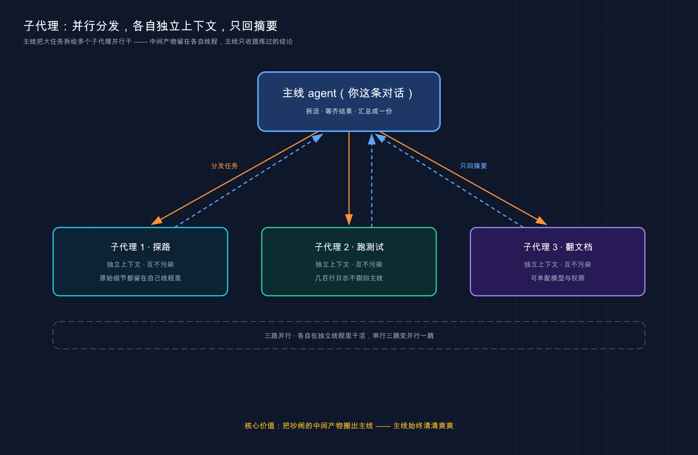
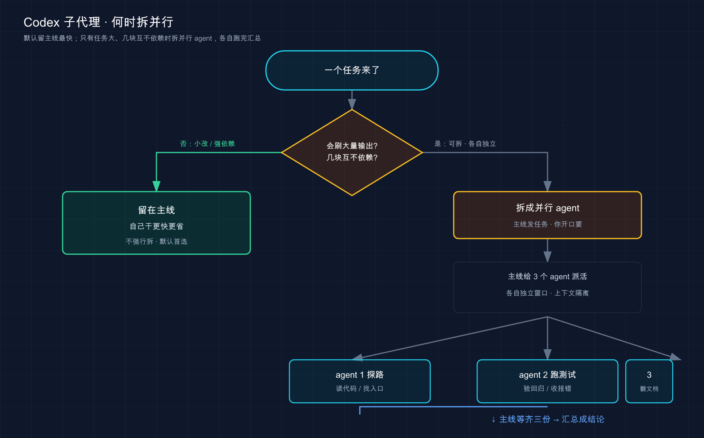

# 21 · 子代理（Subagents）：把活儿拆出去并行跑，但只有「你开口」它才拆

> 📚 **系列导航**：上一篇 [20 · 用 MCP 接外部工具](20-mcp.md) 教你给 Codex 接上外部工具，让它能查文档、连服务。这一篇换个思路——不是给它「加工具」，而是教你把活儿**拆出去并行跑**：子代理（Subagent），一批带独立模型、独立指令、独立权限的专项助手，几个同时干，干完把结论汇总成一份交回来。

兄弟们，今天聊 Codex 里最唬人、也最容易用歪的一个功能——子代理。

名字一听就高级，「多代理并行」，仿佛你一个人指挥一支小分队。我刚摸到这功能那阵，确实飘了一下，恨不得把每个任务都拆成五六个 agent 一起跑，觉得这才叫「专业玩法」。

**但说句实话：Codex 的子代理跟你在别处见的不太一样，有个反直觉的设定你必须先知道——它默认压根不会自己拆。** 官方写得明明白白：Codex 只在**你明确开口要它拆**的时候才派生子代理。你不喊「开几个 agent 并行」，它就老老实实一个人干到底。这一条，决定了你怎么用它、什么时候用它。

这一篇我不光教你怎么唤起子代理、怎么写自定义 agent、怎么给不同 agent 挑不同模型，更重要的是帮你想清楚那条线：**什么活值得拆出去并行，什么活拆了纯属给自己添堵又烧钱。**

**看完这一篇，你会拿到：**

- 子代理到底是什么——把活儿拆给一批专项 agent 并行跑、再汇总，和「单个 agent 闷头干」差在哪
- 它真正解决的两个老毛病：上下文污染（context pollution）和上下文腐烂（context rot），以及那条反共识的线：什么时候**别**拆
- Codex 自带的三个内置 agent（`default` / `worker` / `explorer`），开箱即用、不用配
- 怎么写自定义 agent：往 `~/.codex/agents/` 或 `.codex/agents/` 丢一个 TOML 文件，必填三个字段是干嘛的
- 怎么给不同 agent 选不同模型和「思考强度」，让侦察兵用快模型、审查员用强模型
- 手把手实战：写一个只读侦察 agent，派它跑、验证它只回摘要、不越权

> ⚠️ 下文凡涉及具体命令、配置键、默认值，都以 Codex [官方文档](https://developers.openai.com/codex/subagents) 为准；模型名（`gpt-5.5` 之类）这种随版本变的东西，看到时以你本地实际显示为准，本篇尽量不写死。

---

## 01 先搞懂：子代理到底是什么

先给结论：**子代理就是 Codex 临时派生出来的一批专项 agent——它们各自在独立的线程里干活，干完不把过程中翻的一堆原始资料倒回来，由 Codex 统一收成一份结论交给你。**

**类比：把一个大案子拆成几路侦探同时查。** 你是探长（主线对话），手上一个复杂案子，比如「把这次改动从安全、性能、测试三个角度审一遍」。这三路互不挡道，你犯不着自己一个人顺着查三趟。于是你派出三路侦探：**一路专盯安全漏洞、一路专盯性能、一路专盯测试缺口，三人同时出门、各查各的**。查完了，他们不会把翻过的几百页卷宗全堆回你桌上，而是各递一份摘要：「安全这块有两处风险，在 X 和 Y」。你最后拿到的，是一份按角度归好类的汇总。

这批侦探有几样东西是「他们自己的」，跟你这条主线隔开。官方把术语理得很清楚，值得记一下：

> **Subagent**：Codex 派生出来、用来处理某个具体任务的受托 agent。
> **Agent thread**：某个 agent 的 CLI 线程，你能用 `/agent` 进去查看、来回切换。

拆开看，一个子代理可以拥有这么几样「独立」的东西：

| 维度 | 主线（你这条对话） | 子代理（派出去的那一路） |
|------|------------------|----------------------|
| **线程 / 上下文** | 你和 Codex 一路聊下来的需求、决策、历史 | 自己一条独立 agent thread，干的是你交代的那一小块，原始细节都留在它自己线程里 |
| **模型 / 思考强度** | 你主会话用的那套 | 可以单独指定，比如侦察兵用快模型、审查员用强模型（第 05 节细说） |
| **指令（人设）** | Codex 的默认行为 | 你给它写的专属 `developer_instructions`，比如「你只负责探路、不准改代码」 |
| **沙箱权限** | 你当前会话的沙箱策略 | 默认继承你的策略，但能给单个 agent 单独拧，比如强制 `read-only` |

最关键的一点，也是 Codex 子代理的灵魂：**它的价值是「把吵闹的中间产物搬出主线」**。官方原话——让主 agent 专注在需求、决策和最终产出上，把探路、跑测试、翻日志这些会刷一大屏的脏活丢给子代理并行干，子代理**只回摘要、不回原始输出**。

这一点决定了子代理「擅长什么、不擅长什么」，下一节就靠它来判断。



这张图把子代理的运作方式画成了一条线：主线 agent 把一个大任务拆开、**分发**给几路子代理并行干，每路子代理都待在自己**独立的上下文**里（探路的、跑测试的、翻文档的互不污染），干完**只把一份摘要回传**给主线——那些刷屏的原始细节全留在各自线程里，主线始终清清爽爽。

> 💡 一句话总结：子代理 = 一批带独立线程、可独立配模型和权限的专项 agent，**各自并行干活、只把摘要汇总回主线**；核心价值是「把吵闹的中间产物搬出你的主对话」。

---

## 02 它解决什么——以及那条反共识的线

知道了「是什么」，得搞清「为什么要有它」。官方把子代理要治的病说得特别直白，就俩词，你记住这俩词，这功能你就懂了一半。

### 病一：上下文污染（context pollution）

**类比：一桌正经文件里混进一摞外卖单。** 你的主对话本来摊着正事——需求、约束、定下来的决策。结果你让它「把整个测试套件跑一遍」，哗啦刷出几百上千行测试日志，全糊在桌上。**有用的那几句「哪几个挂了」，被埋在一摞没用的中间输出底下，你想找都得扒半天。** 这就是上下文污染：噪声把信号盖住了。

官方定义：

> **Context pollution（上下文污染）**：有用的信息被吵闹的中间输出埋没。

**真实场景**：我去年调一个第三方接口，让 Codex 反复试调、每次刷一屏 JSON 返回。聊到第十几轮，我回头想确认「最初的需求是不是字段 A 必填」，往上翻——全是 JSON，翻了快二十屏才找到那句话。那一刻我就懂了，**会刷大量中间输出的活，根本不该在主线上摊开干**。

### 病二：上下文腐烂（context rot）

**类比：会议开太久，人就开始走神。** 一场会，前一个钟头大家还紧扣议题；拖到第三个钟头，桌上堆满了跑题的细节、临时岔出去的话头，决策质量肉眼可见地往下掉。模型也一样——对话越填越满、越填越杂，**它的表现会随着「不相关的细节」越积越多而慢慢变差**。

官方定义：

> **Context rot（上下文腐烂）**：随着对话被越来越多不那么相关的细节填满，表现逐渐变差。

这俩病的药方是同一个：**把吵闹的活搬出主线，扔给子代理并行干，让它们只把提炼过的摘要交回来。** 官方还举了个极端例子——一份几百万 token 的大文档，Codex 能拆成若干小块、派多个子代理分头啃，每个只把「嚼出来的要点」回传主线。主线始终清清爽爽。

### 反共识的线：哪些活别拆

好，病说清了，回到开头那句——**为什么「一上来就拆」是错的？**

因为子代理不是免费的。官方反复强调一条成本：**每个子代理都要自己跑模型、自己调工具，所以子代理工作流比同等的单 agent 跑法更烧 token。** 拆得越多，烧得越多。还有第二条隐性成本——并行写比并行读危险得多：

> 起步时，把并行 agent 用在**偏读**的任务上，比如探路、跑测试、分流、做摘要。**偏写**的并行工作流要更小心，因为多个 agent 同时改代码会撞车、还会增加协调成本。

我把官方的取舍提炼成一张对照表，这是本节最该带走的东西：

| 这类活 | 该不该拆给子代理 | 为什么 |
|--------|----------------|--------|
| 探路 / 跑测试 / 翻日志 / 做摘要（偏读、会刷大量输出） | ✅ 值得拆，还能并行 | 把噪声搬出主线，正是它的主场 |
| 几块**互不依赖**的调研（认证 / 数据库 / API 各查各的） | ✅ 值得并行 | 同时跑，串行三趟变并行一趟 |
| 一句话能说清、改动就在眼前的小修改 | ❌ 别拆 | 子代理要自己跑模型、烧 token，得不偿失 |
| 几个 agent 同时改同一片代码 | ⚠️ 慎用 | 偏写并行容易撞车、协调成本高 |
| 步骤间强依赖、必须 A 完了才能 B | ⚠️ 拆了也快不了 | 并行的前提是互不依赖 |

**真实场景**：我有阵子犯轴，连「把这个函数名改清楚」都想喊一句「开个 agent 去改」，图个「显得专业」。结果纯属添堵——派生、跑模型、回传，一圈下来比我直接在主线说「把这名字改了」慢一截，还白烧 token。从那以后我立了条铁规矩：**一句话能说清、改动就在眼前的活，绝不拆。**

> 💡 一句话总结：子代理治的是「上下文污染 + 上下文腐烂」两个病——把吵闹的偏读活搬出主线并行干；但**小修改、强依赖、并行写**这三类别碰，拆得多 ≠ 专业，过度拆只会又慢又贵又撞车。

下面这张图把「拆与不拆」的判断和「拆出去之后怎么跑」串成一条线：



这张图在干什么：先判断「该不该拆」，不该拆就留主线；该拆且你开了口，Codex 才派出几路 agent 并行，等齐所有结果后汇总成一份交回主线——**注意那个「你开口」的岔口，没它 Codex 不会自己拆。**

---

## 03 不用配也能拆：三个内置 agent + 怎么唤起

讲完「该不该用」，来真的拆一次。好消息是：**Codex 自带三个内置 agent，开箱即用，你一行配置都不用写。**

官方给的三个内置 agent：

| 内置 agent | 定位 | 适合派去干 |
|-----------|------|----------|
| `default` | 通用兜底 agent | 没特别要求时的默认人选 |
| `worker` | 偏执行：实现、修复 | 写代码、改 bug 这类动手的活 |
| `explorer` | 偏只读：啃代码库、探路 | 大范围读代码、定位、调研 |

光有 agent 还不够，得有人喊它们出门。这里是 Codex 最关键、也最该记牢的一条规矩：**Codex 不会自动拆，必须你在话里明说要并行。** 官方原文：

> Codex 不会自动派生子代理，只有在你明确要求子代理或并行 agent 工作时才会用。

所以「唤起」靠的不是什么特殊语法，就是你**把话说清楚**——明说怎么分活、要不要等齐、最后回什么。官方原话给的是「spawn two agents」「delegate this work in parallel」「use one agent per point」这种直白指令。一个写得好的子代理 prompt，官方说该讲明三件事：**怎么分工、要不要等所有 agent 都完事再继续、最后回什么样的摘要。**

照着官方的样子，你可以直接在 Codex 里这么说：

```text
用并行子代理审一下这个分支（当前分支 vs main）。开一个 agent 专盯安全风险、一个专盯测试缺口、一个专盯可维护性。三个都等齐，再按类别把发现汇总，带上文件位置。
```

**类比：你是导演喊「分镜同时拍」。** 不喊就一条线顺着拍；你喊一句「这三场戏三个机位同时开拍，拍完都给我」，剧组才会分头行动。这句「同时开拍 + 都给我」就是你的派生指令——**机位（agent）一直在，等的是你这声令下。**

干起来之后，编排全由 Codex 自己扛——官方说它负责派生新 agent、转达后续指令、等结果、关掉干完的线程；**多个 agent 在跑时，它会等到你要的结果全齐了，再返回一份汇总响应。**

**真实场景**：我第一次用这功能审 PR，照着官方那条「spawn one agent per point」的 prompt 把六个审查点一次性甩出去，本来以为要等很久，结果几路并行下来，比我自己一条条问快了一大截，最后拿到的是按六个点归好类的一份汇总。那次我才真正体会到「并行」省的是什么——**省的是你来回等的那几趟串行时间。**

> ⚠️ 可见性有个平台差异得提一句：子代理的活动目前在 **Codex app 和 CLI** 里能看到，**IDE 扩展里的可见性官方标注「即将支持」**。所以想直观看到几个 agent 在跑，现在用 app 或 CLI。

> 💡 一句话总结：三个内置 agent（`default` / `worker` / `explorer`）开箱即用；但 Codex **绝不自动拆**，得你在话里明说「开几个 agent 并行、等齐、回汇总」才动——它会等所有结果齐了再给你一份汇总。

---

## 04 管在跑的 agent：/agent 进去看，或直接喊话指挥

几路 agent 同时在跑，你总得有办法看它们干到哪了、甚至临时改主意。Codex 给了两个抓手。

### 抓手一：用 /agent 切换和查看

官方给的命令是 **`/agent`**（注意是单数，不是 `/agents`），在 CLI 里用它**在几条活跃 agent 线程之间来回切换、查看某条线程当前在干嘛**。

```text
/agent
```

**注意这跟你印象里别的工具可能不一样**——它不是「运行某个 agent」的命令，而是「进去看 / 切线程」的命令。派生靠你说话，查看才靠 `/agent`。

### 抓手二：直接喊话指挥

更顺手的是直接跟 Codex 说。官方原话：你可以**直接让 Codex 去操控某个在跑的子代理、叫停它、或者关掉已经干完的 agent 线程**。不用记什么子命令，大白话指挥就行，比如「把那个还在跑的探路 agent 停了」。

**类比：你是调度台，对讲机随时插话。** 几辆车在外面跑，你既能切到某个频道听某辆车的实时汇报（`/agent`），也能直接对着对讲机喊「3 号车别查了，回来」（喊话指挥）。**车在外面自己跑，但方向盘的最终话语权一直在你手里。**

这里还有个审批上的坑，官方专门讲了，值得知道：**在交互式 CLI 里，审批请求可能从一个你没在看的 agent 线程里冒出来。** 比如你正盯着主线，某个后台 agent 撞到要审批的操作，弹窗会标出是哪条线程发的——这时你可以**按 `o` 先跳进那条线程看看上下文**，再决定批不批、拒不拒、或怎么答。要是在非交互式流程里（比如脚本跑），冒不出新审批的操作会直接失败，并把错误抛回上层工作流。

> 💡 一句话总结：管在跑的 agent 两招——`/agent`（单数）进去切线程 / 看进度，或直接喊话让 Codex 停掉、操控、收尾某个 agent；交互式 CLI 里别的线程也可能弹审批，按 `o` 能跳进去看了再批。

---

## 05 自定义 agent：写一个 TOML 文件，给它配专属模型

内置三个 agent 能应付不少场景，但你要是发现自己老在重复同一类活——每次审查都强调「像 owner 那样审、盯正确性和安全」——那就该把这套固化成一个**自定义 agent**，下次一句话唤起。

**怎么写：往 agent 目录丢一个 TOML（Tom's Obvious Minimal Language，一种简洁的配置文件格式，比 JSON 更适合人读写）文件，一个文件定义一个 agent。** 官方给的两个位置：

| 放哪 | 谁能用 | 适合 |
|------|--------|------|
| `~/.codex/agents/` | **你的所有项目** | 个人通用 agent，到哪都想用的那种 |
| `.codex/agents/` | **仅当前项目** | 项目专属 agent，能跟着 git 提交给团队 |

**类比：给某一路侦探建一份「专属档案」。** 内置那三位是公司随时能调的通用编制；你写的 TOML，是给某个专精方向的侦探单独立的档案——叫什么名、专攻什么、办案守则是什么、给他配什么级别的装备（模型）。**立好档，以后点名就能调。**

一个自定义 agent 文件长这样，**必填只有三个字段**：

```toml
name = "reviewer"
description = "PR reviewer focused on correctness, security, and missing tests."
developer_instructions = """
Review code like an owner.
Prioritize correctness, security, behavior regressions, and missing test coverage.
"""
```

把字段拎出来说清楚（官方 schema 原样）：

| 字段 | 必填 | 干嘛的 | 小白要点 |
|------|------|--------|---------|
| `name` | 是 | Codex 派生 / 指代这个 agent 用的名字 | **它是身份的唯一真相**，文件名最好跟它一致但以 `name` 为准 |
| `description` | 是 | 给人看的说明：什么场景该用它 | 写清楚点，方便你和团队认领 |
| `developer_instructions` | 是 | 定义这个 agent 行为的核心指令 | 就是它的「人设 + 办案守则」 |
| `nickname_candidates` | 否 | 派生时显示用的昵称池 | 同一个 agent 开多个实例时，UI 能显示不同昵称区分，**纯展示、不影响身份** |

剩下这些可选字段，**你不写就从父会话继承**：`model`、`model_reasoning_effort`、`sandbox_mode`、`mcp_servers`、`skills.config`。官方还提了一句——**自定义 agent 文件其实是当成「配置层」加载的，所以你能往里塞其它 `config.toml` 支持的键。** 另外有个优先级要记住：**如果你的自定义 agent 重名了内置的（比如也叫 `explorer`），你写的盖过内置的。**

### 给不同 agent 选不同模型和思考强度

这是自定义 agent 最香的地方——**让每路 agent 用最匹配的脑子**。两个旋钮：

- **`model`**：用哪个模型。官方思路是「侦察用快的、审查用强的」——偏读、扫大文件、跑并行 worker 这种活，用更快更省的（官方点名 `gpt-5.4-mini` 这档）；要审查、要啃多步复杂逻辑的，用更强的（官方列了 `gpt-5.4` / `gpt-5.5` 两档，`gpt-5.5` 是 demanding agents 的起点，reviewer 示例用的是 `gpt-5.4`）。**具体模型名随版本变，以官方为准**，记住这个「侦察用快、攻坚用强」的分配思路就够了。
- **`model_reasoning_effort`**：思考强度，三档。

| 思考强度 | 用在 | 代价 |
|---------|------|------|
| `high` | 要追复杂逻辑、查假设、抠边界情况（审查 / 安全类 agent） | 最慢、最烧 token，但复杂活质量更高 |
| `medium` | 大多数 agent 的平衡默认 | 折中 |
| `low` | 任务直白、就图个快 | 最快 |

把它俩落到文件里，给侦察兵配快模型、低思考，给审查员配强模型、高思考：

注意模型名：官方示例的侦察兵用 `gpt-5.3-codex-spark`（需 ChatGPT Pro，研究预览），这里改用 `gpt-5.4-mini`，Pro 用户可换回 `gpt-5.3-codex-spark`。

```toml
# .codex/agents/explorer.toml —— 只读侦察兵：快、省、不动手
name = "pr_explorer"
description = "Read-only codebase explorer for gathering evidence before changes."
model = "gpt-5.4-mini"
model_reasoning_effort = "medium"
sandbox_mode = "read-only"
developer_instructions = """
Stay in exploration mode.
Trace the real execution path, cite files and symbols, and avoid proposing fixes unless asked.
"""
```

注意上面那行 `sandbox_mode = "read-only"`——**这就是给单个 agent 单独拧权限**。官方说子代理默认继承你当前会话的沙箱策略，但你能在 agent 文件里给某一个单独标成只读，让这路侦察兵**想动手也动不了**。

> ⚠️ 一个权限上的优先级坑：你在会话里**临时**改的运行时设置（比如 `/permissions` 调整、`--yolo`），会被重新套用到派生出的子代理身上——**哪怕那个 agent 文件里写了不一样的默认值**。也就是说你会话里的实时选择，盖过 agent 文件里的静态默认。

还有一类**全局** `[agents]` 配置，管的是所有子代理的「总闸」，写在你的 `config.toml` 里（不是单个 agent 文件）：

| 全局键 | 干嘛的 | 默认值 |
|--------|--------|--------|
| `agents.max_threads` | 同时能开几条 agent 线程的上限 | 不设时默认 **6** |
| `agents.max_depth` | agent 嵌套深度（根会话从 0 算） | 默认 **1**：允许直接子代理、但禁止再往下套 |
| `agents.job_max_runtime_seconds` | CSV 批处理任务里每个 worker 的默认超时 | 不设时回退到每个 worker **1800 秒** |

官方对 `max_depth` 有句很实在的提醒：**保持默认 1 就好，除非你真需要递归委派。** 调大它会把「广泛委派」的指令变成层层 fan-out，token、延迟、本机资源消耗全往上窜——`max_threads` 能卡住并发线程数，但卡不住深层递归带来的成本和不可预测性。

> 💡 一句话总结：自定义 agent 就是 `~/.codex/agents/` 或 `.codex/agents/` 下的一个 TOML，**必填 `name` / `description` / `developer_instructions`**；可选字段不写就继承父会话，靠 `model` + `model_reasoning_effort` 给侦察兵配快脑、给审查员配强脑，还能 `sandbox_mode` 单独锁权限。

---

## 06 动手：写一个只读侦察 agent 并让它干活

光看不练假把式。下面带你**手写一个最小的自定义 agent，再让它真的跑起来**，亲眼看到「侦察兵探完路、只回结论、不越权」这条链路。全程不依赖复杂环境。

我们建一个最简单的：一个**只读的「项目侦察兵」**，专门读代码、回报结构和潜在问题，但**一个字都不准改**（靠 `sandbox_mode = "read-only"` 锁死）。

**第一步：建一个玩具项目和 agent 目录**（Mac / Linux）

```bash
mkdir sub-demo
cd sub-demo
mkdir -p .codex/agents
```

**预期**：`sub-demo` 文件夹里有了 `.codex/agents/` 这层目录。敲 `ls .codex` 能看到 `agents` 在里头。

> Windows 用户用 PowerShell：`mkdir sub-demo; cd sub-demo; mkdir .codex\agents -Force` 。后面 `echo`、`cat` 也对应换成 PowerShell 写法。

**第二步：手写自定义 agent 文件**

用你顺手的编辑器，新建 `sub-demo/.codex/agents/scout.toml` ，贴入：

```toml
name = "scout"
description = "只读的项目侦察兵，读指定文件、回报结构与潜在问题，不动手改。"
sandbox_mode = "read-only"
model_reasoning_effort = "low"
developer_instructions = """
你是一个只读的代码侦察兵，只探路、不改代码。
被派来时：
1. 读用户指定的文件
2. 按可读性、命名、潜在 bug 三类列出问题
3. 每条给一句改进方向，但绝不修改任何文件
最后只回一份精炼摘要，别把原始代码整段贴回来。
"""
```

注意这里**没写 `model` 字段**——按官方默认，它会从你的父会话继承模型。`sandbox_mode = "read-only"` 把它钉死成只读，**它想写也写不了**；`model_reasoning_effort = "low"` 让这种轻活跑得快些。

**第三步：造一段「有改进空间」的代码给它侦察**

```bash
echo 'def f(a, b):
    return a / b' > calc.py
```

这个函数名 `f` 、参数名 `a` / `b` 都很烂，还没处理除以 0——正好让侦察兵逮个正着。

**预期**：`sub-demo` 里有了 `calc.py` ，内容是上面那两行。

**第四步：启动 Codex，明说让这个 agent 去探**

```bash
codex
```

进去后，**记住第 03 节那条铁规矩——你得明说要用子代理去干**，Codex 不会自己拆：

```text
派 scout 这个子代理去侦察 calc.py，按它的守则只回一份问题摘要，别动文件。
```

**预期**：Codex 会**派生 scout 子代理**（在 app / CLI 里能看到这个 agent 线程在跑，可能带个昵称标签）。它在自己的只读线程里读完 `calc.py` ，然后**只把一份「侦察摘要」汇总回主线**——大致会指出：函数名 `f` 和参数 `a` / `b` 不达意、缺除数为 0 的处理、建议改成更清楚的命名并加边界判断。**注意它只给方向、没动你的文件**（因为它是 `read-only`）。想中途看它干到哪了，可以敲 `/agent` 切进它的线程瞄一眼。

**第五步：验证它真的没改文件**

退出 Codex，回终端看：

```bash
cat calc.py
```

（Windows PowerShell 用 `type calc.py`）

**预期**：`calc.py` **原封不动**，还是那两行——**这就是「锁权限」的威力**：你把它钉成只读，它就算想帮你改也无能为力，只能动嘴。

跑通这五步，你就把「写 TOML → 明说派生 → 子代理在独立线程干活 → 只回摘要、不越权」这条完整链路亲手验证了一遍。**以后任何自定义 agent，本质都是在这套机制上换指令、调模型、拧权限。**

> ⚠️ 要是 Codex 没派生 scout、而是自己上手读了，多半是你**没把「用子代理」说够明白**——回第 03 节，把「派 XX 子代理去」这种话说死，别让它以为你只是想要个结果。

> 💡 一句话总结：写一个 `read-only` 的侦察 TOML、明说「派 scout 去侦察」让它跑、再 `cat` 确认文件没被动——**亲手跑通「独立干活 + 锁权限不越界」这条链路，比记十条字段都管用**。

---

## 07 进阶顺一句：批量处理 CSV（实验性）

> ⚠️ 这个功能官方标注**实验性，可能随子代理支持演进而变化**——这里只点一下名，让你知道有这么个东西，别当稳定能力依赖。

要是你有**一大堆长得很像的活**——比如「一行一个文件 / 一行一个 PR / 一行一个迁移目标」，挨个审一遍——Codex 有个 `spawn_agents_on_csv` ：它读一份 CSV，**每行派一个 worker 子代理**，等整批跑完，再把合并结果导出成 CSV。

**类比：流水线分拣。** 一筐包裹（CSV 每行一件），开一排分拣员（每行一个 worker）同时贴标签，全贴完汇总成一张总表。每个 worker 必须**恰好调一次** `report_agent_job_result` 回报结果，否则那一行在导出的 CSV 里会被标成错误。具体参数和用法以[官方文档](https://developers.openai.com/codex/subagents)为准，这里不展开。

哪些活值得用它、哪些不值得，简单对一张表：

| 场景 | 适不适合 `spawn_agents_on_csv` | 原因 |
|------|-------------------------------|------|
| 批量审几十个 PR、对象结构一致 | ✅ 适合 | 同一套动作、大量相似对象，并行收益明显 |
| 批量把几十个文件的注释翻译成英文 | ✅ 适合 | 每行独立、互不依赖，正是 CSV 批处理的主场 |
| 步骤间有顺序依赖（A 完才能 B） | ❌ 不适合 | CSV 各行是并行派出的，无法保证顺序 |
| 只有三四个对象、改动很小 | ❌ 不适合 | 开实验性批处理的成本比你直接说高，得不偿失 |
| 涉及并行写同一批文件 | ⚠️ 慎用 | 多 worker 同时动手，撞车风险和第 02 节一样 |

> 💡 一句话总结：`spawn_agents_on_csv`（实验性）适合「同一套动作、对着大批量相似对象重复跑」的只读或独立写入场景——步骤有依赖、对象太少、或并行写同一批文件的，用普通子代理或直接在主线干更稳。

---

## 08 小结

这一篇我们把 Codex 的「子代理」从「该不该用」一路讲到「怎么唤起、怎么写、怎么验证」——**核心不是教你拆得多花哨，而是帮你建立那条「该并行还是自己干」的判断线，以及记牢 Codex 那个反直觉的设定：不开口它不拆。**

把要点串起来回顾：

| 你想搞清的事 | 答案 | 关键点 |
|-------------|------|--------|
| 子代理是什么 | 一批带独立线程、可独立配模型 / 权限的专项 agent | 各自并行、只把摘要汇总回主线 |
| 它解决什么 | 上下文污染 + 上下文腐烂 | 把吵闹的偏读活搬出主线 |
| 什么时候**别**用 | 小修改、强依赖、并行写 | 拆得多 ≠ 专业，过度拆又慢又贵又撞车 |
| 怎么唤起 | **你必须明说**要并行，Codex 绝不自动拆 | 说清「怎么分工、要不要等齐、回什么」 |
| 内置 / 自定义 | 内置三个开箱即用；自定义写 TOML | 必填 `name` / `description` / `developer_instructions` |
| 怎么选模型 | `model` + `model_reasoning_effort` | 侦察用快脑、审查用强脑 |

**你现在应该能：** 判断一个任务该不该拆给子代理（而不是一激动就拆）；用好内置三个 agent，或往 `~/.codex/agents/` 写一个带专属指令、专属模型、锁定权限的自定义 agent；并且记牢——**得你开口它才拆，干完它只把摘要汇总回来。** 这套「该并行就并行、该自己干就自己干」的分寸感，才是子代理真正的门槛——功能十分钟学会，分寸得用出来。

记住开头那句反共识的话：**Codex 的子代理强，但它默认不替你做主——拆不拆、拆几个，话语权一直在你这儿。**

---

下一篇 **22「Agent Skills 技能」**——到这儿你给 Codex 配的「外援」越来越成体系了：AGENTS.md 定规矩、斜杠命令攒快捷、MCP 接外部工具、现在又会拆子代理并行干活。但你有没有发现，子代理的「办案守则」还得每次写一长段 `developer_instructions` ？要是这套本领能打包成一个**可复用的技能**、随用随调，是不是更省事？下一篇就聊 Codex 怎么把一身本事沉淀成 Skill。
