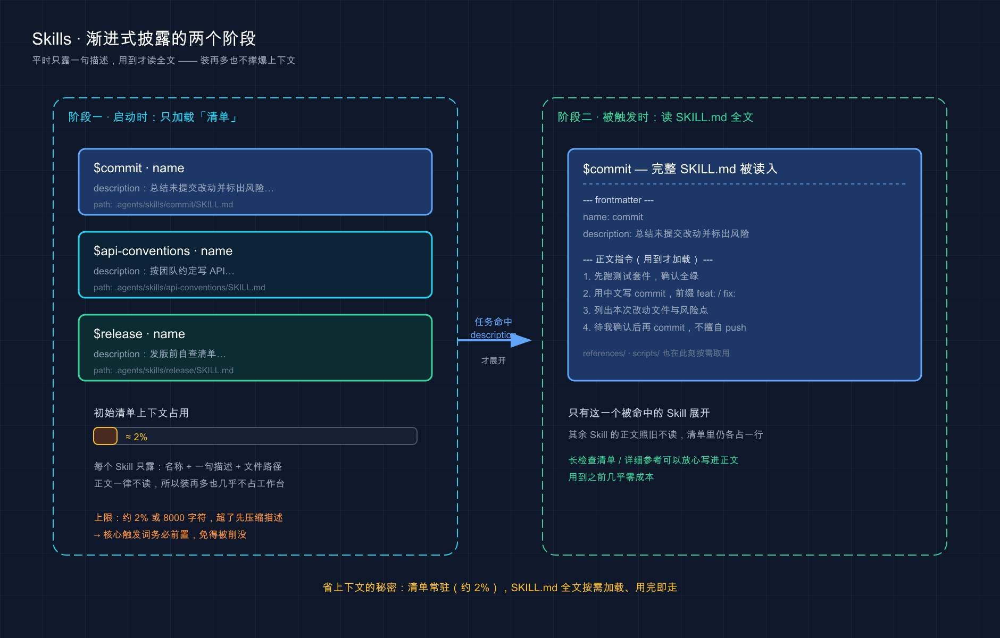

# 22 · Agent Skills 技能：把一套活儿打包，教会 Codex 自己接

> 📚 **系列导航**：上一篇〔[21 子代理（Subagents）](21-subagents.md)〕讲的是「把一个重活拆出去、丢给一个独立上下文的小助手干完再收结果」。这一篇换个角度：不拆任务，而是**封装能力**——把一套你反复交代的固定流程打包成 Agent Skills，让 Codex 在该用的时候自己调出来。下一篇〔[23 插件（Plugins）](23-plugins.md)〕再讲怎么把这身本事打包、分发给别人装。

我翻了一下 OpenAI 官方那个 `github.com/openai/skills` 仓库。

里头一个 Skill，骨架精简到**只有一个 `SKILL.md` 文件**就能跑——上面两道横线框一段元数据，下面写几行「该咋干」的说明，齐活。可就这么个不起眼的小目录，官方给它的定位是「**可复用工作流的编写格式**」（the authoring format for reusable workflows）：你把一套活儿写进去，Codex 之后该用就用，不用你每次把步骤重敲一遍。

很多人第一次听 Skill，反应是「这不就是斜杠命令换了个壳？我第 12 篇刚学的 `/review` 不也是打一下就跑」。说句实话，这个理解差了一层。**斜杠命令是你主动喊它才动；Skill 你可以不喊——Codex 看你这活儿对得上某个 Skill 的描述，自己就把它调出来了，而且平时几乎不占你的上下文。**

这一篇，我把 Skill 到底是什么、凭什么能塞一堆还不撑爆上下文、放哪、怎么触发、怎么自己写，一次给你讲透。事实一律以 Codex [官方文档](https://developers.openai.com/codex/skills) 为准——网上有些老教程把 Skill 的目录路径、字段名写错了，下面我会专门拎出来提醒你别踩。

**看完这一篇，你会拿到：**

- Skill 到底是什么——一个 `SKILL.md` 加可选脚本 / 资源，怎么就成了 Codex 的一项本事
- 它的命门「渐进式披露」：为什么平时只占一句描述、用到才展开全文，省上下文的秘密全在这
- 两种触发方式（显式 `$` 喊名字 / 隐式按描述自动匹配）差在哪，怎么写描述才匹配得准
- Skill 该放哪个目录（`.agents/skills` 那套，**不是** `~/.codex/skills`），同名了会咋样
- 怎么用 `$skill-creator` 三五句话生成一个、怎么用 `$skill-installer` 装现成的、怎么禁用某个

---

## 01 先搞懂：Skill 到底是个什么东西

先给结论：**一个 Skill，本质就是一个带 `SKILL.md` 文件的目录，外加可选的脚本和参考资料，打包成一身「专项本事」交给 Codex**。官方原话——「一个 Skill 是一个带 `SKILL.md` 文件、外加可选脚本和参考资料的目录」。

为什么需要它？因为你跟 Codex 干活，总有那么几套流程是**反复交代的**。比如我每次让它提交代码，都得叮嘱「先跑测试、commit 信息用中文、前缀按 `feat:`／`fix:` 来」——同一段话，我去年估摸着敲了不下三十遍。这种「说明书级别」的重复，就是 Skill 该接管的。

**类比：乐高的「拼装说明书」。** 你买一盒乐高，盒子里那本图纸不替你拼，但它一步步标清楚「先装底盘、再上四个轮子、最后扣车顶」。照着拼，谁来都能拼对、拼得一样。Skill 就是你写给 Codex 的那本图纸：把一套固定步骤（「总结未提交的改动并标出风险」）写进 `SKILL.md`，之后这套流程就成了 Codex 随手能照着拼的一个动作，你不用每次把图纸重画一遍。

`SKILL.md` 长什么样？最小骨架就两部分，官方给的模板是这样：

```md
---
name: skill-name
description: 说清这个技能该在什么时候触发、什么时候不该触发。
---

供 Codex 遵循的技能指令写在这里。
```

上面那个 `---` 框起来的部分叫 **YAML frontmatter**（前置元数据，写在文件开头两道 `---` 之间的配置区），官方规定它**必须含 `name` 和 `description` 两个字段**：`name` 是这身本事的名字（也是你以后用 `$` 喊它时的名字），`description` 告诉 Codex 这个 Skill 是干啥的、啥时候该用。下面的 markdown 正文，是 Codex 真正调用时照着做的**说明**。

> ⚠️ 这里有个**新手最容易被老教程带歪的坑**：有些非官方资料里 frontmatter 写了个 `trigger:` 字段（说是「触发关键词」），还教你把**自己手写**的 Skill 放进 `~/.codex/skills/`。**官方文档里没有 `trigger` 这个字段**，触发靠的是 `description` 的语义匹配（下文细说）；**手写 / 仓库级 Skill 的目录是 `.agents/skills` 那一套**（第 04 节讲），不是 `~/.codex/skills/`。**例外要先说清**：第 05 节讲的 `$skill-installer` 这个**官方安装器**装精选 Skill 时，确实会把它放到 `$CODEX_HOME/skills/<名字>`（默认 `~/.codex/skills/<名字>`）——那是 Codex 当前版本下安装器**自己的行为**，跟「老教程让你手动把自建 skill 塞这儿」不是一回事。**自己手写一律走 `.agents/skills`；`$skill-installer` 装的留在 `~/.codex/skills/` 别动它**。

一个 Skill 不止 `SKILL.md` 一个文件，它是个**目录**。除了必需的 `SKILL.md`，还能带脚本和参考资料：

```text
my-skill/
├── SKILL.md          # 主说明（必需，含 name + description）
├── scripts/          # 可选：可执行脚本（要确定性行为、或调外部工具时用）
└── references/       # 可选：参考文档，Codex 执行时按需查阅
```

只有 `SKILL.md` 是必需的，其余都可选。这也引出官方一条很实在的取舍——**能用指令说清的就别写脚本，除非你需要「确定性行为」或得调外部工具**。说白了：让 Codex 照着自然语言步骤干，比硬塞一个脚本更灵活；只有那种「这一步必须分毫不差地跑」或者「得调个命令行工具」的活儿，才值得把脚本捆进来。

**三个真实场景，你立刻能想到 Skill 能干嘛：**

- 你每次让 Codex 提交代码，都要叮嘱那套「先测试、中文 commit、前缀按约定」——写进一个 `commit` Skill，以后一句话搞定。
- 团队约定了一套 API 写法（RESTful 命名、统一错误格式、必带参数校验）——写成 `api-conventions` Skill，谁写接口它自动按这套来。
- 你有一套固定的「发版前自查清单」（更新 changelog、打 tag、跑冒烟测试）——写成 Skill，发版那天一句话拉起来走流程。

> 💡 一句话总结：Skill 就是「带 `SKILL.md`（`name` + `description` + 怎么做）的目录 + 可选脚本 / 参考资料」打成的一身本事——**写一次，之后 Codex 随手就能调**；能用指令说清的别急着写脚本。

---

## 02 命门：渐进式披露，省上下文的秘密

这是整篇最该吃透的一节。**Skill 凭什么能装一大堆，却几乎不占你的上下文？** 答案就一个词：渐进式披露（progressive disclosure，意思是「按需逐步展开」，不相关时不加载全文）。

先说为什么这事关键。你回想第 02 篇讲的上下文窗口——Codex 的「工作台」就那么大，塞进去的每个字都在花预算、都在挤占它思考的余地。要是每个 Skill 的全文一开会话就全堆进去，装上十个八个，你的工作台就废了一半。

**类比：自助餐厅的「菜品牌子」和后厨。** 你端着盘子走过取餐台，每道菜前面只立一块**小牌子**——菜名加一句话（「麻婆豆腐 · 微辣」）。你扫一眼就知道有什么，但牌子背后那口锅、那套火候配料，**没轮到这道菜，你压根接触不到**。等你真夹了麻婆豆腐，后厨那套详细做法才在它那边「展开」。Skill 就这么运作，官方把这两阶段说得很清楚：

> Codex 启动时，只带着每个技能的名称、描述和文件路径。只有当它决定使用某个技能时，才会加载该技能完整的 `SKILL.md` 指令。

翻成大白话就是：

- **平时**：上下文里每个 Skill 只占「名字 + 一句 description + 文件路径」（取餐台的小牌子）。
- **选中时**：Codex 判断某个 Skill 对得上当前任务，**才把那一个 Skill 的完整 `SKILL.md` 正文**读进来（端走那道菜的详细做法）。

这就是为什么你可以放心往 Skill 正文里写长篇检查清单、详细参考——**用到之前，它几乎不花成本**。



两列并排：左边阶段一，启动时每个 Skill 只占「名称 + 一句描述 + 文件路径」；右边阶段二，只有被任务命中的那一个 Skill 才把完整 `SKILL.md` 展开读入，其余照旧只占一行。

不过这个「初始清单」也不是无限白送的——官方给了它一个**字符预算**，这点很多人不知道，栽过坑：

> 为了不挤占提示词的其余空间，这份初始清单被限制在模型上下文窗口的**约 2%**，或上下文窗口未知时的 **8,000 个字符**。如果装了很多技能，Codex 会**先缩短描述**；对于极大的技能集，**部分技能可能被从初始清单里省略**，Codex 会给出警告。

注意，这个预算**只管初始清单**——Codex 真选中某个 Skill 后，照样会完整读它的 `SKILL.md`。这条规则有个直接的实战含义，记牢：**你的 `description` 要把核心用例和触发关键词放在最前面**。万一装的 Skill 多到描述被压缩，前置的关键词还能保住、匹配照样准；要是关键词埋在描述末尾，一压缩就被削没了——这跟我第 11 篇讲 `AGENTS.md` 那个「把唯一有用的规矩埋在第 140 行」是同一个教训：**重要的信息要前置**。

> 💡 一句话总结：渐进式披露 = 平时只露「名称 + 一句描述」、用到才展开完整 `SKILL.md`，所以装再多也不撑上下文；但初始清单有字符预算（约 2% 或 8000 字符），**描述务必把核心触发词前置**，免得被压缩时削没了。

---

## 03 两种触发方式：显式喊名字 vs 隐式自动匹配

知道 Skill 怎么省上下文了，那它到底怎么被「调出来」？官方给了**两条路**，搞清这俩的差别，是用好 Skill 的关键。

**类比：叫外卖的两种点法。** 一种是你**点名要某家店**——「就要楼下那家黄焖鸡」，平台直接派给它，不用猜。另一种是你**只说需求**——「来份下饭的、辣一点的」，平台根据你这句话去匹配最合适的店。Skill 的两种触发，正好对应这两种点法。

### 显式调用：你点名喊它

第一种是**显式调用（explicit invocation）**——你在提示词里直接把这个 Skill 点出来。官方给的操作：在 CLI 或 IDE 里，**跑 `/skills` 命令，或者输入 `$` 符号来提及一个技能**。

```text
$commit
```

打一个 `$`，会弹出可选的 Skill 列表，选中（或直接把名字打全）就是点名让它接管。显式调用时 Codex **不做任何匹配判断**，直接加载完整 `SKILL.md` 照着干——你说要哪个就是哪个，最稳妥。

> ⚠️ 又一个老教程的坑：有资料里写显式调用是 `@skill-name`。**官方的写法是 `$`（配合 `/skills`）**，不是 `@`。别记混了。

### 隐式调用：它按描述自己匹配

第二种是**隐式调用（implicit invocation）**——你压根不提 Skill 名，正常说人话，Codex 拿你这句话去比对每个 Skill 的 `description`，对上了就自动把那个 Skill 调出来。官方原话：「当你的任务匹配某个技能的 `description` 时，Codex 可以自己选用该技能。」

这是 Skill 最舒服的地方：**你不用记 `$什么什么`，描述写得好，需求一说它自己就接住了**。但这也把球踢回给了 `description`——官方说得很直白：

> 因为隐式匹配依赖 `description`，所以要写**简洁、范围清晰、边界明确**的描述。把关键用例和触发词前置，这样即使描述被缩短，Codex 仍能匹配到这个技能。

我自己写第一个 Skill 时就吃过亏：description 写成「帮助处理代码相关任务」——太泛了，结果它要么什么活儿都想往这个 Skill 上靠、要么该用时反而没匹配上。后来改成「**总结未提交的改动并标出风险。当用户问『改了啥』『想要提交信息』『帮我看看 diff』时使用**」，把用户真会说出口的话直接写进去，匹配立刻准了。**description 不是写给人看的简介，是写给匹配算法的钩子。**

两种触发方式摆一起对比：

| 维度 | 显式调用（`$` / `/skills`） | 隐式调用（按描述匹配） |
|------|---------------------------|----------------------|
| 怎么触发 | 你打 `$` 点名，或跑 `/skills` 选 | 正常说需求，Codex 自己匹配 |
| Codex 做不做判断 | 不做，**点名即用** | 做，**拿你的话比对 description** |
| 准不准取决于 | 你点对没有 | **description 写得好不好** |
| 最适合 | 想精确控制用哪个、用哪一次 | 让 Codex「该用就用」，省得记名字 |
| 想关掉吗 | 关不掉（点名永远有效） | 可关（见第 05 节 `allow_implicit_invocation`） |

> 💡 一句话总结：显式调用靠 `$` 或 `/skills` 点名、最稳妥；隐式调用靠 `description` 语义匹配、最省心——**而隐式准不准全压在 description 上**，把核心触发词写成「用户真会说出口的话」并前置，是写 Skill 的头等功夫。

---

## 04 放哪决定谁能用：`.agents/skills` 那套目录

知道是什么、怎么触发了，那自己写的 Skill 放哪儿？这一节是**最容易被网上老教程带错的地方**，照官方表抄，别凭印象。

官方说 Codex 从**仓库（REPO）、用户（USER）、管理员（ADMIN）、系统（SYSTEM）** 四个层级读取技能。其中仓库层有个特别之处：**Codex 会从你启动它的当前目录，一路往上扫到仓库根，沿途每一级的 `.agents/skills` 都读**。完整位置表如下：

| 作用范围 | 放哪 | 谁 / 哪里能用 |
|---------|------|--------------|
| **REPO（当前目录）** | `$CWD/.agents/skills` | 你启动 Codex 的那个目录——适合某个模块 / 微服务专属的技能 |
| **REPO（上级目录）** | `$CWD/../.agents/skills` | 当前目录的上层——适合嵌套结构里某块共享区域 |
| **REPO（仓库根）** | `$REPO_ROOT/.agents/skills` | 仓库最顶层——整个仓库所有子目录都能用的基础技能 |
| **USER（个人）** | `$HOME/.agents/skills` | 你这个用户在**任何**仓库里都能用 |
| **ADMIN（机器级）** | `/etc/codex/skills` | 这台机器 / 容器上所有用户共享（SDK 脚本、自动化、管理员默认技能） |
| **SYSTEM（系统内置）** | 由 OpenAI 随 Codex 打包 | 所有人启动 Codex 就有（如 `skill-creator`、plan 类技能） |

> ⚠️ **划重点防踩坑**：上面这张表讲的是**你自己手写**的 Skill 该放哪——仓库级 `.agents/skills`、个人级 `$HOME/.agents/skills`，**不要手动把自建 Skill 塞进** `~/.codex/skills/` （`~/.codex/` 是放 `config.toml` 这类**配置**的地方，第 05 节会用到）。
>
> 但有个**例外**得交代清楚，免得跟第 05 节自相矛盾：用 `$skill-installer` 安装的**精选 Skill**（curated skill），当前版本下安装器会把它装到 `$CODEX_HOME/skills/<名字>`，默认就是 `~/.codex/skills/<名字>`——**那是安装器自己的行为，Codex 也会从那里加载**。所以记住：「**自己手写的走 `.agents/skills`、安装器装的留在 `~/.codex/skills/` 别去碰**」，这俩位置都是 Codex 在用，不是非此即彼的对错。这跟第 11 篇 `AGENTS.md` 那套发现链是两码事，别混。

逻辑其实很直观：**只有你自己用、跨项目通用的**（比如你个人的 commit 习惯），放用户级 `$HOME/.agents/skills`；**这个仓库专属、想让团队都用的**（比如本项目的发版流程），放仓库级 `.agents/skills` 并提交进版本库，队友拉下来就有。Mac / Linux 上 `$HOME` 就是你的主目录；Windows 用户注意，官方这套路径以类 Unix 写法给出，实际以你本机 Codex 实际读取的位置为准。

那**两个 Skill 重名了**会咋样？官方说得很明确——**Codex 不会合并它们，两个都会出现在技能选择器里**。这跟第 11 篇 `AGENTS.md` 的「就近覆盖」不一样：`AGENTS.md` 是拼接 + 冲突时近的赢，Skill 重名则是**两个并存、都列出来让你挑**。所以官方建议：**不同作用范围之间别用相同的技能名**，免得选的时候自己都分不清哪个是哪个。

还有个贴心细节：**Codex 会自动侦测技能文件的变更**——你改了 `SKILL.md` 一般马上生效。万一改完没反应，官方给的招就一个字：**重启 Codex**。

> 💡 一句话总结：技能放 `.agents/skills`（仓库级，会从当前目录往上扫到仓库根）或 `$HOME/.agents/skills`（用户级），**不是 `~/.codex/skills`**；同名不合并、两个都列出来，所以跨层别重名；改完一般自动生效，不行就重启。

---

## 05 上手：用 `$skill-creator` 生成、`$skill-installer` 安装、按需禁用

光懂原理不够，这一节落到三件最实操的事：怎么快速造一个 Skill、怎么装别人现成的、怎么临时关掉某个。

### 造：优先用内置的 `$skill-creator`

官方的建议很干脆——**先用内置的创建器**，别一上来手搓。在 CLI 或 IDE 里输入：

```text
$skill-creator
```

它会跟你做个简短问答，官方说就问三件事：**这个技能做什么？什么时候该触发？纯指令就够还是要带脚本？**（最后一项**默认推荐纯指令**，简洁好维护——呼应第 01 节那条「能用指令别写脚本」。）答完它就把目录骨架和 `SKILL.md` 给你生成好。这是我现在写新 Skill 的默认起手式：让它先搭架子，我再改细节，比对着文档从零敲一个 `SKILL.md` 省事多了。

当然你也可以**手动建**——按第 01 节那个模板，建个目录、写个含 `name` + `description` 的 `SKILL.md` 就行，本质和创建器产出的一样。

### 装：用 `$skill-installer` 拉现成的

不想自己写、想用别人做好的？官方提供了 `$skill-installer` 来装内置之外的精选技能。比如装 Linear（一个项目管理工具）的技能：

```bash
$skill-installer linear
```

你还能让安装器**从别的仓库下载技能**。装完 Codex 一般自动侦测到，没出现就重启。

> ℹ️ **它装到哪？** 当前版本（codex-cli 0.142.x）的安装位置是 `$CODEX_HOME/skills/<名字>`，默认就是 `~/.codex/skills/<名字>`——**注意这跟第 04 节「自己手写的 Skill 放 `.agents/skills`」不冲突，那是「手写」，这是「安装器装」**，两条路 Codex 都会扫。**具体安装位置以当前 `$skill-installer` 输出和官方文档为准**，后续版本可能调整。

> ℹ️ 官方对 `$skill-installer` 的定位是「**本地试用和实验**」。要是你想把**自己写的**技能正经分发给别人、或者把好几个技能打包，官方推荐走 **Plugins（插件）** 那条路——这正好是下一篇〔23 插件〕的主题。一句话先记着：**Skill 是「编写格式」，Plugin 是「分发格式」**；先用 Skill 把工作流设计好，要给别人装时再打包成插件。

### 禁用：不删文件，关掉就行

某个技能（可能是装来的，也可能是系统内置的）你暂时不想让它出现，**又不舍得删**，怎么办？官方给的办法是在 `~/.codex/config.toml`（Codex 的用户级配置文件，注意是 `.codex` 不是 `.agents`）里加一段：

```toml
# 文件路径：~/.codex/config.toml
[[skills.config]]
path = "/path/to/skill/SKILL.md"
enabled = false
```

把 `path` 填成那个技能 `SKILL.md` 的实际路径，`enabled = false` 一关，它就不参与了。**改完 `config.toml` 记得重启 Codex** 才生效。这招在「装的技能太多、初始清单字符预算被挤爆」时特别有用——第 02 节说过预算有限，把当前用不上的技能临时禁掉，给常用的腾地方。

### 进阶：关掉隐式触发（`agents/openai.yaml`）

如果你想给 Skill 配点高级属性——比如在 Codex App 里的显示名 / 图标、声明依赖的工具、或者**关掉它的隐式触发**——官方支持在技能目录里放一个 `agents/openai.yaml`。最常用的一项是这个：

```yaml
# 文件路径：<技能目录>/agents/openai.yaml
policy:
  allow_implicit_invocation: false
```

`allow_implicit_invocation` **默认是 `true`**（即默认允许隐式匹配）；设成 `false` 后，**Codex 不再根据你的提示词隐式调用它，但显式的 `$技能名` 调用照样有效**。这正是第 03 节那张表里「隐式可关、显式关不掉」的开关。什么时候用？比如一个有副作用、你想亲手掐时机的技能（像「发布上线」），你肯定不希望 Codex「看你代码像写好了」就自作主张隐式触发——给它 `allow_implicit_invocation: false`，锁成只能你 `$` 点名。

把这一节的几个动作和它们的「住址」理一张表，别再放错地方：

| 你想干啥 | 用什么 | 文件 / 命令在哪 |
|---------|--------|----------------|
| 快速造一个新 Skill | `$skill-creator` | CLI / IDE 里直接打 |
| 装别人现成的 Skill | `$skill-installer <名字>` | CLI / IDE 里直接打 |
| 临时禁用某个 Skill | `[[skills.config]]` | `~/.codex/config.toml` |
| 关掉某 Skill 的隐式触发 | `allow_implicit_invocation: false` | 该技能目录的 `agents/openai.yaml` |
| 放自己写的 Skill 文件 | 建目录 + `SKILL.md` | `.agents/skills` 或 `$HOME/.agents/skills` |
| 查 `$skill-installer` 装到哪 | 上一节那个安装器 | `$CODEX_HOME/skills/<名字>`（默认 `~/.codex/skills/<名字>`） |

> 💡 一句话总结：造用 `$skill-creator`（默认纯指令）、装用 `$skill-installer`、禁用在 `~/.codex/config.toml` 写 `[[skills.config]]`、关隐式触发在技能目录放 `agents/openai.yaml` 设 `allow_implicit_invocation: false`——**注意一条对照：自己手写的 Skill 走 `.agents/skills`，`$skill-installer` 装的精选 Skill 在 `~/.codex/skills/` 由它管，两条路 Codex 都会扫，别混着用**。

---

## 06 动手：3 分钟造一个 Skill，看它「自己被叫出来」

光看不练记不住。下面这套最小操作，不写任何脚本，就让你亲眼看到两件事：**Skill 怎么被一句人话隐式触发、怎么用 `$` 显式点名**。全程在一个空目录就能跑。

> 平台差异先说清：下面建目录的 `mkdir` 在 **Mac / Linux** 直接用；**Windows** 用 PowerShell 把 `mkdir -p` 换成 `mkdir`，或在资源管理器里手动建文件夹。`~` 指用户主目录，Windows 对应 `C:\Users\你的用户名\` 。还没装 Codex 的回第 03 篇装好再来。本节命令、目录均以官方文档为准；个别交互界面随版本会变，**以你本地实际显示为准**。

### 第一步：建用户级技能目录

```bash
mkdir -p ~/.agents/skills/explain-self
```

**预期**：`~/.agents/skills/` 下多了个 `explain-self` 空目录。**注意是 `.agents` 不是 `.codex`**——这就是第 04 节反复强调的那个坑，亲手建对一次记得最牢。

### 第二步：写一个最简单的 `SKILL.md`

用你顺手的编辑器，把下面内容存到 `~/.agents/skills/explain-self/SKILL.md` ：

```md
---
name: explain-self
description: 用大白话解释一段代码或一个报错。当用户说「这段代码啥意思」「这个报错咋回事」「帮我读读这个」时使用。
---

把用户给的代码或报错，用初学者能懂的大白话讲清楚：

1. 这东西整体在干啥（一句话）
2. 逐行 / 逐段拆开说
3. 如果是报错，指出最可能的原因和怎么改

不要堆术语，能用生活类比就用。
```

注意它的 `description` 特意写了「这段代码啥意思」「这个报错咋回事」这些**你真会说出口的话**——这就是第 03 节讲的「隐式匹配的钩子」。

**预期**：`explain-self` 目录里有了一个 `SKILL.md` 。

### 第三步：启动 Codex，确认它认得这个 Skill

```bash
codex
```

进去后跑：

```text
/skills
```

**预期**：弹出的技能选择器里，能看到 `explain-self` ，旁边是你写的那句描述。**看到它在列表里 = Skill 已被正确发现。** 这一步也顺带印证了渐进式披露：此刻上下文里只有它这**一句描述 + 名字 + 路径**，正文那几行说明还没被加载进来。

### 第四步：不点名，用「人话」隐式触发它

故意**不打** `$explain-self` ，而是说一句对得上描述的话：

```text
这段代码啥意思：print(sum([1,2,3]) / len([1,2,3]))
```

**预期**：Codex 隐式匹配上 `explain-self` 这个 Skill（你压根没提它的名字，是它自己对上描述的），然后按你写的三步——先一句话说整体（算这三个数的平均值，结果是 2.0）、再逐段拆、术语少——来解释。**它没等你喊就把对应本事调出来了，这就是隐式调用。**

### 第五步：对比 `$` 显式点名

再试一次显式档，打一个 `$` 把它点出来：

```text
$explain-self 这个报错咋回事：ZeroDivisionError: division by zero
```

**预期**：同样触发这个 Skill，效果和第四步一致——区别只在于这次是你**主动点名**的，Codex 不做匹配判断、直接照单全收。两条路通向同一身本事，正好印证第 03 节那张表。

跑通这五步，你就把 Skill 最核心的几件事——**放对目录（`.agents` 不是 `.codex`）、描述匹配隐式触发、`$` 显式点名、平时只占一行描述**——亲手验证了一遍，比记十条文档都实在。

> 💡 一句话总结：在 `~/.agents/skills/explain-self/SKILL.md` 写个最小技能、用 `/skills` 确认发现、再用「人话」和 `$名字` 各触发一次——**亲眼看到隐式和显式通向同一身本事，还顺手避开了「目录建错到 `.codex`」这个最常见的坑**。

---

## 07 小结

这一篇把 Agent Skills 从「是什么」到「怎么上手」捋了一遍——**它让 Codex 不再是张白纸，而是带着一身能按需调出的专项本事上岗**。

核心要点串起来回顾：

| 主题 | 答案 | 关键点 |
|------|------|--------|
| Skill 是什么 | 带 `SKILL.md` 的目录 + 可选脚本 / 参考 | frontmatter 必须有 `name` + `description` |
| 为什么不撑上下文 | 渐进式披露 | 平时只露名称 + 描述，用到才展开正文；初始清单约 2% / 8000 字符预算 |
| 怎么触发 | 显式 / 隐式两种 | `$` 或 `/skills` 点名；或按 `description` 自动匹配 |
| 放哪 | `.agents/skills` 那套 | 仓库级 / 用户级 `$HOME/.agents/skills`，**不是 `~/.codex/skills`** |
| 怎么上手 | 造 / 装 / 禁用 | `$skill-creator`、`$skill-installer`、`[[skills.config]]` |

**你现在应该能：** 说清一个 Skill 由什么组成、它凭「渐进式披露」省上下文的原理；分得清显式 `$` 点名和隐式描述匹配两种触发、知道隐式准不准全压在 `description` 上；记住技能放 `.agents/skills`（而不是 `~/.codex/skills`）、同名会并列不合并；并且会用 `$skill-creator` 三五句话生成一个、用 `[[skills.config]]` 临时禁掉一个。**这套「把反复交代的活儿封成一项能力」的本事，是你把 Codex 从『通用助手』调教成『懂你这套流程的专家』的关键一步。**

几条最容易踩的坑，临走再钉一遍：**自己手写的 Skill 走 `.agents/skills`（不要手动塞进 `~/.codex/skills/`）、`$skill-installer` 装的精选 Skill 由它自己放在 `~/.codex/skills/`、字段没有 `trigger`、显式调用是 `$` 不是 `@`**——这几点凡是跟你看过的某些老教程对不上的，**以官方为准**。

---

下一篇 **〔[23 插件（Plugins）](23-plugins.md) 〕**——这一篇你学会了把一套活儿封成 Skill，可它默认只在你自己机器、你自己仓库里转。要是想把这身本事**打包好、让队友或社区一键装上**呢？官方给的答案就是 Plugins——「Skill 是编写格式，Plugin 是分发格式」。下一篇就讲怎么把一个或多个 Skill 连同配置一起打成插件、装到别人那儿去。留个小思考：你这一篇写的 `explain-self`，要是想让整个团队都用上，光提交进仓库够不够，还差哪一步？
