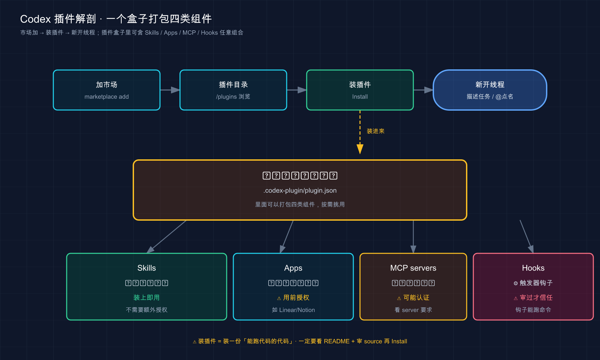

# 23 · 插件（Plugins）：一键装一整套能力，别再一个个手配

> 📚 **系列导航**：上一篇〔[22 Agent Skills 技能](22-skills.md)〕教你给 Codex 写「专项操作手册」——一个 skill 教它「这类活按这套步骤干」。但你写着写着会发现一个尴尬：skill、MCP 配置、app 集成这些好东西，全是「一件一件单独配」的散件。这一篇教你把它们打成**插件（plugin）**：一个包整体装、整体停、整体分享。下一篇〔[24 规则与钩子（Hooks）](24-hooks.md)〕再聊怎么给 Codex 装「自动触发的卡点」。

兄弟们，今天聊一件听起来很「锦上添花」、实际是刚需的事——**插件**。

都说插件嘛，不就是个「打包」的便利功能，可有可无，先把单个功能用熟再说？**说句实话，这判断反了。** 我自己踩过这个亏：2025 年四月我在一个项目里给 Codex 配了一套「拉数据库迁移、生成 schema 文档」的 skill，加上一个连内部工具的 MCP server，前后弄了俩小时。两周后换到另一个仓库想复用同一套——我对着旧项目的目录一个文件一个文件抄，结果漏了 `.mcp.json` 里一段环境变量配置，新项目里那个工具死活连不上，又排查了半小时。**散件管理，就是这么又累又容易漏。**

插件就是 Codex 给这个问题的官方答案：**把 skills、app 集成、MCP server 这些散件，打成一个能整体分发、能一键装卸的包**。你在 A 项目辛苦攒的那套能力，打成插件后，B 项目、同事的机器，一次安装全齐活——不用对着目录抄，不会漏。

**看完这一篇，你会拿到：**

- 插件到底打包了哪三类东西，以及它和「散装 skill」该怎么选，一张表说清
- 「插件目录（Plugin Directory）」怎么逛、怎么装，CLI 和桌面 App 两条路都给到
- 从 CLI 加一个市场、装一个插件、用 `@` 把它调起来，全程给命令和预期
- 插件包的目录长什么样（`.codex-plugin/plugin.json` + 各组件文件夹），自己想打包时照着摆
- 装第三方插件、信任插件里的 hook 之前，必须先过的那道「信任关」

> ⚠️ 下文凡涉及具体命令、配置项、目录路径、默认行为，都以 Codex [官方文档](https://developers.openai.com/codex/plugins) 为准；模型名、套餐、「即将上线」这类随版本变的东西，看到时以你本地实际显示为准，本篇不写死。

---

## 01 先搞懂：插件到底打包了个什么

先给结论：**插件就是一个「自包含的文件夹」，把可复用的工作流——skills、app 集成、MCP server——打包在一起，能当成一个整体来装、来停、来分享。**

为什么需要它？因为散装配置有三个绕不开的痛点：**跨项目复用麻烦、团队共享靠人肉、更新没法统一推**。你在一个项目里配好的 skill 加 MCP，想搬到另一个项目，只能手动复制粘贴；想分给同事，得把每个文件说清放哪儿、哪段配置要改。插件就是把这一整套「装进一个盒子」，盒子整个搬走、整个递给别人就行。

**类比：宜家的一整套「样板间打包」。** 你看中样板间里那套书房——书桌、书架、台灯、收纳盒，要是散着买，你得逐件找货号、对尺寸、自己拼一遍布局；宜家直接给你打成一个「书房套装」，一个订单到手、按图拼好就是样板间那个样。Codex 的插件就是这套思路：**把零散的能力打成一个套装，一次装齐，不用自己一件件配齐再调关系。**

官方把插件能装的东西讲得很明确，就三类，我替你浓缩成一张表：

| 组件 | 它是什么 | 装进来后怎么用 |
|------|---------|--------------|
| **Skills（技能）** | 针对特定活的可复用指令，Codex 按需加载，照着步骤和参考脚本干 | 描述任务时 Codex 自动选用，或用 `@` 显式点名 |
| **Apps（应用集成）** | 连 GitHub、Slack、Google Drive 这类工具的通道，让 Codex 能读信息、做操作 | 装时或首次用时按提示在 ChatGPT 里授权 |
| **MCP servers** | 给 Codex 接更多工具或共享信息的服务，常来自本地项目之外的系统 | 可能需要额外配置或认证后才能用 |

注意看，**Codex 插件打包的是这三类**——skill、app、MCP。这点跟前面几篇的工具线一脉相承：第 22 篇教你写 skill，前面讲过 MCP，而 app 集成是 Codex 把外部服务（Gmail、Drive、Slack）接进来的方式。插件做的事，就是把它们三个**捆成一捆**。

那它和「单写一个 skill」该怎么选？按官方文档的建议判断逻辑：**还在一个仓库、一条个人工作流里来回改，就先用本地 skill；想跨团队共享、想把 app 集成和 MCP 配置一起打包、想发一个稳定的版本化包了，才上插件。**

| 维度 | 散装 skill（本地自用） | 插件（plugin） |
|------|---------------------|---------------|
| **最适合** | 单仓库自用、个人工作流、快速试验 | 跨团队共享、打包 app + MCP、版本化发布 |
| **打包什么** | 通常就一个 skill | skills + apps + MCP，外加生命周期 hook |
| **怎么共享** | 手动复制文件给别人 | 通过市场或工作区分享，对方一键安装 |
| **能不能版本化** | 不强调 | 有 `version` 字段，按版本发布 |

判断逻辑就一句话：**自己一条工作流随手用，散装 skill 就够了；要给别人用、要把一堆配置打成一包、要能发版本，才上插件**。别一上来就为一个一次性 skill 造插件，那是过度工程。

> 💡 一句话总结：Codex 插件就是把 skills、app 集成、MCP server 打成一个能整体装卸的套装盒；**单条工作流自用写 skill 就行，要共享、要打包一堆配置、要发版本才打成插件**。

---

## 02 为什么打成一个包，比散着放强

上一节讲了「是什么」，这一节补一刀「凭什么值得」——因为光知道概念，你可能还是觉得「我手动复制几个文件也不费事」。

真正的差距在三个地方，结合具体场景讲，你就懂了。

**第一，跨项目复用。** 就拿我开头那个翻车说事：一套「拉迁移 + 生成 schema 文档」的 skill 加一个连内部工具的 MCP，散装时换项目就得把 `skills/` 和 `.mcp.json` 挨个抄，一旦漏了 MCP 里那段环境变量，新项目里工具直接连不上。**打成插件之后，新项目里从市场一装就齐，配置一个字都不会漏。**

**第二，团队共享。** 散装配置分享给同事，基本靠「你把这个文件夹拷过去，skill 放这儿，MCP 那段记得加进配置」——一通口头交代，对方十有八九配错。插件不一样：**你把它发到一个市场（哪怕是仓库内部的私有市场），或者在 Codex App 里直接分享给工作区成员，对方点一下就装好，配置完全一致**，不存在「我这能跑你那不行」。

**第三，统一管理与发版本。** 插件带 `version` 字段，是个能版本化的正经包；装好后每个插件的开关、它带的 MCP server 要不要启用、工具审批怎么设，都能在你自己的 Codex 配置里单独调，**不用动插件本体**。散装配置改一处，用过的人根本不知道，只能你挨个喊。

**类比：手机里「描述文件 / 配置档」一键装。** 公司给你配工作手机时，不会让你手动一项项设 Wi-Fi、邮箱、VPN、证书——发你一个「配置描述文件」，点一下，全套设置一次性写进去，要收回时整个描述文件一删就干净。插件之于一堆散配置，就是这个描述文件之于一项项手动设置——**一次装齐、统一管、整体撤**。

对照一下散装和插件在这三件事上的差距：

| 你要干的事 | ❌ 散装配置 | ✅ 插件 |
|-----------|-----------|--------|
| 搬到新项目 | 手动复制每个文件，容易漏 MCP/环境变量 | 从市场一装，整套到位 |
| 给同事用 | 口头交代放哪、哪段要改 | 发市场或工作区分享，对方一键装 |
| 后续管理 | 改一处没法通知，只能人肉喊 | 带版本号，开关和审批在配置里统一调 |

说句实话，**单人单项目，插件的好处你感受不深；一旦人多了、项目多了、还掺了 app 和 MCP，散装就开始拖后腿**。带团队之后往往就会彻底转向插件——光是「新人入职配一套内部工具」这一项，就能从半小时口头教学压到一条安装命令。

> 💡 一句话总结：插件的真正价值在「规模」——**跨项目复用、团队共享、统一管理发版本**这三件事，散装全靠人肉，插件全是一键；人和项目越多、配置越杂，这差距越大。

---

## 03 插件目录：Codex 自带的「应用商店」

知道了插件是什么，下一个问题是：**别人造好的插件，我从哪儿拿？** 答案是「插件目录（Plugin Directory）」——Codex 内置的、能逛能装的那个界面。

它把插件分成三组，名字记住，以后一看就懂：

**类比：手机应用商店里的三个分区。** 一个是「编辑推荐」（官方精挑细选给所有人看的），一个是「家人共享 / 团队共享」（你工作区里别人分享给你的），还有一个是「我的 App」（你自己上架或加进来的）。Codex 的插件目录正好对上：

| 分区 | 里面是啥 |
|------|---------|
| **Curated by OpenAI（OpenAI 精选）** | OpenAI 挑过、向所有 Codex 用户开放的插件，最稳 |
| **Shared with you（分享给你的）** | 你 ChatGPT 工作区里其他成员分享给你的插件 |
| **Created by you（你创建的）** | 你自己创建、或加进自己工作区的插件 |

逛和装有两条路，桌面 App 和 CLI 都能干，挑你顺手的：

**桌面 App：** 打开 Codex App 里的 **Plugins** 面板，直接浏览、搜索、安装精选插件，点详情里的加号或 **Add to Codex** 就装上了。

**CLI：** 启动后敲下面这条打开插件浏览器（注意是**复数 `plugins`**）：

```text
codex
/plugins
```

CLI 的插件浏览器按「市场（marketplace）」分组，用市场标签页切换不同来源；点开一个插件看详情，能装能卸；在已安装的插件上按 <kbd>Space</kbd> 键可以切换它的启用状态（装着但临时关掉）。

装好之后怎么用？官方给了两种调用方式，对应两种心态：

- **直接描述你要的结果。** 比如「总结今天 Gmail 里未读的邮件」「从 Google Drive 拉最新的发布说明」——你说要什么结果，让 Codex 自己挑该用哪个已装工具。
- **用 `@` 点名某个插件或它的某个 skill。** 当你明确知道该用哪个插件、哪个 skill 时，输入 `@` 显式调起来，不让 Codex 自己猜。

这个 `@` 你应该眼熟——第 22 篇讲 skill 时就是用它显式调用的。**插件里打包的 skill，调用方式跟单写的 skill 一样**，只是它来自一个插件套装而已。

> 💡 一句话总结：插件目录是 Codex 自带的应用商店，分「OpenAI 精选 / 分享给你的 / 你创建的」三区；**桌面 App 点 Plugins、CLI 敲 `/plugins` 都能逛能装，装完描述任务让它自己选、或用 `@` 点名调用**。

---

## 04 装一个插件，权限和数据怎么走

`/plugins` 里点一下「安装」就完事了？没那么简单——这一节得把「装插件 ≠ 自动放权」这件事讲透，**这是新手最容易想当然的地方**。

官方把原则说得很清楚：**装了插件，只是让它的工作流在 Codex 里可用，但你原有的审批设置照样管着它**。换句话说，插件不会因为「装上了」就绕过你第 15 篇配的那套权限、第 16 篇守的那条安全线。

具体到三类组件，进场节奏不一样：

| 组件 | 装上之后 |
|------|---------|
| **Skills** | 一装上**立即可用**，不需要额外授权 |
| **Apps** | 可能在装时或**首次使用时**，提示你去 ChatGPT 里安装或登录那个 app |
| **MCP servers** | 可能需要**额外配置或认证**之后才能用 |

看出来没？**skill 是「装上就能用」，app 和 MCP 是「用之前可能还要你授权一道」**。所以装完一个插件，你得知道它带了哪几类东西，才知道还差不差一步授权。

还有一句数据相关的，得记死：**当 Codex 通过插件里打包的某个 app 发送数据时，那个 app 自己的条款和隐私政策就生效了**。也就是说，插件接的外部服务（GitHub、Slack、Drive），数据怎么用归它们各自的政策管，这跟你信不信任这个外部服务直接挂钩。

**类比：给家里装智能门锁 App，授权是分步给的。** 你装好一个智能家居 App（插件本体装上了），但它要联动门锁，还得你单独在门锁那边扫码配对授权（app 集成的首次授权）；它要调摄像头云存储，又是另一道账号登录（MCP 的额外认证）。**装 App 是一步，把每个外部设备的权限交出去是另外几步**——插件这套权限模型就是这样，装是装、授权是授权，分得清清楚楚。

不想要某个插件了，两种处理方式：

- **彻底卸载：** 在插件浏览器里重新打开它，选 **Uninstall plugin**。注意——**卸载只移除插件本体，它装的那些 app 在 ChatGPT 里还留着，得你自己去 ChatGPT 里单独管。**
- **留着但关掉：** 想保留插件、只是暂时不用，去 `~/.codex/config.toml` 把它那条设成 `enabled = false`，然后重启 Codex：

```toml
[plugins."gmail@openai-curated"]
enabled = false
```

留意那个 key 的写法——`插件名@市场名`，`gmail` 是插件、`openai-curated` 是它所在市场。CLI 里在已装插件上按 <kbd>Space</kbd> 切启用状态，跟改这个配置是一回事。

> 💡 一句话总结：装插件不等于自动放权——skill 装上即用，app 和 MCP 用前可能还要你单独授权，**原有审批设置照样管着插件**；不想用了卸载只删本体、想留着就在 `config.toml` 里设 `enabled = false` 重启。

---

## 05 动手：加一个市场、装一个插件、用起来

光看不练假把式。下面带你**从 CLI 加一个市场、装一个本地插件、用 `@` 调起来**，全程不依赖复杂环境，跟着抄就行。

不同于桌面 App 点点点，CLI 里管市场用的是 `codex plugin marketplace` 这一组子命令——**它是终端命令，不是会话里的斜杠命令**，注意别敲混了。

**第一步：加一个市场**

最常用的是从 GitHub 加。把 `owner/repo` 换成实际的 GitHub 仓库名：

```bash
codex plugin marketplace add owner/repo
```

官方还支持别的来源和参数，按需取用：

```bash
codex plugin marketplace add owner/repo --ref main
codex plugin marketplace add https://github.com/example/plugins.git --sparse .agents/plugins
codex plugin marketplace add ./local-marketplace-root
```

来源可以是 GitHub 简写（`owner/repo` 或 `owner/repo@ref`）、HTTP/HTTPS 的 Git URL、SSH 的 Git URL，或者本地市场根目录。`--ref` 用来钉住某个 Git ref；`--sparse PATH` 让 Git 市场仓库走稀疏检出，且只对 Git 来源有效。

**预期**：Codex 把这个市场登记下来，之后它就成了插件目录里一个可选的来源。**这一步一个插件都没装**，只是让你看得到这个货架。

**第二步：看看现在登记了哪些市场**

```bash
codex plugin marketplace list
```

**预期**：列出 Codex 正在考虑的每个市场，以及它解析出来的根路径——包括本地默认市场和已配置的市场快照。**看到你刚加的市场在列 = 加对了。**

顺带认一下另外几条管理命令（先记着，用到再敲）：

```bash
codex plugin marketplace upgrade                 # 刷新所有市场
codex plugin marketplace upgrade marketplace-name # 刷新指定市场
codex plugin marketplace remove marketplace-name  # 移除指定市场
```

**第三步：打开插件浏览器，装一个插件**

进会话开插件浏览器：

```text
codex
/plugins
```

**预期**：弹出按市场分组的插件浏览器，用市场标签页切到你刚加的那个市场。点开一个插件看详情，选 **Install plugin** 安装。

**第四步：用 `@` 把插件调起来**

官方明确说了——**装完插件，开一个新线程（new thread）再让 Codex 用它**。然后在输入框直接描述任务，或者输入 `@` 点名这个插件 / 它的某个 skill：

```text
@<插件名或其 skill>
```

**预期**：Codex 调起这个插件对应的能力。如果它带的是 app 或 MCP，可能在这时提示你去 ChatGPT 授权或先做认证——按提示走完，就能用了。

跑通这几步，你就把「加市场 → 装插件 → 调用」这条完整链路亲手验证了一遍。**以后装任何插件，本质都是这套流程；桌面 App 只是把这几步换成了图形界面的点按。**

> ⚠️ 如果装完 `@` 调不起来，先确认你是**新开了一个线程**再调的（官方要求装后新起线程）；带 app/MCP 的还要确认授权 / 认证那一步走完没。

> 💡 一句话总结：CLI 里加市场用 `codex plugin marketplace add`（终端命令）、装插件在 `/plugins` 里选 Install、调用开新线程后描述任务或 `@` 点名——**亲手把这条链路跑一遍，比记十条命令都管用**。

---

## 06 想自己打包？先认识插件包的目录长相

前面全是「用别人的插件」，但你迟早会想「我能不能把自己那套 skill 加 MCP 也打成插件」。这一节不教你从零造一个发布级插件（那是单独的量），只带你**认住插件包的目录长什么样**，做到看得懂、心里有数。

先说最省事的路子：官方内置了一个 `@plugin-creator` skill，**专门用来搭插件脚手架**——它能生成必需的 `.codex-plugin/plugin.json` 清单，还能帮你生成一个本地市场条目用来测试。已经有插件文件夹了，也能用它把插件接进本地市场。想动手，从它起步最快。

手动看的话，一个插件的核心就两部分：**一个「身份证」清单 + 各组件的文件夹**。

**身份证**就是 `.codex-plugin/plugin.json`，最小形态长这样：

```json
{
  "name": "my-first-plugin",
  "version": "1.0.0",
  "description": "Reusable greeting workflow",
  "skills": "./skills/"
}
```

其中 `name` 最关键——**它就是插件的标识符和组件命名空间**，官方要求用 kebab-case（小写加连字符，如 `my-first-plugin`）写一个稳定的名字。`skills`、`mcpServers`、`apps`、`hooks` 这几个字段，分别指向打包进来的对应组件，路径相对插件根目录、以 `./` 开头。

**各组件的文件夹**就摆在插件根目录下，按类型分门别类。官方的结构约定我整理成一张表，照着摆就对：

| 你想加什么 | 放到哪里 | 清单里对应字段 |
|-----------|---------|--------------|
| skill | `skills/<名字>/SKILL.md` | `skills` |
| 生命周期 hook | `hooks/hooks.json` | `hooks`（用默认路径可省） |
| MCP server 配置 | 根目录的 `.mcp.json` | `mcpServers` |
| app / 连接器 | 根目录的 `.app.json` | `apps` |
| 图标、截图等素材 | `./assets/` 下 | 在 `interface` 里引用 |

整个插件摆起来大概长这样：

```text
my-first-plugin/
├── .codex-plugin/
│   └── plugin.json        ← 身份证，只有它放这儿
├── skills/
│   └── hello/
│       └── SKILL.md
├── .mcp.json              ← MCP 配置，根目录
├── .app.json             ← app 集成，根目录
└── hooks/
    └── hooks.json
```

这里有个**官方明确强调、新手必踩的坑**，我替你画重点：

> 只有 `plugin.json` 属于 `.codex-plugin/`。把 `skills/`、`hooks/`、`assets/`、`.mcp.json`、`.app.json` 都放在插件根级别。

说白了：**`.codex-plugin/` 这个文件夹里只准放 `plugin.json` 一个东西**，其他组件文件夹全部摆在插件根目录下，跟 `.codex-plugin/` 平级。这个坑第一次打包很容易踩——一旦把 `skills/` 塞进了 `.codex-plugin/`，插件可能加载了但 skill 死活不出现，排查半天才发现是位置摆错。

还有两个省心的小默认值，记一下：

- **hooks 用默认路径可以不写字段。** 如果你的 hook 就存在 `./hooks/hooks.json`，清单里**不用**再写 `hooks` 字段，Codex 会自动检查这个默认文件。
- **发布级清单比这丰富得多。** 真正要发出去的插件，清单里通常还带 `author`、`homepage`、`license`，以及一个 `interface` 对象（控制显示名、描述、图标、品牌色、起始提示这些「上架展示」信息）。这些字段都是可选的，自己测着玩用最小清单就够。

你可能注意到，这套目录结构跟第 22 篇讲的 skill 目录、前面讲的 MCP `.mcp.json` 几乎一模一样。**这不是巧合**——插件本质就是「把你散落各处的那些配置，按同样的格式收进一个独立文件夹」。所以官方才说「还在一个仓库里迭代就先用本地 skill，要共享了再打成插件」，因为格式是相通的，搬过去就行。

> 💡 一句话总结：插件 = `.codex-plugin/plugin.json`（身份证，`name` 用 kebab-case 定命名空间）+ 根目录下的各组件文件夹；**记死那条铁律——`.codex-plugin/` 里只放 `plugin.json`，skills / hooks / `.mcp.json` / `.app.json` 全摆根目录**；起步用 `@plugin-creator` 搭脚手架最快。

---

## 07 信任关：插件能跑代码，hook 还得你单独点头

这是全篇最该慎重的一节，**也是新手最容易掉以轻心的地方**。前面那些便利，都建立在一个前提上：**你信任这个插件的来源**。

回想第 16 篇讲的安全判断力——那一篇的本事，到了插件这儿一样要用上。原因很直接：一个插件里可能带 **app 集成**（能读写你的外部账号）、带 **MCP server**（自动可用的外部工具）、带 **生命周期 hook**（在特定事件自动跑脚本）。这些东西一旦启用，就在你的权限边界里活动。

但 Codex 在这儿留了一道我特别想点赞的设计——**hook 不会因为你装了、启用了插件就自动被信任**。官方原文意译：

> （官方原文意译）安装或启用插件不会自动信任它的 hook。插件打包的 hook 属于非托管（non-managed）hook，所以在用户审阅并信任当前 hook 定义之前，Codex 会跳过它们。

这句话的分量在哪？**它意味着哪怕你手滑装了个带恶意 hook 的插件，那个 hook 也不会立刻跑**——Codex 会卡住，等你亲眼审过这段 hook 定义、确认信任了才放行。这道「装了也不自动信」的闸门，是插件安全里最关键的一层。关于 hook 的事件、信任审阅这套机制，下一篇〔[24 规则与钩子（Hooks）](24-hooks.md)〕会专门讲透，这里你先记住「插件带的 hook 默认不被信任」这个结论。

**类比：收到陌生人寄来的智能音箱，插电不等于联网。** 你收到一台没听过的牌子的智能音箱，插上电它能亮灯（插件装上、skill 可用），但它想连你家 Wi-Fi、想访问你的账号，**得你在 App 里一项项点「允许」**——不点，它就只是个亮灯的盒子，碰不到你的网络和数据。插件里的 hook 就是这个性质：**装进来了，但「准它自动跑」是你单独的一次点头**。

给你三条「装第三方插件前」的自检，值得当成硬规矩：

| 检查项 | 怎么做 |
|--------|--------|
| **来源可信吗** | 优先 OpenAI 精选区；工作区分享的看是谁分享的；陌生公开仓库的，没把握就别加它的市场 |
| **它带了什么** | 装前在插件详情里看清楚带不带 app / MCP / hook，分别意味着哪些权限 |
| **hook 审了吗** | 带 hook 的，在 Codex 提示信任时**逐条看懂再点信任**，别无脑放行 |

几个能让你稍微安心的官方设计：**工作区分享的插件留在你工作区和组织边界内**，没登进这个工作区的账号碰不到；**hook 默认不被信任**，要你审过才跑；**装插件不绕过你原有的审批设置**。但这些都不能替代你自己的判断——**核心还是那句「只从你信任的来源装」**。

最后补一句现状（随版本会变，以官方为准）：官方文档明确写着，**把插件加到官方公开插件目录、以及自助发布管理，目前还是「即将上线（coming soon）」**。也就是说现阶段第三方插件主要走「仓库市场」和「工作区分享」两条路分发，这反而让来源相对可控——你装的多半是自己团队或明确信任方给的，而不是一个完全开放的公海。

> 💡 一句话总结：插件能带 app、MCP、hook 进你的权限边界，但 Codex 给了关键一道闸——**插件里的 hook 默认不被信任，要你审过才跑**；装第三方前三查（来源、带了啥、hook 审没审），官方精选最稳，陌生来源宁可不装。

---

## 08 小结

这一篇我们把 Codex 的「插件」从概念捋到动手——**它本质就是把 skills、app 集成、MCP server 这些散件，打成一个能整体装卸、能分发、能版本化的套装盒**。

把核心要点串起来回顾：

| 你要做的事 | 用什么 | 关键点 |
|-----------|--------|--------|
| 理解插件是什么 | plugin = skills + apps + MCP 的套装 | 单条工作流写 skill，要共享/打包/发版本才打成插件 |
| 拿别人的插件 | 插件目录 | 三区：OpenAI 精选 / 分享给你的 / 你创建的 |
| 逛和装 | App 的 Plugins 面板 / CLI 的 `/plugins` | CLI 加市场用 `codex plugin marketplace add` |
| 调用插件 | 描述任务 或 `@` 点名 | 装后**新开线程**再用；app/MCP 可能要先授权 |
| 关掉某插件 | `config.toml` | `[plugins."名@市场"] enabled = false` 后重启 |
| 自己打包 | `.codex-plugin/plugin.json` + 组件文件夹 | `.codex-plugin/` 里**只放** `plugin.json`；`@plugin-creator` 搭脚手架 |
| 装第三方 | 信任三查 | 能带 app/MCP/hook；**hook 默认不被信任，审过才跑** |

下面这张图把本篇两条主线收在一起：左边「加市场 → 装插件 → 调用」的使用流，右边一个插件盒子打包的三类组件外加 hook，以及它们装进来后各自的「进场方式」。



这张图在干什么：上排是你作为「用户」从加市场到调用的四步使用流；下排是一个插件盒子里到底打包了什么——三类组件加 hook，每个后面标着它的进场门槛，一眼看清「哪个装上就能用、哪个还要你再点一道头」。

**你现在应该能：** 看懂插件和散装 skill 该怎么选、用「加市场 → 装插件 → `@` 调用」从插件目录拿到现成能力、看懂装插件时 app/MCP/hook 各自的授权门槛、认住插件包的目录长相，并且清楚装第三方插件、信任它的 hook 之前必须先过的那道关。**这套能力让你不用什么都自己从零配——市场上现成的套装，拿来即用。**

从第 11 篇的 `AGENTS.md`、到 MCP、到第 22 篇的 skill，再到这一篇用插件把它们打包统管——你给 Codex「加 buff」的工具，到这儿基本配齐了。

---

下一篇 **24「规则与钩子（Hooks）」**——这一篇我反复提到「插件里的 hook 默认不被信任、要你审过才跑」，但 hook 本身到底是个啥、能卡在哪些事件上、那段「信任审阅」具体长什么样，还没展开。下一篇就专门聊它：**怎么给 Codex 装上「自动触发的卡点」**——在它读文件、跑命令、开会话这些时刻自动插一脚，把规矩从「靠它自觉」变成「机器强制」。想想看：如果每次提交前都能自动跑一遍检查、不靠你记着，是不是踏实多了？
