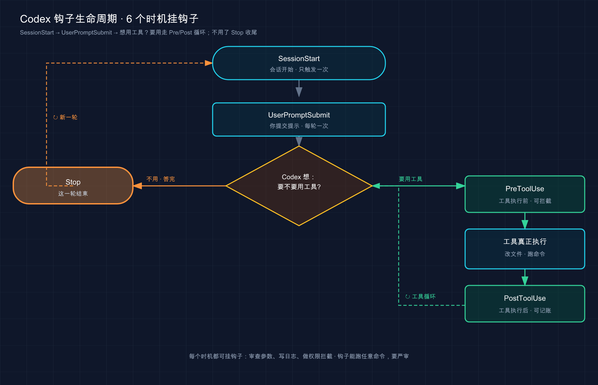
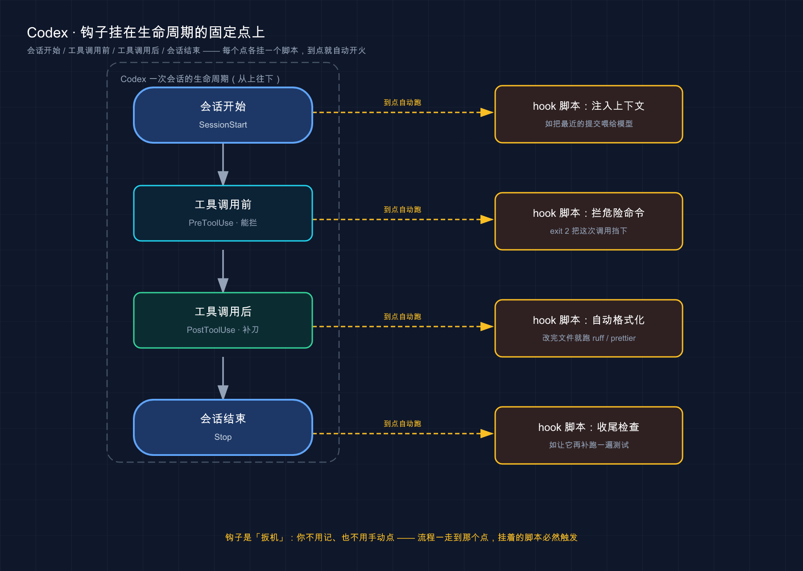

# 24 · 规则与钩子（Rules & Hooks）：给 Codex 装上「卡点」和「扳机」

> 📚 **系列导航**：上一篇〔[23 插件（Plugins）](23-plugins.md)〕教你把别人打包好的能力一键装进 Codex。这一篇聊两件更底层、也更「你说了算」的事——**规则（Rules）管「哪些命令能在沙箱外跑」，钩子（Hooks）管「在干活流程的某个固定点自动替你跑一段脚本」**。一个是闸门，一个是扳机，配好了，很多「每次都得盯着、每次都得手敲」的破事就再也不用你操心了。下一篇〔[25 Worktrees 并行隔离](25-worktrees.md)〕再讲怎么让多个 Codex 各干各的、互不打架。

先还原一段我上个月真实发生的对话。我跟同事在排查一个 CI 老挂的问题：

> 我：「这周我让 Codex 改完代码，手动补敲 `ruff format` 的次数，少说也有十几回了。」
> 同事：「你 AGENTS.md 里不是写了『改完记得格式化』吗？」
> 我：「写了啊。可它三次里总有一次想不起来——那是**请求**，又不是**保证**。漏一次，CI 的格式检查就把我打回来重跑一遍。」
> 同事：「那你挂个钩子啊。事件一触发，脚本必跑，跟它记不记得没关系。」

就这一句点醒我。回去配了一个 `PostToolUse` 钩子，从那以后 Codex 每改完一个文件，格式化自动跑，**再没手敲过一次，也再没被 CI 打回来过**。这一篇，就把规则和钩子这俩东西，从「是什么」一路讲到「怎么配、怎么调」。

**看完这一篇，你会拿到：**

- 一句话说清规则和钩子各管什么、为啥它们能做到 AGENTS.md 做不到的「确定性」
- 规则（`.rules` 文件 + `prefix_rule`）怎么写，让某条命令「永远放行」或「直接禁掉」，怎么用 `codex execpolicy check` 先验后用
- 钩子配在哪几个文件、生命周期里有哪些「时机」（`PreToolUse` / `PostToolUse` / `Stop` / `SessionStart` 等）能挂
- Codex 钩子特有的**信任机制**——为什么新钩子默认不跑，得你在 `/hooks` 里先「过目签字」
- 钩子和 Codex 怎么对话（stdin 的 JSON、退出码、stdout 的 JSON），以及和 Claude Code 几个**反直觉的差异**
- 两个能直接抄走的真实例子：改完自动格式化、拦危险命令；外加钩子不触发时怎么查

> ⚠️ 下文凡涉及具体命令、配置项、默认值，都以 Codex 官方文档（[Hooks](https://developers.openai.com/codex/hooks) / [Rules](https://developers.openai.com/codex/rules)）为准。**规则（Rules）官方标注为「实验性，可能变化」**，配置项名字和行为随版本可能调整，看到时以你本地实际为准。

---

## 01 先分清：规则管「闸门」，钩子管「扳机」

开篇先把这俩的分工钉死，因为名字都挺抽象，新手最容易糊在一起。

- **规则（Rules）** 解决的是「**这条命令到底准不准在沙箱外跑**」——它是一道**闸门**，盯着你想执行的命令，按你写死的规矩判「放行 / 先问 / 直接禁」。
- **钩子（Hooks）** 解决的是「**干活流程走到某个点，自动替我跑段脚本**」——它是一个**扳机**，挂在生命周期的固定时机上，事件一到就开火，跟 Codex 自己想不想干没关系。

**类比：小区门口的两套东西——门禁卡规则，和自动感应灯。** 门禁系统里存着一张「谁能进、谁要登记、谁直接拦」的名单，这就是**规则**：每次有人刷卡，它对着名单判一下。而楼道里那盏「人一走过就亮」的感应灯，是**钩子**：它不关心你是谁、要去哪，只要「有人经过」这个事件发生，灯就必然亮。一个在**判断准入**，一个在**自动响应**——两件事，别混。

那它们和你已经会写的 AGENTS.md（项目说明书，第 [11](11-agents-md.md) 篇讲过）差在哪？差在一个**根本点**：

> 写进 AGENTS.md 的，是**请求**；配成规则或钩子的，是**保证**。

说白了：

- **AGENTS.md 里写「改完记得格式化」「别碰生产库」**——这是你**拜托** Codex 做的事，它大概率照办，但每一步都在「自己判断」，**可能漏、可能忘**。
- **配成钩子的格式化、配成规则的禁令**——只要那个条件触发，动作**一定**执行（或一定被拦），跟 Codex 想不想、记不记得没半点关系。

这就是开头那段对话的核心：「改完跑格式化」写在 AGENTS.md 里是请求，三次漏一次；配成钩子是保证，一次不漏。

几个你大概率会遇到、值得「上保证」的场景，先感受一下：

- **「`gh pr view` 这条命令我天天用，别每次都弹审批问我」**——用规则给它开个「永远放行」的口子
- **「`rm -rf`、`git push --force` 这种，谁来都给我硬拦死」**——用规则或钩子确定地拦住，不靠提示
- **「每次改完文件，自动跑格式化 / lint」**——用钩子，别再手敲，也别指望它自觉

> 💡 一句话总结：规则是「准不准跑某条命令」的闸门，钩子是「到某个时机自动跑脚本」的扳机；它俩的共同价值，是把 AGENTS.md 里的**请求**升级成必然兑现的**保证**。

---

## 02 规则（Rules）：给单条命令立规矩

> ⚠️ **实验性，可能变化。** 规则是 Codex 官方明确标注的实验功能，下面的字段和行为以官方为准。

先说规则解决的痛点。第 [15](15-permissions.md) 篇讲过，沙箱是「按圈划」的**粗**边界——圈里随便动、出圈就问。但有时候你想要的是**按命令**的精细控制：「`gh pr view` 哪怕出圈也直接放行，别烦我」「`grep` 一律禁掉，逼我自己用 `rg`」。这种需求，扩大整个沙箱太粗暴，写一条规则才对症。

**类比：给保安一张「特批 / 拉黑」名单。** 沙箱是保安的默认守则（「陌生人一律先登记」），规则是你额外塞给他的两张小条子：一张写「这几个老熟人放进来，别拦」，一张写「这几个人来了直接轰走」。保安照着名单办，比每次都临时问你省事，也比「把大门拆了」安全。

它真实会用在哪：

- 团队里 `gh`、`make test` 这类高频只读命令，开个白名单口子，省掉每天几十次审批点击
- 把 `grep`、`find` 这类有更好替代品的命令标成禁用，强制大家走 `rg`、`fd`
- 公司层面把 `rm -rf /`、改 `~/.ssh` 这类高危前缀直接 `forbidden`，焊死团队红线

### 规则文件长什么样、放哪

规则写在 **`.rules` 文件**里，这文件要放在某个**生效配置层旁边的 `rules/` 文件夹**下，最常用的是用户级 `~/.codex/rules/default.rules` 。语法看着像 Python，**实际是 Starlark**（一种「能安全执行、不会乱碰你文件系统」的配置语言）。

一条最简单的规则长这样——「`gh pr view` 出沙箱前先问我一声」：

```python
# 运行带 `gh pr view` 前缀的命令前，先弹审批问我。
prefix_rule(
    # 要匹配的命令前缀（按参数逐个写）。
    pattern = ["gh", "pr", "view"],

    # 匹配到时的动作：allow（直接放行）/ prompt（先问）/ forbidden（直接拦死）。
    decision = "prompt",

    # 可选：写清这条规则为什么存在，审批弹窗里可能给你看。
    justification = "查看 PR 允许，但要我点头",

    # 可选的「内联单元测试」：举例哪些命令该命中、哪些不该，加载时 Codex 会替你验。
    match = [
        "gh pr view 7888",
        "gh pr view --repo openai/codex",
    ],
    not_match = [
        # 不命中：pattern 必须是「精确前缀」，这条把 view 挪后面了。
        "gh pr --repo openai/codex view 7888",
    ],
)
```

`prefix_rule` 里几个字段，挑最该懂的说：

| 字段 | 作用 | 备注 |
|---|---|---|
| `pattern`（必填） | 要匹配的命令**前缀**，按参数逐个列 | 元素可以是字面量 `"pr"`，也可以是「或」`["view", "list"]` |
| `decision`（默认 `allow`） | 命中后怎么办 | `allow` / `prompt` / `forbidden`，**最严的赢** |
| `justification`（可选） | 这条规则的理由 | 审批 / 拒绝时可能显示给你 |
| `match` / `not_match`（可选） | 举例验证规则对不对 | 加载时 Codex 替你跑，提前抓写错 |

`decision` 三选一，优先级官方写死——**最严的赢**（`forbidden` > `prompt` > `allow`）：

| decision | 效果 |
|---|---|
| `allow` | 出沙箱直接跑，不问 |
| `prompt` | 每次匹配都先问你 |
| `forbidden` | 直接拦死，不问也不跑 |

写完 `.rules` 别忘了**重启 Codex** 才生效。还有个你会自然碰到的点：当你在 TUI 里手动把某条命令「加进允许列表」时，Codex 会自动帮你写进 `~/.codex/rules/default.rules` ——所以这个文件常常不是你纯手写的，而是用着用着自己长出来的。

### 一个救命的安全设计：复合命令会被拆开判

这条特别重要，第 [15](15-permissions.md) 篇点过，这里展开。碰到 `git add . && rm -rf /` 这种**把多条命令塞进一行**的，Codex 在安全的前提下会用 tree-sitter **把它拆成单条逐个判**，再取「最严的结果」：

```text
["bash", "-lc", "git add . && rm -rf /"]
```

会被拆成两条单独评估：

```text
["git", "add", "."]
["rm", "-rf", "/"]
```

**关键就在这**：哪怕你 `allow` 了 `git add`，那个 `rm -rf /` 也会被**单独拦下**，整条命令不会被「夹带过关」。这堵死了「把危险命令藏在安全命令屁股后面偷渡」的路子。

但要留个心眼——**只有「干净的线性命令链」才会被拆**。如果脚本里用了重定向（`>`）、变量替换（`$(...)`）、环境变量赋值（`FOO=bar`）、通配符（`*`）这些高级货，Codex **不会**去拆它，而是把整段当成一条 `bash -lc "<整个脚本>"` 来判。所以别指望规则能看穿任意复杂 shell——它在「安全可拆」时帮你细查，「拆不动」时保守对待。

### 改完规则，先用 `execpolicy check` 验一把

别上来就实战。改完规则文件，用 `codex execpolicy check` 拿一条命令试试它会怎么判：

```bash
codex execpolicy check --pretty \
  --rules ~/.codex/rules/default.rules \
  -- gh pr view 7888 --json title,body,comments
```

它会输出一段 JSON，告诉你**最严的判决是什么、命中了哪几条规则**（连 `justification` 一起带出来）。我自己写 `forbidden` 规则时养成了个习惯：**先用 `execpolicy check` 把「该拦的拦住、不该拦的别误伤」验一遍，再重启 Codex**。有次我图省事直接上，结果一条写宽了的 `forbidden` 把团队常用的 `git log` 也连带拦了，被同事吐槽半天——`execpolicy check` 跑一下本可以提前发现。

> 💡 一句话总结：规则用 `.rules` 文件里的 `prefix_rule` 给命令前缀立规矩（`allow`/`prompt`/`forbidden`，**最严的赢**）；复合命令会被安全地拆开逐条判、防夹带；改完先 `codex execpolicy check` 验、再重启生效。

---

## 03 钩子（Hooks）：有哪些「时机」能挂

规则讲完，转到钩子。钩子不是随便什么时候都能挂，它得挂在 Codex 干活流程里**特定的「时机」**上——官方叫**事件（event）**。想用好钩子，第一步就是认清「我想让这事在什么时候发生」。

回想第 [02](02-core-concepts.md) 篇讲的「代理循环」——Codex 干活是「想 → 做 → 看」转圈。这些事件，正好散布在这个循环的前前后后。先画张图，看几个最常用的事件卡在哪儿：



这张图把「想 → 做 → 看」摊开了：一进会话是 `SessionStart`，你说话是 `UserPromptSubmit`，然后进入「要不要用工具」的循环——每次动工具，前面有 `PreToolUse`、后面有 `PostToolUse`，这一轮答完就是 `Stop`。**你想让动作在哪一步发生，就挂对应的那个事件。**

Codex 支持的事件不止这几个（还有压缩前后的 `PreCompact`/`PostCompact`、子代理起停的 `SubagentStart`/`SubagentStop`、审批请求时的 `PermissionRequest` 等），但**对小白来说，先把下面这四个吃透，能覆盖九成场景**：

| 事件 | 什么时候触发 | 最典型的用法 |
|---|---|---|
| **`PreToolUse`** | 某个工具**执行前** | 拦危险命令、改写命令（**能阻止操作**） |
| **`PostToolUse`** | 某个工具产出结果**之后** | 改完文件自动格式化 / 跑 lint |
| **`Stop`** | Codex 答完这一轮 | 让它「再多跑一趟」（比如把没过的测试再修一遍） |
| **`SessionStart`** | 会话开始 / 恢复时 | 往上下文里注入项目状态（如最近的提交） |

第五个值得知道的是 **`PermissionRequest`**（将要弹审批弹窗时触发），能自动放行或拒绝——配合第 02 节讲的规则一起用，比单独靠规则更灵活，尤其适合「高频命令免审批」这种场景。

记这张表有个窍门：**看名字里的 `Pre` 和 `Post`**——`Pre` 是「之前」，所以只有它能在动作发生前**拦住**；`Post` 是「之后」，工具都跑完了，它撤不回已经产生的副作用，只能「事后补一刀」（格式化、记日志、把结果退回让模型重看）。



这张图把上面四个事件摊在 Codex 一次会话的生命周期上：**会话开始 / 工具调用前 / 工具调用后 / 会话结束**自上而下串成主轴，每个固定点旁边各挂一个 hook 脚本——流程一走到那个点，挂着的脚本就被「到点自动跑」拉起来，跟 Codex 记不记得没关系。这就是钩子「扳机」的本质：你只管挂上，开火由时机决定。

这里有个**易错点**得专门说：和 Claude Code 不同，Codex 这边 `Stop` 事件里 `decision: "block"` **不是「拒绝这一轮」**，而是反过来——它告诉 Codex「**别停，再来一轮**」，并把你给的 `reason` 当成下一条用户提示。`PostToolUse` 的 `decision: "block"` 也不撤销已经跑完的命令，而是把反馈塞回去让模型接着往下想。**Codex 的 `block` 在这两个事件上更像「续一轮 / 退回重看」，不是「否决」**，别按 Claude Code 的直觉理解。

> 💡 一句话总结：钩子挂在 Codex 生命周期的**特定事件**上；新手先吃透 `PreToolUse`（前，能拦）、`PostToolUse`（后，补刀）、`Stop`（答完，能续一轮）、`SessionStart`（开场）这四个；注意 Codex 的 `block` 在 `Stop`/`PostToolUse` 上是「续 / 退回」而非「否决」。

---

## 04 钩子配在哪、`matcher` 怎么把它收窄

知道了能挂哪些事件，来看怎么写、写哪。

### 钩子放在哪几个文件

Codex 找钩子的地方有两种形态：**独立的 `hooks.json`**，或 **`config.toml` 里内联的 `[hooks]` 表**。官方说最常用的四个位置是：

| 配置文件 | 生效范围 | 能共享给团队吗 |
|---|---|---|
| `~/.codex/hooks.json` | **你所有项目** | 否，只在你这台机器 |
| `~/.codex/config.toml` | **你所有项目** | 否 |
| `<repo>/.codex/hooks.json` | **仅当前项目** | **是**，可提交进 git |
| `<repo>/.codex/config.toml` | 仅当前项目 | **是** |

逻辑和第 [15](15-permissions.md) 篇讲配置时一样：**全队都该有的钩子（比如「改完一律格式化」）写进项目的 `.codex/` 提交进 git；只是你自己想要的写进 `~/.codex/`**。两个细节记一下：

- **多个来源的钩子会全部加载、一起跑**——高优先级的配置层**不会替换**低优先级的钩子，是叠加关系。
- **同一层里别同时写 `hooks.json` 和内联 `[hooks]`**，Codex 会合并但会在启动时警告你，官方建议一层只用一种写法。
- **项目级钩子只在这个 `.codex/` 层被「信任」时才加载**（信任是什么，下一节讲）；不信任的项目里，Codex 仍会加载你的用户级和系统级钩子。

### 钩子配置长什么样

先看一个最小的完整例子——**「每次 Codex 用 Bash 跑完命令，触发一个脚本」**，写进项目根的 `.codex/hooks.json`：

```json
{
  "hooks": {
    "PostToolUse": [
      {
        "matcher": "Bash",
        "hooks": [
          {
            "type": "command",
            "command": "/usr/bin/python3 \"$(git rev-parse --show-toplevel)/.codex/hooks/post_tool_use.py\"",
            "timeout": 30,
            "statusMessage": "Reviewing Bash output"
          }
        ]
      }
    ]
  }
}
```

别被嵌套吓到，它就三层，对着拆一下你立刻懂：

1. **`"PostToolUse"`**——挂哪个**事件**（这里：工具产出结果后）。
2. **`"matcher": "Bash"`**——**收窄到哪个工具**才触发（这里：只在 `Bash` 之后）。
3. **里层的 `hooks` 数组**——真正要跑的**动作**：`"type": "command"` 表示跑一条 shell 命令，`"command"` 就是那条命令。

这里有几个 Codex 特有的、**最容易想当然写错的默认值**，挑出来钉死：

- **`timeout` 的单位是「秒」，不是毫秒**；省略不写时，默认是 **600 秒**。
- **目前只有 `type: "command"` 的处理器真会跑**；`prompt` 和 `agent` 类型「能被解析但会被跳过」；`async: true` 的也会被跳过（异步钩子还没支持）。
- **同一事件上有多个匹配钩子时，它们是并发启动的**——你的拦截钩子不会阻止另一个同事件匹配钩子同时跑。这是 Codex 和 Claude Code 的又一差异点：写 `PreToolUse` 拦截逻辑时，别以为它能「先跑完再决定其他钩子跑不跑」。
- **命令的工作目录是会话的 `cwd`**。所以仓库内的钩子，官方建议**别用 `.codex/hooks/...` 这种相对路径**，因为 Codex 可能从子目录启动——用 `$(git rev-parse --show-toplevel)` 从 git 根算绝对路径才稳（上面例子就是这么写的）。
- **Windows 想用不同命令**，加一个可选的 `command_windows`（TOML 里也可写 `commandWindows`）字段覆盖。

> ⚠️ 这里要把和 Claude Code 的几个**差异**点透，免得你拿那边的笔记照抄踩坑：Codex 钩子的 `timeout` 是**秒**（Claude Code 是毫秒），没有 `$CLAUDE_PROJECT_DIR` 这个变量（用 git 根代替），也**没有 `disableAllHooks` 这种一键全关开关**（要关就改 `[features] hooks = false`）。同名不同义，别混。

写成 `config.toml` 内联 TOML 是等价的，长这样：

```toml
[[hooks.PostToolUse]]
matcher = "^Bash$"

[[hooks.PostToolUse.hooks]]
type = "command"
command = '/usr/bin/python3 "$(git rev-parse --show-toplevel)/.codex/hooks/post_tool_use.py"'
timeout = 30
statusMessage = "Reviewing Bash output"
```

### `matcher`：让钩子「只在该触发的时候触发」

`matcher` 是钩子配置里**最该搞懂的一个字段**。一句话：**没有它，钩子会在那个事件的「每一次」都触发；有了它，你能把范围收窄**。

**类比：还是楼道那盏感应灯——你得圈定它的感应范围。** 灯如果整层楼都感应，那隔壁单元有人走动它也亮，纯浪费电。你得把感应区圈在「**只有自家门口**那段过道」。`matcher` 干的就是这个「圈定范围」的活。

Codex 的 `matcher` 和 Claude Code 有个关键区别：**它是一个正则表达式（regex）字符串**。对工具类事件（`PreToolUse`/`PostToolUse`），它匹配的是**工具名**。写法看这张表：

| 你写的 matcher | 含义 | 例子 |
|---|---|---|
| `"Bash"` | 匹配 Bash 工具 | 只在跑 Bash 命令时触发 |
| `"^apply_patch$"` | 用正则精确匹配 | 只在改文件时触发 |
| `"Edit\|Write"` | 改文件的别名（`\|` 是正则的「或」） | 只在编辑 / 写文件之后触发 |
| `"mcp__filesystem__.*"` | 正则匹配一批 MCP 工具 | 这个 MCP server 的所有工具 |
| `"*"` / `""` / 省略 | **匹配所有** | 该事件每次发生都跑 |

几个**新手最容易栽的坑**：

- **改文件的工具名是 `apply_patch`，不是 `Edit`/`Write`**。Codex 改文件走的是 `apply_patch` 机制——你在 `matcher` 里可以用 `Edit`、`Write`、`apply_patch` 任意一个来匹配它（互为别名），但钩子收到的 stdin 里 `tool_name` 始终报的是 `"apply_patch"`。想在脚本里判断工具名，记得认 `apply_patch`。
- **不是所有事件都认 `matcher`**。`UserPromptSubmit` 和 `Stop` 这俩**无视 `matcher`**，你写了也被忽略，因为它们没有「工具名」这种东西可筛，总是每次都触发。`SubagentStop` 则不同，它的 `matcher` 作用于 `agent_type`，是支持的——别把 `SubagentStop` 和 `Stop` 混在一起理解。`SessionStart` 的 `matcher` 匹配的不是工具名，而是「会话怎么起来的」（`startup`/`resume`/`clear`/`compact`）。
- **`PreToolUse` 拦不住所有命令**。官方说得很直白：它是「护栏，不是密不透风的强制边界」——目前只拦得住简单的 shell 调用、`apply_patch` 和 MCP 工具，更复杂的 shell（走 `unified_exec` 的）、`WebSearch` 这类它拦不到。所以**别拿 `PreToolUse` 当唯一的安全防线**，它是「多一道闸」，不是「万能墙」。

> 💡 一句话总结：钩子写进 `~/.codex/` 或项目 `.codex/` 的 `hooks.json` / `config.toml`，配置就三层——**事件、matcher、动作**；记死 Codex 特有的几条：`timeout` 单位是**秒**（默认 600）、改文件工具名是 **`apply_patch`**、`matcher` 是**正则**、用 git 根拼路径。

---

## 05 信任机制：为什么你的新钩子「默认不跑」

这一节是 Codex 钩子区别于 Claude Code 的**最大不同**，也是新手第一次配钩子最容易懵的地方：**你明明把钩子写好了，它却没跑——因为 Codex 默认不信任它。**

先说为什么有这道关。钩子是**用你完整用户权限跑的 shell 脚本**，能删你能删的任何文件、能联网把东西发出去。要是从网上抄一段插件、或者克隆一个仓库，里头夹带的钩子**自动就跑**，那等于谁都能在你机器上偷偷执行代码。所以 Codex 加了一道「**过目签字**」的关卡。

**类比：新装的 App 第一次要权限，得你亲手点「允许」。** 你装个新 App，它想用相机、想发通知，系统不会替你默认放开，而是弹一下「是否允许」——你不点，它就用不了。Codex 的钩子信任就是这个机制：**非托管的命令钩子，必须你先「审一眼、再信任」，否则它一直被跳过、不会跑。**

官方把规则定得很清楚：

- Codex 按钩子定义的**当前哈希**记录信任。所以**新加的、或改动过的钩子**都会被标成「待审」，**在你信任之前一律跳过**。改一个字符，哈希变了，就得重新信任。
- 用 **`/hooks`** 这个命令来查看钩子来源、审阅新增 / 变动的钩子、信任它们、或禁用某个非托管钩子。
- 如果启动时有钩子待审，Codex 会打印一条警告，提示你去开 `/hooks`。

所以**第一次配完钩子的标准动作**是：配好 → 启动 Codex（可能看到「有钩子待审」的警告）→ 敲 `/hooks` → 找到你那条、确认命令没问题 → 信任它。之后它才会真正触发。我第一次配格式化钩子时，就是没注意这茬，改完文件死活没格式化，还以为 `matcher` 写错了，查了半天才反应过来——**根本没信任，它压根没跑**。

```text
/hooks
```

**预期**：弹出钩子浏览器，列出所有来源的钩子，标明哪些是「待审（review）」、哪些已信任、哪些是「托管（managed）」。托管钩子（来自系统、MDM、企业 `requirements.toml` 等）是「按策略信任」的，**你在这个界面里禁不掉**——那是管理员焊死的。

还有个一次性的出口：如果你在 CI 这种「钩子来源本来就在 Codex 之外审过了」的场景，可以用 `--dangerously-bypass-hook-trust` 启动，跳过这次的信任校验。名字里那个 `dangerously` 就是提醒你——**别在日常本机随手用，它等于把这道安全关卡关了**。

> ⚠️ 回到安全主线（第 [16](16-security.md) 篇）：**加任何钩子前先在 `/hooks` 里把它的命令逐行审一遍**，尤其别从来路不明的插件或仓库里抄整段钩子就信任。信任机制是 Codex 替你设的最后一道防线，但点「信任」那一下的判断，还是你自己的。

> 💡 一句话总结：Codex 钩子有**信任机制**——非托管钩子默认不跑，新增 / 改动后都要你在 `/hooks` 里「审一眼再信任」（按哈希记录，改一字符就要重审）；这是它和 Claude Code 最大的不同，也是新手「钩子不触发」的头号原因。

---

## 06 钩子和 Codex 怎么对话：stdin、退出码、stdout

这一节是**看懂一切的钥匙**。前面的脚本怎么拿到命令内容？钩子怎么「拦」住一条命令？答案全在这套「对话机制」里，和第 [16](16-security.md) 篇讲的输入输出是一脉相承的。

机制本身极简单，三条管道：**Codex 把事件数据从 `stdin` 喂给你的脚本 → 脚本干活 → 脚本用「退出码 + stdout」告诉 Codex 接下来怎么办**。

### 输入：Codex 从 stdin 递给你一坨 JSON

事件一触发，Codex 会把**这个事件的相关数据**作为一段 JSON 从标准输入（stdin）塞给你的命令。每个钩子都会拿到一些共有字段：

| 字段 | 含义 |
|---|---|
| `session_id` | 当前会话 id |
| `cwd` | 会话的工作目录 |
| `hook_event_name` | 当前事件名 |
| `transcript_path` | 会话记录文件路径（可能为 null） |
| `model` | 当前活跃的模型 slug（Codex 特有扩展，需要按模型做差异处理时用） |
| `permission_mode` | 当前权限模式（多数事件都有，部分特殊事件可能缺省） |

工具类事件还会多带 `tool_name`（比如 `"Bash"`、`"apply_patch"`）、`tool_input`（工具的具体输入，`Bash` 和 `apply_patch` 用 `tool_input.command` 装命令）。比如 Codex 要跑 Bash 命令时，`PreToolUse` 钩子收到的大概长这样：

```json
{
  "session_id": "abc123",
  "cwd": "/Users/sarah/myproject",
  "hook_event_name": "PreToolUse",
  "tool_name": "Bash",
  "tool_input": {
    "command": "rm -rf /tmp/x"
  }
}
```

看到了吧——**Codex 要干什么、用哪个工具、参数是什么，全在里头**。你的脚本从这坨 JSON 里把 `tool_input.command` 抠出来，就能判断这条命令该不该拦。

### 输出：用「退出码」给 Codex 下指令

脚本干完活，靠**退出码（exit code）**给 Codex 下最基础的指令：

| 退出码 | 含义 | 效果 |
|---|---|---|
| **`0`** | 没意见，正常走 | 操作继续；没有任何输出也当成功 |
| **`2`** | **特殊信号** | 阻止 / 续轮等（不同事件含义不同，见下） |
| 其他 | 官方未明确定义 | 以实测为准 |

**重点是 `exit 2`**，但它在不同事件上含义不一样，这点 Codex 和 Claude Code 不太一样，务必对清楚：

- 在 **`PreToolUse` / `UserPromptSubmit`** 上：`exit 2` + 把理由写到 **stderr** = **拦住**这次操作 / 这条提示。
- 在 **`PostToolUse` / `Stop` / `SubagentStop`** 上：`exit 2` + stderr 不是「拦」（工具早跑完了），而是把那段理由作为反馈塞回去——`PostToolUse` 用它替换工具结果让模型重看，`Stop` 用它让 Codex 再续一轮（详细行为见第 03 节）。

换句话说，**「拦得住」的只有 `Pre` 类事件**；`Post`/`Stop` 收到 `exit 2` 是「退回 / 续轮」，撤不回已经发生的事。

### 进阶：用 stdout 返回 JSON，做更细的控制

退出码只能表达粗信号。想要更细的控制（拦的同时说明原因、往上下文注入信息），就 `exit 0` 然后往 **stdout** 打印一段 JSON。举两个最常用的：

**① `PreToolUse` 想拦截、并说明理由**——返回 `permissionDecision: "deny"`：

```json
{
  "hookSpecificOutput": {
    "hookEventName": "PreToolUse",
    "permissionDecision": "deny",
    "permissionDecisionReason": "这条命令会动生产库，已拦截"
  }
}
```

> Codex 也接受一种更老的写法 `{"decision": "block", "reason": "..."}`，效果一样。两种都行，新写法语义更清楚。

**② `SessionStart` 想往上下文里塞点信息**——返回 `additionalContext`，那段文字会作为「额外的开发者上下文」喂给模型：

```json
{
  "hookSpecificOutput": {
    "hookEventName": "SessionStart",
    "additionalContext": "编辑前先读一遍本仓库的代码规范。"
  }
}
```

这里有几个 Codex 的**输出约定坑**得提醒：

- **`PreToolUse` 往 stdout 打纯文本会被忽略**——想注入上下文得用 JSON 里的 `additionalContext`，想拦得用 `permissionDecision` 或 `exit 2`，光 `echo` 一句没用。
- **`SessionStart`、`UserPromptSubmit` 的 stdout 纯文本会被当成上下文**喂进去（这俩特殊）；但 **`Stop`、`SubagentStop` 必须输出 JSON**，纯文本对它们是非法的。
- **`PreToolUse` 不支持 `continue`/`stopReason` 这些字段**，你硬返回，Codex 会把这次钩子标记为失败、报错、然后**照样继续**那次工具调用——所以别在 `PreToolUse` 里指望用 `continue: false` 来阻止。

> 💡 一句话总结：钩子和 Codex 靠三条管道对话——**stdin 喂 JSON、退出码下指令、stdout 的 JSON 做精细控制**；记死 Codex 特有的：`exit 2` 在 `Pre` 类是「拦」、在 `Post`/`Stop` 是「退回 / 续轮」；改文件认 `apply_patch`；`PreToolUse` 的纯文本 stdout 会被忽略。

---

## 07 两个能直接抄走的真实例子

理论够了，上两个最常用、你也能直接抄的钩子。每个都标清楚「挂哪个事件、收窄到哪、配在哪个文件」。

### 例子一：改完文件自动格式化（`PostToolUse`）

就是治好开头那「漏敲格式化」毛病的那个，最实用、零风险，**强烈建议每个项目都配上**。

**第一步**，把格式化逻辑写进脚本 `.codex/hooks/format.py`（从 stdin 读 JSON、抠出改的文件路径、丢给格式化工具）。这里给个最小骨架：

```python
#!/usr/bin/env python3
import json, subprocess, sys

data = json.load(sys.stdin)
# apply_patch 的 tool_input.command 里是补丁内容；实际项目里
# 通常直接对整个工作区跑格式化，简单稳妥：
subprocess.run(["ruff", "format", "."])
```

**第二步**，在项目根的 `.codex/hooks.json` 里注册它，挂到 `apply_patch` 的 `PostToolUse` 上（`matcher` 用 `Edit|Write` 或 `apply_patch` 都行，它们是别名）：

```json
{
  "hooks": {
    "PostToolUse": [
      {
        "matcher": "Edit|Write",
        "hooks": [
          {
            "type": "command",
            "command": "/usr/bin/python3 \"$(git rev-parse --show-toplevel)/.codex/hooks/format.py\"",
            "timeout": 30,
            "statusMessage": "格式化改动文件"
          }
        ]
      }
    ]
  }
}
```

**第三步**（关键，别漏），启动 Codex 后敲 `/hooks` **信任这个钩子**——没这一步它不跑（第 05 节讲过）。从此 Codex 每改完文件，格式化自动跑。把 `ruff format` 换成 `prettier --write .`、`gofmt -w .`、`black .` 都是一个套路。

### 例子二：拦掉危险命令（`PreToolUse` + 脚本）

这个用上了「`exit 2` 拦截」。命令复杂时，把逻辑写进**单独脚本**比硬塞进 JSON 清爽得多。

**第一步**，把脚本存到 `.codex/hooks/block-dangerous.py`：

```python
#!/usr/bin/env python3
import json, sys

data = json.load(sys.stdin)
command = data.get("tool_input", {}).get("command", "")

if "rm -rf" in command:
    print("Blocked: 检测到 rm -rf，已拦截", file=sys.stderr)  # 写 stderr，反馈给 Codex
    sys.exit(2)                                                # exit 2 = 拦住这次调用

sys.exit(0)  # 其余命令放行，走正常审批流程
```

**第二步**，在 `.codex/hooks.json` 里注册，挂到 `Bash` 的 `PreToolUse` 上：

```json
{
  "hooks": {
    "PreToolUse": [
      {
        "matcher": "Bash",
        "hooks": [
          {
            "type": "command",
            "command": "/usr/bin/python3 \"$(git rev-parse --show-toplevel)/.codex/hooks/block-dangerous.py\"",
            "statusMessage": "检查 Bash 命令"
          }
        ]
      }
    ]
  }
}
```

**第三步**，`/hooks` 信任它。之后 Codex 一旦想跑带 `rm -rf` 的 Bash 命令，这个钩子就 `exit 2` 把它拦下，并把理由反馈给模型。

> ⚠️ 拦危险命令，**规则和钩子其实都能干**——`forbidden` 规则更轻量（一行声明，无需写脚本），钩子更灵活（能跑任意逻辑、读完整 JSON 再决定）。简单的命令前缀禁令，优先用规则；要按命令内容做复杂判断（比如「只拦删特定目录的 `rm`」），才上钩子。**别两边都配同一条，容易自己绕晕。**

这两个例子对比着记：

| 维度 | 例子一：自动格式化 | 例子二：拦危险命令 |
|---|---|---|
| 挂的事件 | `PostToolUse`（事后） | `PreToolUse`（事前） |
| matcher | `Edit\|Write`（= `apply_patch`） | `Bash` |
| 核心机制 | 跑完就格式化，不阻止 | `exit 2` 拦住 |
| 风险 | 零风险，人人可配 | 改错可能误拦正常命令 |
| 也能用规则做吗 | 不能（规则只管命令准入） | **能**，简单禁令优先用规则 |

> 💡 一句话总结：两个钩子按风险递增——**格式化（`PostToolUse`，零风险，建议人人配）、拦命令（`PreToolUse` + 脚本 + `exit 2`）**；脚本路径用 `$(git rev-parse --show-toplevel)` 拼最稳，**配完都要 `/hooks` 信任**才生效；简单命令禁令优先用规则而非钩子。

---

## 08 动手：5 分钟配一个钩子并亲眼看它触发

光看不练记不住。下面带你配一个**最安全、最容易看到效果**的钩子——**每次 Codex 跑完 Bash 命令，就把这条命令记进一个日志文件**。全程不动你任何代码，纯加一段配置，跑完能亲眼验证。

> ⚠️ 平台说明：脚本用 Python 写，Mac / Linux / Windows 都能跑（Windows 上把 `python3` 换成 `py -3`，或用 `command_windows` 字段）。下面以 Mac / Linux 为例。

**第一步：找个练手目录，建钩子脚本和配置**

随便找个空目录（别在重要项目里练），在里头建两个文件。脚本 `.codex/hooks/log-bash.py` ：

```python
#!/usr/bin/env python3
import json, sys, os

data = json.load(sys.stdin)
command = data.get("tool_input", {}).get("command", "")
log = os.path.expanduser("~/codex-bash-log.txt")
with open(log, "a") as f:
    f.write(command + "\n")
```

配置 `.codex/hooks.json` ：

```json
{
  "hooks": {
    "PostToolUse": [
      {
        "matcher": "Bash",
        "hooks": [
          {
            "type": "command",
            "command": "/usr/bin/python3 \"$(git rev-parse --show-toplevel)/.codex/hooks/log-bash.py\"",
            "statusMessage": "记录 Bash 命令"
          }
        ]
      }
    ]
  }
}
```

> 注意：`command` 里用了 `git rev-parse --show-toplevel` 拼路径，**这个练手目录得先 `git init` 一下**，不然这条命令找不到 git 根。嫌麻烦的话，把它换成脚本的绝对路径也行。

**第二步：进这个目录启动 Codex，信任钩子**

```bash
codex
```

进去后敲 `/hooks` ：

```text
/hooks
```

**预期**：弹出钩子浏览器，你会看到刚配的 `PostToolUse` 钩子，**大概率标着「待审 / review」**。选中它、确认命令无误后**信任它**（第 05 节讲的关键一步）。看到它从「待审」变成已信任 = 这钩子现在会真正触发了。

**第三步：让 Codex 跑条 Bash 命令，触发钩子**

回到对话，让它跑个无害的命令：

```text
帮我用 ls 看一下当前目录有哪些文件
```

它会调用 `Bash` 工具跑 `ls`。**这一跑，`PostToolUse` 钩子就该触发了。**（钩子成功执行时通常是「静默」的，终端不会特意提示——这是正常的。）

**第四步：验证钩子真跑了——查日志文件**

新开一个终端，看日志：

```bash
cat ~/codex-bash-log.txt
```

**预期**：文件里出现了刚才那条 `ls` 命令（以及这个会话里 Codex 跑过的其他 Bash 命令）。**看到命令被记下来了 = 钩子真的在每次 Bash 后自动触发了**，你这条「自动化规则」立起来了。

**第五步：清理（可选）**

练完拆掉很简单——把 `.codex/hooks.json` 里那段删掉（钩子没有单独的「删除命令」，从配置移除即可），日志文件 `rm ~/codex-bash-log.txt` 删掉。

跑通这五步，你就把「**写配置 → `/hooks` 信任 → 触发事件 → 验证副作用**」这条完整链路亲手走了一遍。**以后配任何钩子，本质都是这套流程**，无非换个事件、换个 matcher、换个脚本——但「`/hooks` 信任」这一步，Codex 这边千万别漏。

> 💡 一句话总结：练手就配「记录 Bash 命令」这种零风险钩子最稳——**写进 `.codex/hooks.json`、`/hooks` 信任它、让 Codex 跑命令触发、查日志验证**；Codex 比 Claude Code 多了「信任」这关，亲眼走一遍才不会以后栽在它上面。

---

## 09 钩子不触发 / 报错了，怎么查

钩子配好了不灵，是新手最常见的卡点。别瞎猜，按下面这个顺序查，基本都能定位。我把它整理成「症状 → 怎么查」：

| 症状 | 最可能的原因 / 怎么查 |
|---|---|
| **钩子压根不触发** | ① **是不是没在 `/hooks` 里信任**？这是 Codex 头号坑（第 05 节）；② 改过钩子后哈希变了、又得重新信任；③ 事件 / matcher 选错了 |
| **`/hooks` 里根本没有我配的钩子** | ① JSON 格式错了（**不允许尾逗号、不允许注释**）；② 文件位置 / 文件名错了（`hooks.json` 或 `config.toml` 内联 `[hooks]`）；③ 同一层同时写了两种、被合并并警告；④ 改完重启一次 |
| **报 `command not found` / 脚本找不到** | 路径不对。命令工作目录是会话 `cwd`，**用 `$(git rev-parse --show-toplevel)` 拼绝对路径**，别用 `.codex/hooks/...` 相对路径 |
| **想拦却没拦住** | ① 八成挂错事件了（拦操作要用 `PreToolUse`，`PostToolUse` 拦不住）；② `PreToolUse` 本就拦不住复杂 shell / `WebSearch`（第 04 节）；③ 拦截要 `exit 2` 或 `permissionDecision: "deny"`，光打印文本没用 |
| **钩子超时被杀** | `timeout` **单位是秒**（默认 600），别按毫秒理解；长任务适当调大 |

两个**最实用的排查手段**单独拎出来：

**① 手动喂假数据测脚本**。不用真在 Codex 里触发，自己造一段 JSON 管道喂给脚本，看它退出码对不对：

```bash
echo '{"tool_name":"Bash","tool_input":{"command":"rm -rf /tmp/x"}}' | python3 .codex/hooks/block-dangerous.py
echo $?   # 看退出码：拦截脚本这里应该输出 2
```

这是调拦截钩子的标准动作——**先把脚本单独喂熟了，再挂到 Codex 上**，省得在真实会话里反复试。

**② 用 `codex execpolicy check` 验规则**（规则那边的排查利器，第 02 节讲过）。规则没按预期放行 / 拦截时，拿命令试一下它到底怎么判，别靠猜。

还有一条值得知道：**想临时全关钩子**，Codex 没有 Claude Code 那种 `disableAllHooks` 开关，而是改 `config.toml`：

```toml
[features]
hooks = false
```

> 💡 一句话总结：钩子不灵，**第一件事先查「是不是没在 `/hooks` 信任」**（Codex 独有的头号坑），再查 matcher / 事件选对没、用 git 根拼路径没；想拦没拦住先看是不是挂错成 `PostToolUse`、或没用 `exit 2`；规则不灵用 `execpolicy check` 验。

---

## 10 小结

这一篇把规则和钩子从「是什么」一路讲到「怎么配、怎么调」——**它俩是给 Codex 装的「闸门」和「扳机」：规则管哪些命令能在沙箱外跑，钩子在生命周期固定点自动替你开火，把 AGENTS.md 里的请求升级成必然兑现的保证。**

把核心串起来回顾：

| 你想干的事 | 用什么 | 关键点 |
|---|---|---|
| 让某条命令永远放行 / 禁掉 | 规则 `prefix_rule` | `allow`/`prompt`/`forbidden`，**最严的赢**；改完 `execpolicy check` 验 |
| 选对钩子挂载时机 | 认生命周期事件 | `Pre` 能拦、`Post` 补刀、`Stop` 能续轮、`SessionStart` 开场 |
| 写一个钩子 | 配进 `hooks.json` / `config.toml` | 三层：事件 + `matcher`（正则）+ 动作；`timeout` 单位**秒** |
| 让新钩子真的跑起来 | `/hooks` 信任 | **Codex 独有**：非托管钩子默认不跑，改一字符要重审 |
| 让钩子和 Codex 对话 | stdin / 退出码 / stdout | `exit 2` 在 `Pre` 是拦、在 `Post`/`Stop` 是退回 / 续轮 |
| 钩子不灵了 | 按顺序排查 | **先查信任**、再查 matcher / 事件 / 路径 |

**你现在应该能：** 说清规则和钩子各管什么、跟「写进 AGENTS.md 的请求」差在哪个根本点（保证 vs 请求）；写一条 `prefix_rule` 给命令立规矩并用 `execpolicy check` 验；知道 `PreToolUse`/`PostToolUse`/`Stop`/`SessionStart` 各挂在 Codex 干活流程的哪一步；照模板往 `hooks.json` 写一个带 `matcher` 的钩子，并记得**去 `/hooks` 信任它**；看懂钩子靠 stdin / 退出码 / stdout 跟 Codex 对话，且分得清 Codex 和 Claude Code 那几个反直觉差异（`timeout` 秒、`apply_patch`、`block` 是续轮、信任机制）。**开头那「每周漏敲十几次格式化」的苦差，到这儿你已经有能力用一个钩子永久解决了。**

> 💡 一句话总结：规则是「闸门」、钩子是「扳机」，两者配合把 AGENTS.md 的请求升级成必然兑现的保证；Codex 独有的信任机制、并发钩子、秒制 timeout 和 `apply_patch` 命名，是和 Claude Code 最容易踩坑的几个差异点。

---

下一篇 **〔[25 Worktrees 并行隔离](25-worktrees.md)〕**——这一路你都是「一个 Codex 干一件事」。但真到了开发节奏快起来的时候，你会想：**能不能让一个 Codex 修 bug、另一个同时做新功能，俩互不踩脚？** 直接开两个会话改同一个仓库，分分钟把彼此的改动覆盖掉。下一篇聊 Git worktree 这个老牌但极好用的招——给每条任务一个独立工作区，让多个 Codex 真正并行、各扫门前雪。想想看：你现在要同时推进两件事，是不是只能干完一件再开下一件？
