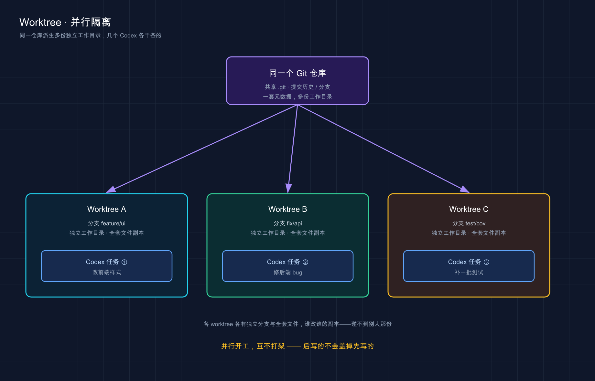

# 25 · Worktrees 并行隔离：让几个 Codex 各干各的，互不打架

> 📚 **系列导航**：上一篇〔[24 规则与钩子（Hooks）](24-hooks.md)〕给 Codex 装上了「闸门」和「扳机」，让重复的破事自动化。这一篇换个维度——**不是让一个 Codex 多干一件事，而是让好几个任务真正同时开工、还互不踩脚**。Worktree（工作树）就是 Codex 用来做这件事的核心隔离手段：怎么建、怎么用、为什么同一个分支不能同时在两处检出、Handoff（交接）又是怎么把活儿在前台后台之间搬来搬去。下一篇〔[26 Git 与 GitHub 集成](26-git-github.md)〕再讲改完之后怎么提交、推送、开 PR。

说个我今年三月干的蠢事。

那天我图省事，在 Codex 桌面 App 里**连开两个 Local（本地）线程**改同一个仓库，一个让它重构数据层、一个让它顺手改路由。我心里美滋滋：这不双开双倍效率嘛。结果两个线程都动了同一个 `config.ts` ，第二个线程一提交，把第一个刚写进去的改动**盖掉了一半**。我对着 `git diff` 那一坨花花绿绿的红绿块愣了好几分钟，才反应过来：**不是 Codex 抽风，是我让俩人在同一张桌上抢同一支笔。**

后来我才老老实实把那个本该用的东西用上——**Worktree**。同一个项目要并行，一律开 Worktree，每个线程拿一份隔离的代码副本，从那以后再没出过「互相覆盖」这种破事。

第 07 篇讲桌面 App 时我已经把 Worktree **提过一下**——它是新线程时三个模式（Local / Worktree / Cloud）里的一个，配 Handoff 在前后台之间搬（其中 Cloud（云端）模式本篇不展开，单独放在〔[10 云端任务](10-cloud.md)〕讲）。这一篇咱们往下挖：**它底层到底怎么隔离的、为什么有「分支只能在一处检出」这条铁规、Handoff 两个方向怎么走、副本攒多了怎么清。** 这些坑，不讲清楚迟早自己踩。

**看完这一篇，你会拿到：**

- 一句话讲清 Worktree 解决什么、它和「连开俩 Local」的本质区别
- 在桌面 App 里建一个 Worktree 线程的完整步骤，外加它默认处在 detached HEAD（游离头指针）这件反直觉的事
- 那条最容易栽跟头的铁规——**同一个分支不能同时在两处检出**，撞了报什么错、怎么绕
- Handoff（交接）把线程在 Local 和 Worktree 之间双向搬的两条常见路径，分别什么时候用
- 用 Local environment（本地环境）的 setup 脚本，让新 worktree 一建出来就把依赖装好，不缺东西
- Worktree 攒多了占磁盘怎么办：默认保留几个、什么不会被删、删之前的快照能不能恢复

> ⚠️ Worktree、Handoff、Local environments **都是 Codex 桌面 App（desktop app）的功能**，CLI 里没有对应的 `--worktree` 之类的开关——别在终端里找它。下文凡涉及具体按钮、默认值、配置项，都以 Codex 官方文档（[Worktrees](https://developers.openai.com/codex/app/worktrees) / [Local environments](https://developers.openai.com/codex/app/local-environments)）为准；功能随版本可能调整，以你本机运行的实际界面为准。

---

## 01 先想清楚：Worktree 到底解决什么问题

先给结论：**Worktree 解决的是「同一个仓库里，几件互不相干的活想同时干，又不想互相覆盖」**。它成立的前提只有一条——**别让这几件活在同一份文件上抢笔**。

回想前面那些篇，咱们基本都在「一个线程」里折腾：开一个任务，给指令，它一步步干完。这模式九成的活够用。但有两种时候你会嫌它憋屈。

**一是几件活天然能拆开、互不依赖。** 比如「改前端样式」「修后端一个 bug」「补一批测试」，八竿子打不着，却被逼着排队——改完前端才轮到后端。明明能同时干。

**二是你想试个新点子，又不敢碰手头没收尾的活。** 当前工作区还一堆没提交的改动，你又突然想验证另一个思路，直接在原地动手，万一搞砸了，连带把没收尾的东西也弄乱了。

这时候你可能想：那我多开几个线程不就行了？——**坑就埋在这儿。** 多开线程，如果都是 Local 模式、都指着同一个项目目录，那就是开头我干的那件蠢事：几个 Codex 在**同一份文件**上同时改，后写的盖前写的。

**类比：医院的会诊单。** 一个病人的病历本只有一份原件，三个科室的医生要同时给意见，全挤在那一本上写，笔迹必然打架、还会互相涂掉。规矩的做法是——**给每个医生发一份病历的副本去写**，各写各的，最后再汇总进原件。Worktree 干的就是这事：它从同一套仓库历史里，给你拉出几份独立的工作目录，**各有各的全套文件，但共享同一个 `.git`（提交历史、分支这些元数据是同一套）**。一个线程在它那份副本里怎么改，都碰不到另一个线程的副本。

官方把这个值钱的点说得很直白：

> 每个 worktree 都有你仓库里每个文件的一份独立副本，但它们共享关于提交、分支等的同一份元数据（`.git` 文件夹）。这让你能并行检出并处理多个分支。

落到你会遇到的真实场景，该上 Worktree 的活长这样：

- **「这两个不相干的模块，一个修 bug、一个加功能，想同时推」**——各开一个 Worktree 线程，谁也碰不到谁
- **「手头改了一半没提交，突然想试另一个方案」**——开个 Worktree 试，原件纹丝不动，试砸了直接扔
- **「让 Codex 在后台慢慢跑一个大重构，我前台继续干别的」**——把它甩进 worktree 后台跑（下一节细说前后台）

> 💡 一句话总结：Worktree 是为了让**同一仓库里互不相干的活同时开工又不互相覆盖**（像给每个医生发一份病历副本），铁律只有一条——**别让它们在同一份文件上抢笔**，否则越并行越乱。



上图：同一 Git 仓库派生三份独立 worktree，三个 Codex 任务各占一份、互不覆盖。

---

## 02 在桌面 App 里建一个 Worktree 线程

知道为什么用之后，来看怎么建。**全程在桌面 App 里点几下，没有命令要敲。**

> Worktree 只在 **Git 仓库**里能用——底层就是 git 的 worktree 能力。你选的那个项目得是个 git 仓库，否则压根没这个选项。

### 四步建出来

**第一步：新线程，模式选 Worktree。** 在新线程的输入框下方，把模式从默认的 Local 切到 **Worktree**。（顺手可以挑一个 local environment 跑 setup 脚本，第 05 节专讲。）

**第二步：选「从哪个分支起」。** 输入框下面会让你挑这个 worktree 基于哪个分支创建——可以是 `main` / `master` ，可以是某个功能分支，也可以是**你当前分支连带那些还没暂存的本地改动**。这点很贴心：你手头改了一半的东西，能一起带进 worktree 里继续。

**第三步：提交你的指令。** 发出任务，Codex 就**基于你选的分支创建一个 git worktree** 并在里头开工。

**第四步：干完决定去哪。** 收尾时你有两条路——要么就待在这个 worktree 上接着干（提交、推送、开 PR），要么 Handoff 把这个线程交接回 Local（第 04 节）。

### 一个反直觉但关键的事实：worktree 默认处在 detached HEAD

这是新手最容易懵的点，得专门拎出来说。

**Codex 建出来的 worktree，默认不在任何分支上**，而是处在一种叫 **detached HEAD（游离头指针）** 的状态——你可以理解成「它直接指着某个具体提交，而不是指着一个分支名」。官方原话：

> 默认情况下，Codex 在「游离 HEAD」状态下工作。

为什么这么设计？官方说得很实在：**这样 Codex 就能一口气建好几个 worktree，而不会污染你的分支列表**。你的 `git branch` 不会因为开了五个 worktree 就凭空多出五个奇奇怪怪的分支名。

那如果我就想把这份改动**变成一个正经分支**呢？——线程头部有个 **Create branch here（在此创建分支）** 按钮，点一下，当前 worktree 就转成一个分支，之后你才能在它上面提交、推送、开 PR。

> 💡 一句话总结：建 Worktree 线程就四步——**选 Worktree 模式 → 选起始分支 → 发指令 → 决定去留**；记住它默认是 detached HEAD（不在任何分支上），想正经提交推送，先点 **Create branch here** 把它转成分支。

---

## 03 最该吃透的一条铁规：同一分支不能在两处同时检出

这一节短，但**比前面都关键**——栽过这个跟头的人不少，我也栽过。

先把规矩立死。**Git 有一条硬规矩：一个分支，同一时间只能在一个工作树里被检出。** 你在某个 worktree 上检出了 `feature/a` ，那你的本地原件（Local）就**不能**同时也检出 `feature/a` ，反过来也一样。

**类比：图书馆的同一本书。** 一本书只有一个实体，A 借走了，B 就借不到同一本——不是图书馆小气，是这本书的「当前在谁手上」这个状态，**同一时刻只能有一个确定答案**。git 的分支也一样：一个分支名（`refs/heads/<name>`）代表「这棵工作树当前是什么状态」这个唯一答案，要是允许两处同时检出、同时往里提交，到底听谁的就乱套了——可能丢提交、可能索引打架。所以 git 干脆一刀切：**一个分支，同一时刻只认一个工作树。**

撞上这条会怎样？假设 Codex 在某个 worktree 上跑完活，你用 **Create branch here** 建了个 `feature/a` 分支；这会儿你又想在本地原件上检出 `feature/a` 看看——git 会直接甩你一个错：

```
fatal: 'feature/a' is already used by worktree at '<WORKTREE_PATH>'
```

意思就是：这分支已经被那个 worktree 占着了，本地这边检不了。

那怎么办？**正解不是硬怼，是用 Handoff。** 官方给的两条路：

- 临时想看看：在 worktree 上**改检出另一个分支**，把 `feature/a` 腾出来。
- 真要把这条线挪回本地继续：**用 Handoff 把整个线程交接到 Local**（下一节细说），别试图让同一个分支两头同时检出。

> 💡 一句话总结：**一个分支同一时刻只能在一个工作树里检出**（像图书馆的同一本书只能借给一个人），硬要两处检出就报 `already used by worktree`；想把活挪到本地，**用 Handoff，别硬怼分支**。

---

## 04 Handoff：把线程在 Local 和 Worktree 之间双向搬

上一节反复提到 Handoff，这节讲透。它是 Codex 处理「同一分支不能两头检出」这个麻烦的**官方正解**，也是 worktree 工作流里你会天天用的动作。

先理解一个心智模型：**Local 是前台，Worktree 是后台。** Local（本地原件）就是你平时直接动手、开熟悉的 IDE、跑开发服务器的那个工作区，相当于摆在你面前的台面；Worktree 是在旁边后台默默推进的隔离副本。**Handoff 干的，就是把一个线程在前台和后台之间搬过去搬回来。**

**类比：厨房的明档和备餐间。** 明档（Local）是客人能看到、厨师当面出菜的台面；备餐间（Worktree）在后头默默切配、炖煮。一道菜该在哪做，看时机：要当面收尾、上桌验菜，就端到明档；要腾出明档先忙别的、这道菜慢慢炖着，就挪进备餐间。Handoff 就是这个「端进端出」的动作——**而且 Codex 会替你把底层那些 git 操作安全地处理掉**，你不用自己 `git worktree` 一通敲。

官方点明了 Handoff 存在的根本原因，正好接上一节：

> 这一点之所以重要，是因为 **Git 只允许一个分支同一时间在一处被检出**。

它有两个方向，对应两条常见路径：

**方向一：Worktree → Local（把后台的线程端到前台）。** 点线程头部的 **Hand off** ，移到 **Local**。什么时候用？**当你想用日常那套熟悉环境来验收**——在你常用的 IDE 窗口里读 diff、跑你现有的开发服务器、或者你的 app **只能开一个实例**没法在 worktree 里另起一个。我自己最常用这条：让 Codex 在 worktree 后台把一个功能搭完，搭好了 Handoff 回 Local，在熟悉的编辑器里逐行过一遍。

**方向二：Local → Worktree（把前台的线程甩到后台）。** 反过来也行。你正在 Local 上干，想腾出前台去忙别的，就用 **Hand off** 把这条线程挪进 worktree——**让 Codex 在后台继续跑，你把注意力切回本地别的事**。

这里有个**贴心又容易忽略**的细节：**每个线程始终绑着同一个 worktree。** 你把它 Handoff 回 Local，过会儿又想丢回后台，Codex 会**把它送回原来那个 worktree**，让你接着上次的进度干，不会另起炉灶。

最后一个**必须记牢的坑**：

> 由于 Handoff 用的是 Git 操作，任何在你 `.gitignore` 里的文件都不会随线程一起搬过去。

也就是说——**`.env`、本地缓存这些没被 git 跟踪的东西，Handoff 不会带着走。** 这跟 worktree 本身「干净新副本」的特性是一回事，下一节正好讲怎么补这个缺口。

| | Worktree → Local | Local → Worktree |
|---|---|---|
| **方向** | 后台端到前台 | 前台甩到后台 |
| **典型场景** | 用熟悉 IDE 验收、跑只能开一份的开发服务器 | 腾出前台忙别的，让它后台继续跑 |
| **谁处理 git** | Codex 自动处理 | Codex 自动处理 |
| **`.gitignore` 里的文件** | 不跟着搬 | 不跟着搬 |

> 💡 一句话总结：Handoff 把线程在 **Local（前台）和 Worktree（后台）之间双向端进端出**（像厨房明档和备餐间互相挪菜），git 操作 Codex 替你安全搞定；每个线程始终绑同一个 worktree，但 **`.gitignore` 里的文件不会跟着搬**。

---

## 05 让新 worktree 一建出来就「装备齐全」：Local environment 的 setup 脚本

接着上一节那个缺口说：worktree 是一份**全新检出**，跑在跟你 Local 不同的目录里，所以**那些没进 git 的依赖、配置、本地文件，它一开始都没有**。最典型的就是：新 worktree 一跑，`node_modules` 不在、`.env` 不在，活儿直接卡住。

我四月真栽过一次：兴冲冲开了个 Worktree 让 Codex 改后端，结果它连不上数据库——折腾半天才反应过来，**`.env` 压根没在 worktree 里**（前一节说了，`.gitignore` 的东西不跟着走）。补上 setup 脚本之后就再没这毛病。

**类比：连锁店开新分店的「开店清单」。** 总店（你的 Local）东西齐全，新开一家分店（worktree）四壁空空。聪明的连锁店有一张**标准开店清单**：进货、装设备、布置，照着跑一遍，新店立马能营业。Local environment 的 **setup 脚本**就是这张清单——**Codex 每次为新线程创建 worktree 时，自动跑一遍**，把依赖装好、该构建的构建好。

配在哪、怎么配？官方说得清楚：

- 通过 **Codex App 的 settings（设置）面板**配置 local environment，生成的配置存在你项目根目录的 **`.codex` 文件夹**里。
- 这个配置文件**可以提交进 git 跟队友共享**——配一次，全队的 worktree 都自动装备齐全。

举个官方给的 TypeScript 项目例子，setup 脚本就这么两行：

```bash
npm install
npm run build
```

新 worktree 一创建，这两行自动跑，依赖装好、初始构建也做了，Codex 上来就能干活，不缺东西。

**平台差异：** 如果你的 setup 步骤分平台（macOS / Windows / Linux），可以为各平台单独定义 setup 脚本来覆盖默认的。Windows 上桌面 App 的可用范围以官方 Windows 文档为准。

顺带提一个相关能力：除了 setup 脚本，local environment 还能配 **Actions（动作）**——把「启动开发服务器」「跑测试套件」这类常用命令做成 App 顶栏的快捷按钮，点一下就在内置终端里跑。这块第 07 篇露过一下，这里不展开。

> 💡 一句话总结：worktree 是干净新副本，没进 git 的依赖和 `.env` 都不在里头；用 local environment 的 **setup 脚本**（存在项目根 `.codex` 文件夹、可提交共享）让它**一建出来就自动装好依赖**，像连锁店照「开店清单」开新店。

---

## 06 Worktree 攒多了怎么办：清理、上限与快照恢复

并行用爽了，会冒出一个现实问题：**worktree 占磁盘**。每一个都带着自己一整套仓库文件、依赖、构建缓存——开十几个，硬盘肉眼可见地瘪下去。所以 Codex 会帮你**把 worktree 的数量控制在合理范围**。

先讲两个底层事实，免得你到处找 worktree 在哪：

- Codex 把 worktree 都建在 **`$CODEX_HOME/worktrees`** 下统一管理（`CODEX_HOME` 默认是 `~/.codex` ，配置篇第 18 篇提过）。
- 默认情况下，Codex **保留你最近的 15 个** Codex 托管的 worktree；这个上限**可以在设置里改**，也可以**关掉自动删除**自己管磁盘。

那 Codex 删 worktree 的规矩是什么？它会**尽量不删还重要的**。按官方：

**这些情况下，Codex 托管的 worktree 不会被自动删除：**

- 有一个置顶（pinned）的对话绑着它
- 对应线程还在进行中
- 它是一个永久 worktree（permanent worktree，见下文）

**这些情况下会被自动删除：**

- 你归档（archive）了对应的线程
- Codex 为了不超过你设的上限，需要删掉更老的 worktree

最让人安心的一条——**删之前有快照**：

> 在删除一个 Codex 托管的 worktree 之前，Codex 会保存该 worktree 上工作的一份快照。如果你在 worktree 被删后又打开了对应的对话，你会看到恢复它的选项。

也就是说，就算某个 worktree 被自动清掉了，**线程本身还在你历史里**，重新打开还能选择恢复——不至于一删全没。

最后区分一个概念，免得混：**Codex 托管的 worktree** vs **永久 worktree**。

| | Codex 托管的 worktree（默认） | 永久 worktree（permanent） |
|---|---|---|
| **怎么来的** | 开 Worktree 线程时 Codex 自动建 | 在侧边栏项目的三点菜单里手动建 |
| **绑几个线程** | 通常专属一个线程 | 可以从同一个起多个线程 |
| **会被自动删吗** | 会（超上限 / 归档时） | **不会**自动删 |
| **适合** | 轻量、用完即弃的临时活 | 想要一个长期存在的固定环境 |

说白了：**临时试个想法，用默认的就行，反正用完会自动收拾**；**想要一个长期稳定、反复回来用的环境**，就从项目三点菜单建个永久 worktree，它自成一个项目、不会被自动删。

> 💡 一句话总结：worktree 建在 `$CODEX_HOME/worktrees` ，默认**保留最近 15 个**、超了或归档时自动删（**删前有快照能恢复**），置顶 / 进行中 / 永久的不会被删；**临时活用默认、长期环境建永久 worktree**。

---

## 07 动手：在桌面 App 里跑通一条 Worktree 主链

光看不练假把式。下面这条**全程在 Codex 桌面 App 里点**，配一个 git 项目即可。每步给了能自验的预期结果，照着走一遍，这套手段就有肌肉记忆了。

> 用到一个 git 仓库（没有就随便 `git init` 一个练手）。这是**桌面 App 独有**的流程，CLI 里没有对应开关。下面操作不依赖魔法上网。

**第一步：新线程，模式切到 Worktree**

在 App 里点新建线程，输入框下方把模式从 **Local** 切到 **Worktree**，再选一个起始分支（练手就选 `main` ）。

**预期**：模式显示成 Worktree，下方出现「起始分支」选择项。**看到这俩 = 你正准备开一个隔离副本，而不是动原件。**

**第二步：发一个只读的小任务**

随便发一句安全的、不咋改文件的指令，比如：「列出这个项目里所有 markdown 文件的标题。」

**预期**：Codex **基于你选的分支创建一个 worktree** 并在里头开工。这个线程的工作目录在 `$CODEX_HOME/worktrees` 下（默认 `~/.codex/worktrees` ），跟你 Local 原件是两份。

**第三步：在内置终端确认它是个独立 worktree**

打开线程的内置终端（macOS `Cmd + J` ，Windows 键位以本机为准），跑一句：

```bash
git worktree list
```

**预期**：列表里除了你的主检出，**多出一行**指向 `.../.codex/worktrees/...` 那个目录。看到这行 = 隔离副本确实建好了，你眼下就在它里面。

**第四步：试一次 Handoff 回 Local**

点线程头部的 **Hand off** ，选移到 **Local**。

**预期**：这条线程被搬到你的本地原件，**现在你能在平时那套 IDE / 终端环境里看它的改动了**。Codex 自动处理了底层 git 操作，你不用手敲任何 `git worktree` 命令。

**第五步：清理**

练手的临时 worktree 不想留，最省心的办法是**归档（archive）这个线程**——按第 06 节的规矩，归档后对应的 Codex 托管 worktree 会被自动删（删前留快照，反悔了还能从线程恢复）。也可以去设置里看 worktree 的数量上限和自动删除开关。

**预期**：归档后该线程从活动列表消失，对应 worktree 进入自动清理；磁盘上那份副本随之回收。**清干净 = 一条完整链路走通。**

跑通这五步，你就把「开隔离副本 → 确认它独立 → Handoff 搬前台 → 清理」这条 worktree 主链亲手走了一遍。**以后真要并行干活，本质都是这套，无非换任务、多开几个 Worktree 线程。**

> 💡 一句话总结：动手链路就五步——**Worktree 模式开线程 → 发个小任务建出 worktree → `git worktree list` 确认独立 → Hand off 回 Local 验收 → 归档线程让它自动清理**；走通一遍比记十条命令都管用。

---

## 08 小结

这一篇把「让几个 Codex 在同一仓库里同时开工还互不打架」这件事，从「为什么要隔离」一路讲到「副本攒多了怎么清」。

把核心要点串起来回顾：

| 你想干的事 | 用什么 | 关键点 |
|---|---|---|
| 搞清为什么要隔离 | Worktree 的两前提 | 同仓库并行、别在同一份文件抢笔（像给每个医生发病历副本） |
| 建一个隔离线程 | 新线程选 **Worktree** 模式 | 选起始分支；默认是 detached HEAD，想提交先 **Create branch here** |
| 别让分支两头检出 | 记牢那条铁规 | 同一分支同一时刻只能在一处检出，撞了报 `already used by worktree` |
| 在前后台之间搬活 | **Handoff（交接）** | Local 前台 / Worktree 后台双向搬，git 操作 Codex 自动处理，`.gitignore` 的不跟着走 |
| 让新副本装备齐全 | Local environment 的 **setup 脚本** | 存项目根 `.codex` 、可提交共享，新 worktree 一建就自动装依赖 |
| 管住磁盘占用 | 清理规则 + 永久 worktree | 默认留最近 15 个、删前有快照能恢复；长期环境建永久 worktree |

**你现在应该能：**

- 说清 Worktree 解决什么，铁律是「同仓库并行别抢同一份文件」
- 在桌面 App 里建一个 Worktree 线程，知道它默认是 detached HEAD、要提交得先 **Create branch here**
- 理解「同一分支不能两处检出」这条铁规，撞上了用 Handoff 而不是硬怼
- 用 Handoff 把线程在 Local 和 Worktree 之间双向搬，用 local environment 的 setup 脚本让新 worktree 一建就齐活
- 知道 worktree 攒多了怎么清、什么情况不会被删

回头看开头那个「连开俩 Local 改同一个仓库」的蠢事，**根子就是没用隔离、让俩 Codex 抢了同一支笔**。现在你手里有 Worktree 这把隔离的钥匙，也有 Handoff 这个搬运工，**能比一头扎进去的人少走一大圈弯路。**

---

下一篇 **〔[26 Git 与 GitHub 集成](26-git-github.md)〕**——这一篇你已经撞见好几个 Git 动作了：worktree 转分支、Handoff 背后那些被 Codex 悄悄替你处理的 git 操作、改完之后要提交推送……但这些大多还停在「Codex 替你做」的层面。下一篇就把 Codex 的 Git / GitHub 能力正面摊开：在 App 里直接 commit、push、开 PR，diff 面板怎么逐块暂存或还原，再到怎么跟 GitHub 联动。想想看：**worktree 把活隔离好了，最后总得有一步把它干净地并回主线——那一步，正是下一篇的主场。**
