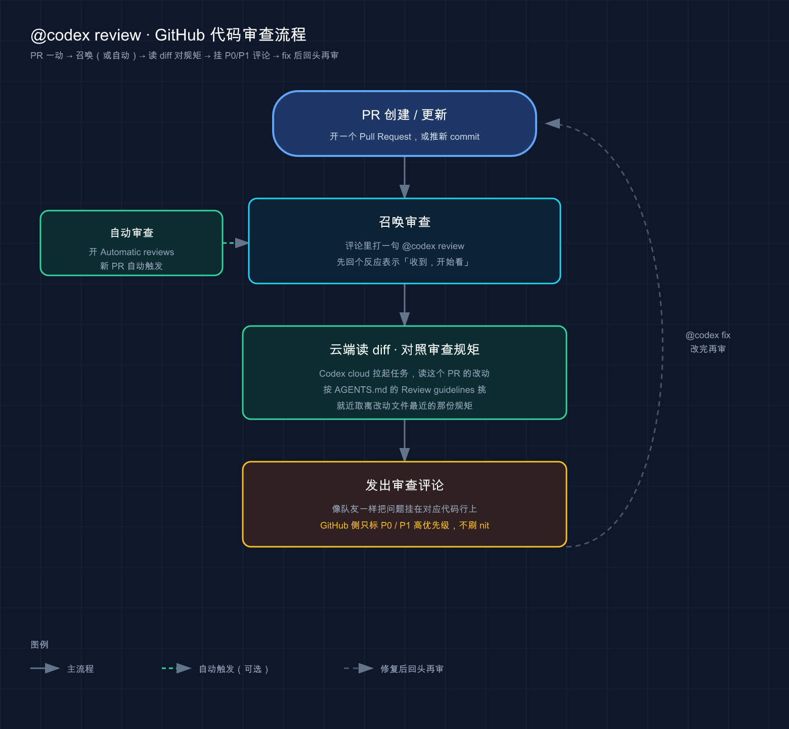
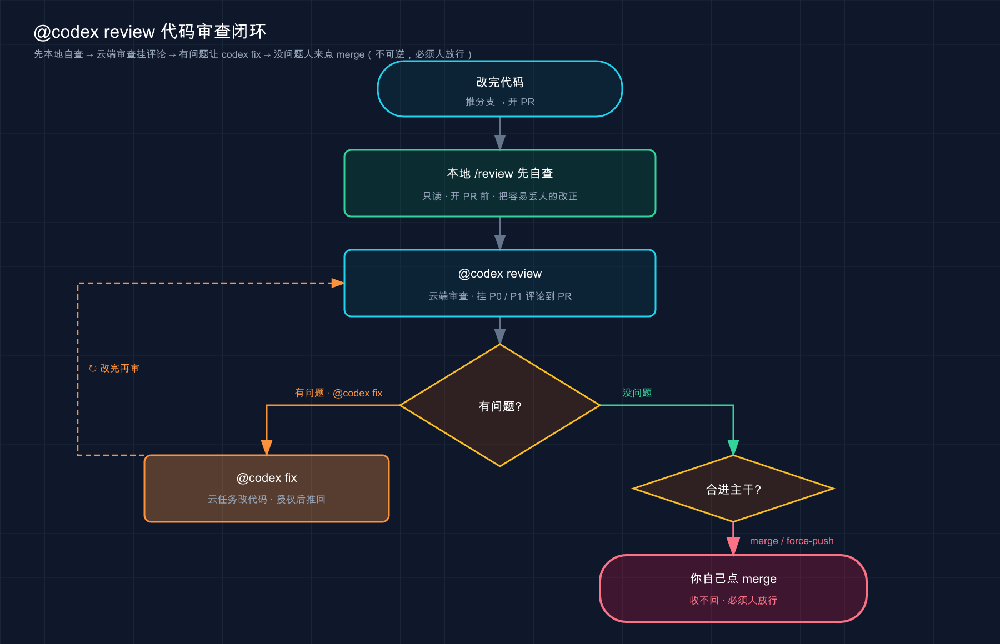

# 26 · Git 与 GitHub 集成：让 Codex 在你的 PR 里当审查员

> 📚 **系列导航**：上一篇 [25 · Worktrees 并行隔离](25-worktrees.md) 教你用 git worktree 给 Codex 开几条互不打架的「平行车道」，多个任务同时跑还不串味。这一篇把战场从你本地终端搬到 **GitHub 仓库**：怎么让 Codex 钻进你的 Pull Request，**自动 review 代码、按你定的规矩挑刺、改完直接推回分支**。下一篇 [27 · 自动化与 CI/CD](27-automation.md) 再把这套搬进 CI 流水线，做成「无人值守」。

先说个团队协作里几乎天天上演的场景。一个 PR 从开出来到合进去，**很大一块时间根本不是花在 review 本身，而是耗在「等人 review」上**——团队小、reviewer 忙，你的 PR 就在那儿挂着，挂一天是常事。

而真到 review 那一下，人能挑出来的，往往是「这个变量名不好」「这行少个空格」这类表面货；真正要命的——并发下的竞态、漏掉的鉴权中间件、把用户隐私写进日志——**累、烦、看三个文件就走神，恰恰最容易漏**。

Codex 的 GitHub 集成就是冲这个来的：**在 PR 评论里 @ 它一下，它像个不会累的队友，扫一遍 diff，按你仓库里定的规矩，把高优先级的风险挑出来挂在 PR 上**。你不用切出 GitHub，它也不抢你「最后合并」那一下——**审查它来当，放行你来按**，这条线和咱们从权限篇 [15] 一路守到现在的是同一条。

**看完这一篇，你会拿到：**

- 一句 `@codex review` 怎么在 PR 里触发审查，它会回什么、只挑哪些级别的问题（P0/P1，官方口径）
- 「自动审查」怎么开——每个新 PR 一开就自动 review，不用你手动 @
- 用 `AGENTS.md` 的 **Review guidelines** 定制审查规则：别记日志、每条路由都要鉴权……让它按你的标准挑刺
- 审查完一句 `@codex fix` 让它直接改、推回分支，以及这一下背后的权限边界
- 本地还有个 `/review`：不进 GitHub，在终端里先自查一遍再开 PR，**改动一行都不碰**
- 一条贯穿全篇的线：哪些放心交给它，哪条「往外推」的红线你自己守

> ⚠️ 本篇讲的 GitHub 触发式审查（`@codex review`、自动审查）依赖 **Codex cloud**，得是付费套餐 + 给仓库授权过；纯本地的 `/review` 不需要 cloud。两条线我会分清楚讲，别混。

---

## 01 先分清两条线：GitHub 里的 Codex，和你终端里的 Codex

动手之前先把一件最容易绕晕的事捋直：**Codex 帮你审代码，有两条完全不同的线，跑在两个地方。**

**类比：同一个老师，既能批改你交上来的作业本，也能在你做题时坐旁边盯着。** 一个是「你写完、提交了，他事后批」；一个是「你还在写，他当场看」。两件事都是这老师干的，但场景、权限、谁先动手，全不一样。

放到 Codex 上，这两条线是：

**第一条：GitHub 触发式（cloud）。** 你在 GitHub 的 PR 评论里打一句 `@codex review`，Codex 在**云端**拉起一个任务，读这个 PR 的 diff，然后像真人 reviewer 一样**在 PR 上发一条 review**。整个过程你人在 GitHub，它的活在 OpenAI 的云机器上跑（这就是 [10 云端] 讲的 Codex cloud）。**前提**：仓库得接好 Codex cloud、在设置里给这个仓库开了 **Code review** 开关。

**第二条：本地 `/review`（CLI）。** 你在终端的 Codex 会话里敲一个 `/review`，它在**你本机**拉起一个专门的审查员，读你选的那段 diff（没提交的改动、跟某个分支的差异、某个 commit……），把问题列给你看。**它只读不写——一行代码都不碰你的工作区。** 不连 GitHub、不需要 cloud，纯本地。

| 维度 | GitHub 触发式 `@codex review` | 本地 `/review` |
|------|------------------------------|---------------|
| 在哪触发 | GitHub 的 PR 评论里 | 终端 Codex 会话里 |
| 活在哪跑 | Codex cloud（云端） | 你本机 |
| 审查对象 | 这个 PR 的 diff | 你选的 diff（未提交 / 比分支 / 某 commit） |
| 结果落哪 | 作为 review 评论挂在 PR 上 | 在终端审查面板里列出 |
| 前提 | 接好 cloud + 开 Code review 开关 | 啥都不用，本地即用 |
| 会改代码吗 | 不会（除非你再 `@codex fix`） | 绝不会，纯只读 |

这一篇主线讲**第一条（GitHub 触发式）**——因为这才是「Git 与 GitHub 集成」的核心；第二条 `/review` 我放在第 06 节单讲，它是开 PR 之前的「自查」环节，特别实用。

> 💡 一句话总结：Codex 审代码有两条线——**GitHub 里 `@codex review` 跑在云端、把 review 挂到 PR 上**（要 cloud + 开开关）；**终端里 `/review` 跑在本机、只读不写**（啥都不用）。这一篇主讲前者，后者是开 PR 前的自查。

---

## 02 一句 `@codex review`：让它在 PR 里挑刺

最核心的用法，就一句话：**在 PR 评论框里打 `@codex review`，回车。**

为什么这事值得交给它？因为「认真 review 一个 PR」是典型的**又费神又容易被拖**的活——人忙起来，你的 PR 排队等 review 排到天黑；真轮上了，看俩文件注意力就开始飘。**这种「重要但累」的活，正是该让一个不会累的队友先过一遍。**

**类比：交稿前请的那位「找硬伤」的编辑。** 你写完一篇稿子，自己读三遍也看不出毛病——因为是你写的，脑子会自动脑补「我本来想表达的」。这时候塞给一位专挑硬伤的编辑，他不管你文笔多漂亮，专盯「这里逻辑断了」「这个数据前后对不上」。Codex 在 PR 里就是这位编辑：**它不夸你代码写得溜，专挑会出事的地方。**

实际操作，进 GitHub，在 PR 的评论框里打：

```text
@codex review
```

发出去之后会发生什么？节奏大致是这样的：

1. **Codex 先给你的评论加个 👀 反应**——表示「收到，我开始看了」（官方明确：它会先 react 一个 👀 再发 review）。
2. 它在云端拉起任务，**读这个 PR 的 diff**，对照你仓库里的审查规矩（下一节讲）。
3. 看完，**像队友一样在 PR 上发一条 code review**，把问题逐条挂在对应代码行上。

这里有个**官方明确的关键设定**，你必须知道，不然会觉得它「怎么漏了一堆」：

> 在 GitHub 里，Codex **只标记 P0 和 P1 级别的问题**，让审查评论聚焦在高优先级风险上。

翻成人话：**它故意不跟你唠叨那些鸡毛蒜皮。** P0、P1 是问题的优先级（P0 最严重、P1 重要），它只挑这两档——那些「变量名能不能更好」「这里多个空格」的 nit，它默认不刷屏。这设计我自己用下来特别舒服：**我去年用某些 AI review 工具，最烦的就是一个小 PR 给我糊上四十条「建议」，真正的 bug 淹在里头根本找不着。** Codex 这个「只报 P0/P1」的克制，反而让每条评论都值得看。

一个我真实的用法：上个月一个同事的 PR 改了支付回调逻辑，我自己 review 时光顾着看金额计算对不对，`@codex review` 之后它给我挂了一条 P1——**回调接口少了幂等校验，重复回调会重复加余额**。这条我当时真没看出来。

> 💡 一句话总结：在 PR 评论打 `@codex review`，它加个 👀、读 diff、像队友一样发一条 review；**它只挑 P0/P1 高优先级问题，不拿 nit 刷屏**——这份克制让每条评论都值得你认真看。

---

## 03 自动审查：每个新 PR 一开，它就自动出手

`@codex review` 是「手动喊一声」。但你总会忘——尤其团队里别人开的 PR，你哪记得每次去 @ 一下。**官方给了个一劳永逸的开关：自动审查（Automatic reviews）。**

**类比：从「想起来才去医院体检」升级成「公司给全员排了年度体检」。** 手动 review 像你自己惦记着去体检——多半惦记着惦记着就忘了；自动审查像公司把体检排进流程，**到点自动通知你去**，不靠你自觉。把「会忘的事」交给机制，而不是交给记性。

怎么开？官方说得很直白：

> 如果你想让 Codex 自动审查每个 PR，在 Codex 设置里打开 **Automatic reviews**。这样每当有人开一个新 PR 待审查时，Codex 都会发一条 review，**不需要 `@codex review` 评论**。

操作路径就两步（设置页在 chatgpt.com 的 Codex 这边，不在 GitHub）：

1. 去 chatgpt.com 的 Codex 设置页（官方地址：`https://chatgpt.com/codex/settings/code-review` ；如果链接失效，在 chatgpt.com → Codex → Settings 里找 Code review）。
2. 把 **Automatic reviews** 打开。

开了之后，**新 PR 一开，Codex 自动就上**，你和队友谁都不用记着去 @。

那什么时候用手动、什么时候用自动？我自己摸出来的分工是：

- **团队主仓、协作频繁的仓库** → 开自动审查。让它当个常驻的「第一道关」，每个 PR 都先过一遍它的眼。
- **自己的玩具项目、改动零碎** → 手动 `@codex review` 就行，不必每个小 commit 都惊动它。
- **大改动、想换个角度重点看** → 哪怕开了自动，也可以再手动补一句带重点的（比如 `@codex review for security regressions`，下一节讲），让它换个视角再扫一遍。

| 对比维度 | 手动 `@codex review` | 自动审查 |
|---------|---------------------|---------|
| 触发方式 | 每次自己评论 @ 一下 | 新 PR 一开自动触发 |
| 会不会漏 | 靠记性，容易忘 | 机制兜底，不会忘 |
| 适合场景 | 个人项目、零碎改动、临时补一刀 | 团队主仓、需要每个 PR 都过关 |
| 控制粒度 | 想审才审，还能带审查重点 | 全量覆盖，省心 |

> 💡 一句话总结：自动审查 = 在 Codex 设置里开 **Automatic reviews**，**新 PR 一开它就自动 review，不靠你记着去 @**；团队主仓建议开它兜底，个人小项目手动喊一声就够。

---

## 04 定制审查规则：把你的标准写进 AGENTS.md

到这儿你可能会问：它挑刺的「标准」是谁定的？**默认它按一套通用的代码质量标准来；但你完全可以用 `AGENTS.md` 告诉它「我这个仓库特别在意什么」。**

[11 AGENTS.md] 那篇讲过，`AGENTS.md` 是 Codex 每次开工必读的「项目交接清单」。审查规则就是清单里的一个专门小节——**官方约定的写法是一个叫 `Review guidelines` 的标题。**

**类比：给质检员一张「本厂特别要查这几项」的检查表。** 通用质检标准谁都会（螺丝拧紧没、外壳有没有裂），但你这条产线有自己的命门——比如「这批货出口欧盟，环保认证那一项必须查」。你把这几条写在检查表上贴墙上，质检员每件都照着多查这几项。`AGENTS.md` 里的 `Review guidelines` 就是这张「本仓特别检查表」。

官方给的例子，写进仓库根目录的 `AGENTS.md`:

```md
## Review guidelines

- Don't log PII.
- Verify that authentication middleware wraps every route.
```

这两条翻过来是：「别把用户隐私信息（PII）写进日志」「确认每条路由都被鉴权中间件包住」。**写进去之后，Codex 每次 review 都会照着这几条额外盯。**

这里有个**特别贴心、也特别符合 [11] 讲的就近原则的机制**——官方原话：

> Codex 把**离每个改动文件最近的那份 `AGENTS.md`** 的指引应用上去。你可以在目录树更深的地方放更具体的指令，当某些包需要额外严查时。

意思是：你不必把所有规矩堆在根目录那一份里。**支付模块要严查的，就在 `src/payment/AGENTS.md` 里写；改到支付代码时，那份更具体的规则自动生效。** 这跟 [11] 讲的「就近覆盖」是同一套机制，审查这里也吃这一套。

举个我会这么配的例子，`src/payment/AGENTS.md`:

```md
## Review guidelines

- 校验金额必须用 Decimal，禁止用 float 做钱的运算。
- 每一笔扣款都要有幂等键，防重复回调。
```

这样 Codex review 到支付相关改动时，就会专门盯这两条——上一节那个「漏了幂等校验」的坑，要是早写进去，它会更主动地揪。

**还有个轻量的口子：一次性审查重点。** 不想动 `AGENTS.md`、就这一个 PR 想换个角度看，直接在评论里带上：

```text
@codex review for security regressions
```

这句的意思是「这次专门帮我盯安全回归」。官方还举了个例子：如果你想让它揪文档里的错别字，可以在 `AGENTS.md` 里写一句「把文档错别字当成 P1」（`Treat typos in docs as P1.`）——**你说它是 P1，它就当 P1 给你报上来。**

> 💡 一句话总结：审查规则写进 `AGENTS.md` 的 **`Review guidelines`** 小节（别记日志、每条路由要鉴权……）；**就近原则**让你能给支付这类敏感模块单独放一份更严的；临时想换重点，评论里 `@codex review for xxx` 即可。

---

## 05 改完直接修：`@codex fix` 与它能动到哪儿

Codex review 完，挂了一条 P1 在 PR 上。接下来呢？**你可以再留一条评论，让它直接把这个问题改了——而且改动直接推回 PR 分支。**

**类比：编辑不光圈出硬伤，还能直接帮你改完、回填进稿子。** 一般编辑是「圈出来、写句批注，你自己改」；Codex 这个能更进一步——你说一句「这条你帮我改了吧」，它真就动手改、改完把新版本放回你的稿子里。但注意，**它动手改，前提是你授权它能动你的稿子**。

官方给的用法，在 PR 上接着评论：

```text
@codex fix the P1 issue
```

接下来官方原话是这么描述的：

> Codex 用这个 PR 作为上下文**启动一个云任务**，在它有权限的时候，可以**把修复推回到分支**。

拆开看这句，有两个关键点，每个都踩在咱们一路守的安全线上：

**第一，`@codex fix` 启动的是一个云任务。** 它不是在 review 评论里凭空改，而是真的拉起一个 [10] 讲的 Codex cloud 任务，把这个 PR 当上下文，进它的「想→做→看」循环里去改代码、验证。

**第二，「在它有权限的时候」才推回分支——这半句是重点。** 能不能推回你的分支，**取决于你给 Codex 授权了多大权限**。这正是 [15 权限] 和 [16 安全] 反复强调的：**「能不能动」是授权说了算，不是它想动就能动。** 你没授权写权限，它就只能把改动给你看、推不回去。

顺带说个**容易记混的点**：`@codex` 后面跟啥，行为不一样：

- `@codex review` → 走**代码审查**这条专门的线（只 review，不改代码）。
- `@codex` + **除 review 外的任何话**（比如 `@codex fix the CI failures`、`@codex 给这个接口补测试`）→ 启动一个**普通云任务**，拿这个 PR 当上下文去干活。

官方原话点得很清楚：

> 如果你在评论里 `@codex` 跟的是 **review 以外**的任何内容，Codex 会用你的 PR 作为上下文启动一个云任务。

所以 `review` 是个「保留词」走审查线，其余都走通用云任务线。**记这个区分，你就不会纳闷「为啥 @codex fix 不是给我 review 而是真去改了」。**

这里我得钉一句**和开篇那条线一脉相承的话**：`@codex fix` 让它推回分支，是「让 AI 直接动你远端代码」——这一步爽，但**要不要给它这个权限、推回来的东西合不合并，决定权在你**。我自己的习惯是：**让它 fix、推回一个分支没问题，但「合进主干」那一下（merge / 点 Merge 按钮）永远自己来**——跟 [25] 讲 worktree 时「车道它跑、并道你点」是同一个道理。

> 💡 一句话总结：审查完一句 `@codex fix the P1 issue`，它**启动云任务**改代码、**在你授权了写权限时**把修复推回 PR 分支；记住 `@codex review` 走审查线、`@codex` + 其它走通用云任务线；而「合进主干」那一下，留给你自己。

到这儿，GitHub 侧这条审查线就完整了，串成一张图是这样的：



这张图把第 02～05 节连成一条环：**PR 一创建 / 更新，要么你打 `@codex review` 召唤、要么开了自动审查直接触发；Codex 在云端读这个 PR 的 diff、对照仓库 `AGENTS.md` 里就近那份审查规矩；最后像队友一样把问题挂回对应代码行，且在 GitHub 侧只标 P0 / P1；你一句 `@codex fix` 让它改完，又回到流程头上再审一轮。**

---

## 06 本地 `/review`：开 PR 之前，先在终端自查一遍

前面五节全在 GitHub 上。但有个场景更早、更省事：**你代码还没推、PR 还没开，想先自己过一遍——这时候用本地 `/review`，不用碰 GitHub。**

**类比：交作业前先用橡皮把自己的错都擦干净，而不是等老师在作业本上画满红叉。** 与其把一堆低级错误推上去让 review（无论是真人还是 `@codex review`）挂一堆评论，不如**开 PR 前先在本地自查一刀**，把明显的坑先填了。返工成本低多了。

操作就一个命令，在终端的 Codex 会话里：

```text
/review
```

按官方文档，敲下去会弹出几个**审查预设**让你选，Codex 会**拉起一个专门的审查员，读你选的那段 diff，报出按优先级排好的、可落地的问题——而且全程不碰你的工作区（只读）**。预设有这么几个：

- **Review against a base branch**（跟某个基线分支比）：选一个本地分支，Codex 找到合并基点、diff 出你的改动，**在你开 PR 之前先把最大的风险点拎出来**。
- **Review uncommitted changes**（审未提交的改动）：把你**暂存的、没暂存的、没跟踪的**全看一遍，提交前先解决问题。
- **Review a commit**（审某个提交）：列出最近的 commit，让 Codex 读你选中那个 SHA 的确切改动集。
- **Custom review instructions**（自定义审查指令）：你自己写一句（比如「重点看无障碍回归」），用同一个审查员按你的话来跑。

这里有个**官方明确的小配置**值得记：`/review` 默认用你当前会话的模型；想给审查单独指定一个更强的模型，在 `config.toml` 里设 `review_model`。我自己日常会话挂个快模型干活，但 review 这种要抠细节的活，**用 `review_model` 单独绑一个更强的，这笔成本花得值**。

我现在的固定习惯，是把本地 `/review` 当成「开 PR 前的安检门」：

1. 改完，先在终端 `/review`，选 **Review uncommitted changes**，让它把没提交的改动扫一遍。
2. 它按优先级排好的那些问题，我先在本地改掉。
3. **改干净了再提交、推、开 PR**——这时候再走 `@codex review`（或自动审查），挂出来的评论就少而精了。

**本地自查一刀，远端 review 就清爽。** 这条链路我从今年三月用到现在，PR 上的 review 评论平均能少一半。

### 什么时候只跑本地，什么时候要走两遍

可能你会问：**本地都审过了，远端 `@codex review` 不就重复了么？** 这俩看着像一回事，其实**角色完全不同**——本地是「**作者自查**」，远端是「**PR 阶段的协作记录**」。一张表说清场景：

| 你的情况 | 本地 `/review` | 远端 `@codex review` / 自动审查 |
|---|---|---|
| 个人仓库 · 自己写自己合 · 小改动 | ✅ 跑一遍就够 | ❌ 没必要再走一道 |
| 团队仓库 · 要别人 review · 走 PR 流程 | ✅ 提交前先净一遍 | ✅ 让审查意见**留在 PR 上**当协作记录 |
| 有保护分支、合并前要审查门 | ✅ 自查打底 | ✅ **守门用**，强制 PR 走一遍审查 |
| 想让维护者 / reviewer 看到「机器先扫过一轮」 | ✅ | ✅ 评论挂在 PR 里，谁打开都能看 |
| 改动很大、想要别人复核 | ✅ | ✅ 评论上下文 + 多人讨论入口 |

一句话记法：**本地 review 是「作者角色」，远端 review 是「PR 协作角色」**。个人小项目走本地一刀就停手，别为了「显得正规」机械加一遍远端；团队 / 受保护分支 / 重要改动那种「需要留痕、需要门」的场景，远端这一刀的价值才显出来。

> 💡 一句话总结：本地 `/review` 是**开 PR 前的自查门**——在终端选预设（未提交 / 比分支 / 某 commit / 自定义），它**只读不写**地报出按优先级排好的问题；先在本地改干净再推，远端 review 就少而精；要更强的审查模型设 `review_model`。**本地是作者自查、远端是 PR 协作记录**——个人小改动跑本地一刀就够，团队 / 受保护分支再叠远端那道门。

---

## 07 配 `gh`：让 Codex 桌面端能读到 PR 的来龙去脉

如果你用 [07] 讲的 Codex 桌面 App（或 [09] 的 IDE 扩展）干活，有个工具强烈建议装上——**GitHub 官方命令行工具 `gh`**。

**类比：给你的助手发一张能进档案室的门禁卡。** 没卡，他知道「有这么个 PR」，但调不出里头的往来邮件、评审记录（PR 上下文、reviewer 评论）；发张卡（`gh` 登录态），他一刷就能把整个卷宗调出来摆你面前。

官方原话说得很清楚：

> 安装 GitHub CLI（`gh`）并用 `gh auth login` 认证，这样 Codex 才能**加载 PR 上下文、审查评论和改动的文件**。如果 `gh` 没装或没认证，**PR 详情可能不会出现在侧边栏或审查面板里**。

翻成人话：**装了 `gh` 并登录，Codex 桌面端的侧边栏才能显示 PR 上下文、reviewer 的评论、改了哪些文件，你能在同一个界面里让它处理这些评论；不装，这些信息可能压根不显示。**

装和登录（平台差异我标出来）：

```bash
# macOS(Homebrew)
brew install gh

# Windows(winget)
winget install --id GitHub.cli

# 装完,任意平台都跑这句登录
gh auth login
```

> ℹ️ Linux 的安装方式按发行版不同（`apt` / `dnf` / `pacman` 等），具体命令以 GitHub CLI 官方安装文档为准。装完同样跑 `gh auth login`。

登录之后，官方给的「在一个界面里走完整修复闭环」的流程是这样的：

1. 在 PR 分支上打开审查面板。
2. 看 PR 上下文、评论、改动的文件。
3. 让 Codex 处理你指定的那几条评论。
4. 在审查面板里检查改出来的 diff。
5. **你准备好了，再 stage、commit、push 回 PR 分支。**

看到第 5 步那个「**你准备好了再 push**」没有？**又是这条线。** 它帮你读评论、帮你改，但「推回去」那一下，官方的流程也是放在你手里的。

这里再钉一句安全提醒，跟 [16] 讲的提示注入一脉相承：**PR 评论、reviewer 留言、关联 issue，都是「外部内容」**，理论上可能藏着写给 AI 的诱导指令。所以让它读评论、处理评论可以，但**别盲目让它「照评论里说的全自动改完直接推」**——尤其评论里冒出「执行某条命令」「访问某个地址」这种不像正常 code review 的话，人多瞄一眼。

> 💡 一句话总结：用桌面端 / IDE 处理 PR，先装 `gh` 并 `gh auth login`——**它是 Codex 读 PR 上下文、评论、改动文件的门禁卡**，不装这些可能不显示；闭环里「push 回分支」那一下官方也放在你手里；读外部评论警惕提示注入。

---

## 08 守住红线：别让任何 AI 替你按下「合并」和「强推」

前面讲了一堆「放心交」，这一节专门讲那条**必须自己守**的线——这条线从 [15 权限]、[16 安全] 一路贯穿，到 Git 这儿尤其要焊死。

**类比：助理能帮你把合同改到满意，但「签字盖章生效」那一下，法人代表自己来。** 改合同、来回沟通、整理条款，助理全包；可一旦盖章，这合同就对外生效、收不回——这一下必须有个明确为后果负责的人。Git 里那个「盖章」动作，就是**往主干合并（merge）和往远端强推（force-push)**。

为什么是这两个？对照一下就清楚：

| 操作 | 改错了能回头吗 | 谁来按 |
|------|--------------|--------|
| `@codex review` / 本地 `/review` | —（只读，不改东西） | ✅ 放心交 |
| `@codex fix` 推回**一个 PR 分支** | ✅ 能（分支可删可改） | ✅ 授权后可交，你过目 |
| 把 PR **合进主干**（merge） | ⚠️ 影响全队，难回头 | ⚠️ 你自己点 |
| `git push --force` / 强推改写历史 | ❌ 可能覆盖别人的提交 | ❌ 红线，永远自己来 |

两条铁律，我自己雷打不动：

**第一，合并那一下自己点。** Codex 可以 review、可以 fix、可以把改动推回一个分支——这些都在「可回头」的范围内（分支不满意，删了重来即可）。但**点 Merge、把改动并进 main**，意味着它进了全队都基于的主干，这一步**你自己来**：你清楚这 PR 到底要不要合、合的时机对不对。

**第二，force-push 永远不交给任何 AI。** `git push --force` 能**直接覆盖远端历史、抹掉别人的提交**，是红线中的红线。这种操作**永远自己手动，而且推之前必看一眼推的是哪个分支**。我去年见过一次惨案：有人图省事让脚本自动 force-push，把同事一上午的提交直接冲没了，找都找不回。**这种事，机制上就别给 AI 留口子。**

还记得 [15] 讲的吗？**Codex 的 `codex exec` 默认跑在 `read-only`（只读）沙箱里**——这不是它能力弱，是**默认就把「能动手的范围」收到最小**，要它能写得你显式 `--sandbox workspace-write`。这套「默认收紧、放开靠你显式授权」的设计哲学，跟「合并、强推自己来」是同一个底层逻辑：**越是收不回的操作，越要让人显式按下那一下。**

> 💡 一句话总结：review、fix、推回分支这些「可回头」的放心交；但**把 PR 合进主干（merge）自己点、`force-push` 永远自己手动**（推前看分支）——越收不回的操作越要人显式按；这跟 `codex exec` 默认 `read-only` 是同一套「默认收紧」哲学。

---

## 09 一张心智图：Codex 当审查员，你当放行的人

把前八节串起来，你脑子里该有这么一张图——**Codex 在 GitHub 流程里干的是「审查员 + 改手」的活，你守的是「合并放行」那道关。**



这张图把一次 PR 协作画成一条线：**开 PR 前本地 `/review` 自查一刀（绿，只读）→ `@codex review` 在云端挑 P0/P1 挂到 PR（可反复 fix、反复审）→ 一旦走到「合进主干」这个岔口，红色那块（merge / force-push）交回你手里。**

记住这条心智模型，你就不会在两个极端之间摇摆：**既不会因为怕出事就连 review 都自己硬扛（那它帮你省的精力全没了），也不会图省事把合并、强推也甩给它（那迟早翻车）。审查员干审查员的活，放行的人守放行的关。**

> 💡 一句话总结：把 Codex 当 GitHub 流程里的**审查员 + 改手**——`/review` 自查、`@codex review` 挑刺、`@codex fix` 改回分支这些它全包；**你守住「合进主干」那道放行关**（merge、force-push 自己来）。不偏向全自己扛，也不偏向全甩给它。

---

## 10 动手：本地 `/review` 跑通一次自查

GitHub 触发式审查依赖 cloud 和仓库授权，没法在一台干净机器上凭空演示；但**本地 `/review` 啥都不用，正好让你亲手跑通一次「开 PR 前自查」**。下面这套全在你本机，纯只读，搞砸了删掉重来即可。

**第一步：造一个玩具 git 仓库**（在终端，不是在 Codex 会话里）

```bash
mkdir review-demo && cd review-demo
git init
printf 'def get_user(uid):\n    return db.query("SELECT * FROM users WHERE id=" + uid)\n' > app.py
git add app.py && git commit -m "feat: 初始 get_user"
```

**预期**：`git init` 建好仓库，提交成功打印类似 `[main (root-commit) xxxxxxx] feat: 初始 get_user` 的一行，后面还会跟一行 `1 file changed, ...`（具体格式因 git 版本略有差异）。**注意我故意在 `app.py` 里埋了个 SQL 注入（字符串拼接 SQL）——一会儿看 Codex 能不能揪出来。**

**第二步：制造一处新改动（不提交，留作待审）**

```bash
printf 'def get_user(uid):\n    return db.query("SELECT * FROM users WHERE id=" + uid)\n\ndef delete_user(uid):\n    db.execute("DELETE FROM users WHERE id=" + uid)\n' > app.py
```

**预期**：无报错。现在工作区有一处「新增了 `delete_user` 函数」的改动，**没暂存、没提交**，正好用「审未提交的改动」这个预设来查。

**第三步：进 Codex 会话，跑 `/review`**

```bash
codex
```

进去后敲：

```text
/review
```

**预期**：弹出审查预设菜单，用方向键选 **Review uncommitted changes**（审未提交的改动），回车。

**第四步：看它报什么**

**预期**：Codex 拉起审查员，读完你这段未提交的 diff，在终端审查面板里列出按优先级排好的问题。它**大概率会揪出 `delete_user` 里的 SQL 注入**（字符串拼接 `uid` 进 SQL），给一条高优先级的发现，并建议改成参数化查询。**看到它准确指出「SQL 注入风险」= 它真读懂了你的改动，不是泛泛说两句。** 同时注意：**你的 `app.py` 一个字没被改**——`/review` 全程只读，这正是它的设计。

> ℹ️ 它具体报几条、措辞如何、是否同时点出第一行那处旧的注入，取决于模型当时的判断，不必和我这儿一字一样；**核心验证点是「它指出了 SQL 注入这类真问题，且没动你的文件」。**

**第五步：清理**（可选）

```bash
cd .. && rm -rf review-demo
```

跑通这五步，你就把「开 PR 前用 `/review` 自查一刀」这条最实用的本地链路亲手过了一遍。**等你回到真实项目、仓库接好了 Codex cloud，把这一刀的结果改干净再推、再走 `@codex review`——本地自查 + 远端审查这套组合，就是本篇的完整打法。**

> 💡 一句话总结：动手链路五步——**建玩具仓库（埋个 SQL 注入）→ 造未提交改动 → `/review` 选「审未提交的改动」→ 看它揪出注入且不碰你文件 → 清理**；全程本机、只读，把「开 PR 前自查」亲手验一遍。

---

## 11 小结

这一篇把「让 Codex 接进 Git 与 GitHub」彻底讲透了——**核心不是它能审多少代码，而是你拎不拎得清「两条线、一条红线」。**

把要点串起来回顾：

| 你要做的事 | 怎么让 Codex 干 | 关键点 |
|-----------|----------------|--------|
| 让它审一个 PR | PR 评论打 `@codex review` | 云端跑、只挑 P0/P1、像队友发 review |
| 每个 PR 都自动审 | 设置里开 **Automatic reviews** | 机制兜底不靠记性，团队主仓建议开 |
| 定制审查标准 | `AGENTS.md` 写 `Review guidelines` | 就近原则，敏感模块可单独放更严的 |
| 审完直接改 | 再评论 `@codex fix the P1 issue` | 启动云任务、**授权后**才推回分支 |
| 开 PR 前自查 | 终端 `/review` 选预设 | 只读不写，先改干净远端 review 才清爽 |
| 桌面端读 PR 详情 | 装 `gh` + `gh auth login` | 不装侧边栏 / 审查面板可能没 PR 信息 |
| 守住合并红线 | merge、force-push 自己来 | 越收不回越要人放行，呼应 `read-only` 默认 |

**你现在应该能：**

- 分清两条线：**GitHub 触发式 `@codex review`**（云端跑、挂到 PR 上，要 cloud + 开开关）和**本地 `/review`**（本机跑、只读，啥都不用）。
- 在 GitHub 侧：用 `@codex review` 手动召唤、开 **Automatic reviews** 让新 PR 自动审、用 `AGENTS.md` 的 `Review guidelines` 定制规则、一句 `@codex fix` 让它改回分支；装好 `gh` 桌面端才读得到 PR 详情。
- 在本地：照着动手环节在玩具仓库里跑通 `/review`，把「开 PR 前自查」这条链路亲手验过一遍。
- **守住放行关**：「合进主干（merge）」和「force-push」两个动作自己来——你既享了 AI 审查提效，又没把方向盘交出去。

回到开头那个场景——**PR 排队等 review 是常态，人 review 又累又容易漏要命的坑**。把审查交给一个不会累、只报高优先级、还按你规矩挑刺的 Codex，你的 PR 不用再干等；而那条「合并放行」的红线攥在自己手里，你就既快又稳。这，就是 Git 协作里人和 AI 最舒服的分工。

---

下一篇 **27「自动化与 CI/CD」**——这一篇的审查靠你（或 PR 事件）在 GitHub 上手动 / 半自动触发；下一篇把它彻底「无人值守」：**用 `codex exec` 把 Codex 写进 GitHub Actions 流水线**，让它在 CI 挂掉时自动拉起、提改动、开 PR，全程没人盯。想想看——连「CI 一红就自动修一版给你看」这种事都不用你动手，而是它在你睡觉时干完、把 PR 摆在那儿等你早上点合并，那协作又是另一个境界了。
