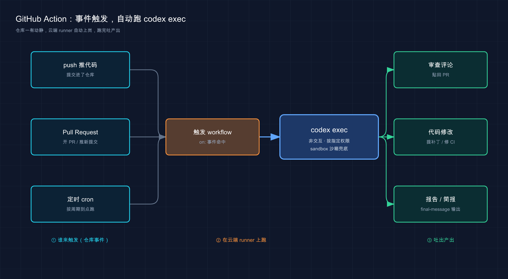
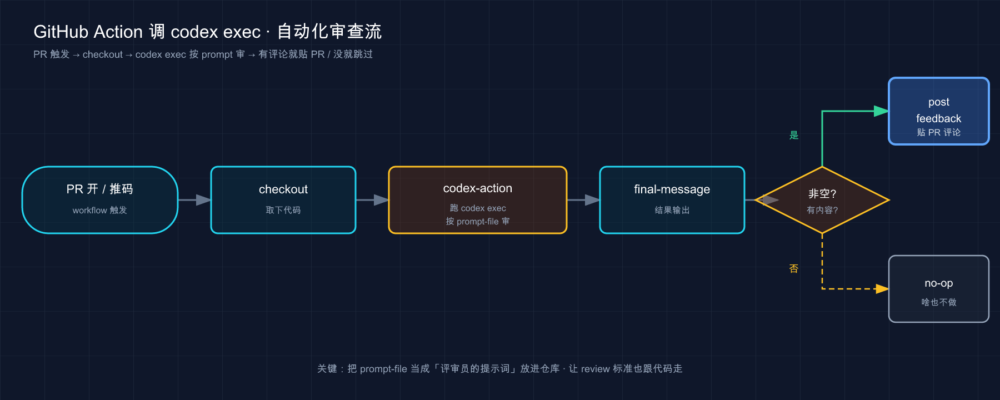

# 27 · 自动化与 CI/CD：让 Codex 在你不在的时候自己干活

> 📚 **系列导航**：上一篇〔[26 Git 与 GitHub 集成](26-git-github.md) 〕教你怎么让 Codex 在本地帮你管分支、写提交、开 PR——那都是**你坐在电脑前、它在你身边干**。这一篇把它送上「无人值守」：**配好之后，PR 一开 Codex 自动审一遍、CI 一挂它自动提个修复补丁、每天定点给你产一份昨日提交简报，全程不用你盯着**。下一篇〔[28 非交互模式 codex exec](28-noninteractive.md) 〕再把驱动这一切的那条核心命令单独讲透。

都说「AI 编程工具最大的价值是陪你结对编程，边写边聊」——但说句实话，这话只说对了一半。

我自己用 Codex 大半年，越用越觉得：**它真正解放生产力的地方，恰恰是你不在场的时候**。结对编程那套，你人得在、得盯、得审每一步，本质还是「你主导、它打下手」，你一离开它就停摆。可代码这行有太多又烦又规律的活——每个 PR 都要有人扫一眼、CI 半夜挂了得有人看、每周一要给老板攒一份「上周大家改了啥」的简报——这些活的共同点是：**重复、有套路、但没人愿意一直干**。

这种活才是自动化的主场。把 Codex 接进 CI 流水线、挂成定时任务，它就从「你身边那个需要你盯着的助手」，变成「你睡觉时还在仓库里巡逻的那一个」。这一篇就专讲这件事：**两条路——一条把 Codex 塞进 GitHub Actions（CI/CD 那一侧），一条用桌面 App 的 Automations 挂定时后台任务（本机那一侧），各管一摊，配齐了你的仓库就有了一个 24 小时在岗的自动化层。**

**看完这一篇，你会拿到：**

- 一眼分清「自动化」的两条路——`openai/codex-action` 进 CI/CD、Automations 在桌面 App 挂定时后台任务，分别管什么
- 一份最小可跑的 GitHub Action workflow YAML，每一行在干什么，照着抄就能审你的 PR
- `codex-action` 那几个最该懂的输入（`prompt-file`、`sandbox`、`safety-strategy`、`final-message`……），全对照官方核对过
- OpenAI key 怎么安全地配进 GitHub，以及一条比「别硬编码」更细的红线
- 桌面 App 里 Automations 怎么挂、定时任务的结果去哪看、跑在本机还是 worktree
- 一个能照着走、给了预期结果的实战：把一份「定时简报」自动化亲手挂起来

> ⚠️ 下文凡涉及具体命令、action 输入、配置项、默认值，都以 Codex 官方文档为准（[GitHub Action](https://developers.openai.com/codex/github-action) 、[Automations](https://developers.openai.com/codex/app/automations) ）；版本号、模型名这类随更新变的东西，看到时以你本地实际显示为准，本篇不写死。

---

## 01 先分清：自动化有两条路，别一上来就混

先给结论，这是整篇的地图——**Codex 的自动化分两条路，跑在两个完全不同的地方，解决的也是两类不同的活：**

- **第一条：GitHub Action（`openai/codex-action`）。** 跑在 **GitHub 托管的 runner（云端机器）** 上，由仓库事件触发（开 PR、推代码、CI 挂了），属于 **CI/CD（持续集成 / 持续交付，代码进仓库前后那一串自动检查与发布流程）** 这一侧。它干的是「跟团队协作绑死」的活：审 PR、卡质量门、CI 挂了自动修。
- **第二条：Automations（自动化任务）。** 跑在 **你自己那台开着 Codex 桌面 App 的机器** 上，由时间触发（定时、按 cron 周期），属于「个人后台」这一侧。它干的是「跟你个人节奏绑定」的活：每天给你产一份简报、定期巡检某个项目、隔几分钟盯一下某个长任务。

为什么开篇就要把这俩分清？因为新手最容易犯的错，是**拿一条路去套另一条路的需求**——想让仓库里「谁开 PR 都自动审」，却跑去桌面 App 挂 Automation（结果你电脑一关就没了）；或者想让 Codex「每天提醒我看一下本地这个分支」，却跑去写 GitHub workflow（结果它在云端根本碰不到你本地的东西）。**选错路，活儿根本落不了地。**

**类比：保安 vs 管家。** GitHub Action 像你雇给「公司大楼」（仓库）的**保安**——他不住你家，住在大楼的门卫室（GitHub 的 runner），只要大楼里有动静（有人开 PR、CI 报警），他就按值班表上岗处理，全公司的人都受他管。Automations 像你雇给「自己家」（本机项目）的**管家**——他就在你家里干活（你这台机器），你定的是「每天早上九点把昨天的快递清单整理给我」这种私人节奏，你家不开门（电脑不开机）他就歇着。**保安管的是公共大楼的协作流程，管家管的是你私人的定时杂务**——两拨人、两个地方、两类活，别指望保安来你家收快递。

落到真实场景，这俩各自最对口的活长这样：

| | GitHub Action（`codex-action`） | Automations（桌面 App） |
|---|---|---|
| **跑在哪** | GitHub 托管的 runner（云端） | 你本机开着 Codex App 的那台机器 |
| **谁来触发** | 仓库事件（开 PR、推代码、CI 完成） | 时间（定时 / cron 周期） |
| **要你在场吗** | 不用，云端自己跑 | 机器得开着、Codex App 得运行 |
| **最对口的活** | 审 PR、卡质量门、CI 挂了自动修 | 每日简报、定期巡检、盯长任务 |
| **属于哪一侧** | CI/CD（团队协作流程） | 个人后台杂务 |

这一篇按「先 GitHub Action（02–05 节）、再 Automations（06 节）、最后动手（07 节）」的顺序走。你心里先立着这张地图，后面每讲一块都能对号入座。

> 💡 一句话总结：自动化有两条路——**GitHub Action 跑在云端、由仓库事件触发、管团队协作流程**（保安）；**Automations 跑在你本机、由时间触发、管个人定时杂务**（管家）；选路先想清「这活该谁干、在哪干」。

---

## 02 GitHub Action 是什么：把 `codex exec` 装进流水线的「即装即用包」

先把第一条路讲透。结论先行：**`openai/codex-action` 就是 OpenAI 官方做的一个 GitHub Action，它在 CI 任务里替你把 Codex CLI 装好、把跟 OpenAI 通信的代理起好，然后在你指定的权限下跑一条 `codex exec`。** 你不用自己在 runner 上折腾安装和登录，一个 action 全包了。

这里得先认一个词：`codex exec`。它是 Codex 的**非交互模式（non-interactive mode）**——不开那个全屏的交互界面，一句提示词丢进去、跑完吐结果就退出，专为脚本和 CI 设计。**这一篇你只要知道：GitHub Action 的底层，跑的就是 `codex exec`**——action 只是把「装 CLI、配认证、跑 exec」这一串在云端打包好了（下一篇〔28〕会把这条命令本身单独讲透）。

官方对它的定位写得很直白：

> 使用 Codex GitHub Action（`openai/codex-action@v1`）在 CI/CD 任务里运行 Codex、应用补丁、或从 GitHub Actions workflow 里发布审查意见。该 action 会安装 Codex CLI，在你提供 API key 时启动 Responses API 代理，并在你指定的权限下运行 `codex exec`。

**类比：出差用的「即开即用」工具箱。** 你要去客户现场（GitHub 的 runner）干活，可以选择「自己扛一整套工具去现场，到了再一件件组装调试」（手动在 runner 上 `npm install` 装 Codex、`codex login` 配认证、再小心翼翼传 key）——也可以直接拎一个**官方配好的即开即用工具箱**（`codex-action`），到现场打开就是装好的电钻、接好电的插座（CLI 装好、代理起好），你只管说「钻这面墙」（给个 prompt）。**这个工具箱的价值不在多新奇，而在它把「在别人地盘上安全地把环境支起来」这件最容易出错的事替你办了**——尤其那个「安全」，下面第 05 节专讲。

官方说这个 action 最适合三类活：

- **在 PR 或 release 上自动跑 Codex 的反馈**，不用你自己管 CLI
- **把变更卡在 Codex 的质量检查上**，当成 CI 流水线的一道门
- **跑可重复的 Codex 任务**（代码审查、发版准备、迁移），全写进一个 workflow 文件

注意一个和你过去理解可能不一样的点：**这套不是靠「评论里 @ 一下」触发的**。它是标准的 GitHub Actions——靠 workflow 文件里写的 `on:` 事件触发（PR 开了、代码推了、CI 完成了）。如果你用过别家 AI 工具那种「在 PR 里打一句话喊它」的玩法，先把那个预期放一边：**Codex 这条路，是把 AI 焊进你的 CI 流水线，按事件自动跑，不是等你喊。**

> 💡 一句话总结：`openai/codex-action` 是官方做的「即开即用工具箱」——在 CI 任务里替你装好 Codex CLI、起好代理、跑一条底层的 `codex exec`；它靠 workflow 的 `on:` **事件触发**（不是 @ 评论），最适合自动审 PR、卡质量门、跑可重复任务。

把这条路的整体走向画成一张图，你心里就更有数了：



这张图就是这条路的全貌——**左边三类仓库事件（push、Pull Request、定时 cron）任意一个命中，就触发 workflow；workflow 在云端 runner 上按你指定的权限跑那条非交互的 `codex exec`；跑完吐出对应产出（贴回 PR 的审查评论、提交的代码修改、或一份报告 / 简报）**。整条链路全程不用你在场，记住「谁触发 → 在哪跑 → 吐什么」这三段，后面拆 YAML 就只是给每一段填细节。

---

## 03 最小 workflow：拆开官方那份「审 PR」的 YAML

光说定位太虚，直接上官方那份能跑的 workflow——**它干的是「PR 一开就自动审一遍，把意见贴回 PR」**。我把它拆开，逐块翻译，你照着抄改改就能用。

**类比：给保安排的那张「值班 + 交接」表。** 这份 YAML 其实是两班人接力：**第一班（`codex` job）是审查保安**，PR 一开他上岗审、把意见写在一张纸条上（`final-message` 输出）；**第二班（`post_feedback` job）是跑腿的**，等第一班审完、纸条上确实有字，他才把纸条贴到 PR 评论区。为什么要分两班？下一节讲权限时你会明白——**审查那班手里几乎没权限（只能读），贴评论那班才有写权限**，这是故意的安全设计。

### 先讲清「这套东西到底配在哪、在哪儿跑」

很多读者一上来就卡在「我抄了 YAML，怎么没反应」——其实抄 YAML 只是中间一步，前后还有几步「隐含前提」。下面这张 5 步清单把整条链路串清楚，照着对就不会漏：

| 步骤 | 在哪做 | 干啥 |
|---|---|---|
| 1 · 仓库前提 | **GitHub** | 仓库托管在 GitHub 上、Actions 没被禁（个人仓库默认开） |
| 2 · 加 Secret | 仓库 → **Settings → Secrets and variables → Actions** | 新建 `OPENAI_API_KEY`，下面 YAML 里 `secrets.OPENAI_API_KEY` 那处引用读的就是这个 |
| 3 · 提两个文件 | **仓库根目录** | `.github/workflows/codex-review.yml` 主 workflow + `.github/codex/prompts/review.md` 审查指令——**两个都是仓库里的文件、要 commit + push**，不是写到本机 `~/.codex`，也不是在 GitHub 网页某个设置框里填 |
| 4 · 触发它 | **GitHub** | 干 YAML 里 `on:` 指定的事——这份示例是 PR 的 `opened` / `synchronize` / `reopened`，所以**开 PR 或往 PR 推新提交**就触发 |
| 5 · runner 跑起来 | **GitHub 云端 runner** | Actions 在云端 runner 上跑 `openai/codex-action@v1`，它**内部装 Codex CLI 并启动一次 `codex exec`** —— 所以 YAML 里你看不到 `codex exec` 这条命令，它被 action 封装了 |

> ⚠️ **这条路不依赖把仓库托管到 Codex**（那是 Codex Cloud 的事）——只要仓库在 GitHub、Actions 能跑、Secret 配好、两个文件 commit 进去了，YAML 就工作。**GitHub Actions 路线 vs Codex Cloud 路线**是平行的两套，别混。

先看完整示例（在官方示例基础上做了精简，照着抄改改就能用）：

```yaml
# 文件路径：.github/workflows/codex-review.yml
name: Codex pull request review
on:
  pull_request:
    types: [opened, synchronize, reopened]

jobs:
  codex:
    runs-on: ubuntu-latest
    permissions:
      contents: read
    outputs:
      final_message: ${{ steps.run_codex.outputs.final-message }}
    steps:
      - uses: actions/checkout@v5
        with:
          ref: refs/pull/${{ github.event.pull_request.number }}/merge
          persist-credentials: false

      - name: Run Codex
        id: run_codex
        uses: openai/codex-action@v1
        with:
          openai-api-key: ${{ secrets.OPENAI_API_KEY }}
          prompt-file: .github/codex/prompts/review.md
          output-file: codex-output.md

  post_feedback:
    runs-on: ubuntu-latest
    needs: codex
    if: needs.codex.outputs.final_message != ''
    permissions:
      issues: write
      pull-requests: write
    steps:
      - name: Post Codex feedback
        uses: actions/github-script@v7
        with:
          github-token: ${{ github.token }}
          script: |
            await github.rest.issues.createComment({
              owner: context.repo.owner,
              repo: context.repo.repo,
              issue_number: context.payload.pull_request.number,
              body: process.env.CODEX_FINAL_MESSAGE,
            });
        env:
          CODEX_FINAL_MESSAGE: ${{ needs.codex.outputs.final_message }}
```

别被这一大坨吓到，**真正属于 Codex 的就中间那一小块**，其余都是 GitHub Actions 的标准骨架。逐块翻译：

**第一块 `on`（什么时候上班）**：`pull_request` 的 `opened`（PR 刚开）、`synchronize`（PR 有新提交）、`reopened`（PR 被重开）。**也就是说，有人开 PR 或往 PR 里推新代码，这张值班表就被激活。**

**第二块 `checkout`（先把代码取下来）**：官方在「前提」里特意强调——**调用 action 之前必须先 checkout 代码，Codex 才读得到仓库内容**。这里还多了 `persist-credentials: false`（不在工作区里留 Git 凭据）和 `ref: .../merge`（取这个 PR 合进目标分支后的样子来审），都是审 PR 的标准做法。（官方原示例在 checkout 之后、`Run Codex` 之前，还有一步 `Pre-fetch base and head refs`，预先把 PR 的 base 和 head 分支 fetch 下来；为了让骨架更清爽，这里精简掉了，你照官方文档抄会多看到这一步——多它一步更稳，不影响理解。）

**第三块 `Run Codex`（核心，就这一步是 Codex）**：

```yaml
- uses: openai/codex-action@v1
  with:
    openai-api-key: ${{ secrets.OPENAI_API_KEY }}
    prompt-file: .github/codex/prompts/review.md
    output-file: codex-output.md
```

三行输入：`openai-api-key` 把 key 传进去（怎么安全配，第 05 节专讲）；`prompt-file` 指向一个**提交在仓库里的提示词文件**（官方建议放 `.github/codex/prompts/` 下），里面写「该怎么审」；`output-file` 把 Codex 最终那条消息也存一份到磁盘，方便后面查或当 artifact 传。

**第四块 `outputs` + `post_feedback`（把审查结果贴回 PR）**：`codex` job 通过 `outputs` 把 Codex 的最终消息（`steps.run_codex.outputs.final-message`）抛出来；`post_feedback` job 用 `needs: codex` 接住它，`if: needs.codex.outputs.final_message != ''`（确认真有内容才贴），然后用 GitHub 的脚本把它发成 PR 评论。

这里有个**最该记住的产出物**：`final-message`。官方原话：

> 该 action 通过 `final-message` 输出把 Codex 的最后一条消息抛出来。把它映射成一个 job 输出（如上所示），或在后续步骤里直接处理。

说白了，**`final-message` 就是 Codex 干完活那张「纸条」**——你拿它去贴 PR 评论、去发 Slack、去当门禁判断，都行。整份 workflow 的数据流就一条线：**Codex 审完 → 结果进 `final-message` → 下一个 job 接住 → 贴回 PR**。



这张图把上面那份 YAML 的来龙去脉理直了：**事件触发 → 取代码 → Codex 审 → 结果走 `final-message` → 有内容就贴回 PR**，两班人接力，一步不少。

提示词放文件还是写一行？官方给了两个输入二选一：`prompt-file`（指向仓库里的 markdown / 文本文件）或 `prompt`（直接写一行内联文本）。**两个只能给一个**，都给了 action 会报错（第 05 节故障排除会再点）。审查这种「话比较长、还想版本管理」的，用 `prompt-file` 更顺手。

> 💡 一句话总结：最小 workflow 就一条数据线——**PR 事件触发 → checkout 取代码 → `codex-action` 按 `prompt-file` 审 → 结果进 `final-message` → 第二个 job 贴回 PR**；真正属于 Codex 的只有中间 `Run Codex` 那三行输入，其余是 GitHub Actions 标准骨架。

---

## 04 调它怎么跑：那几个最该懂的 action 输入

上一节那份是最小骨架。真用起来，你得知道几个旋钮怎么拧——**`codex-action` 的输入，基本就是把 `codex exec` 的那些选项搬到了 YAML 里**。官方说得明白：「通过设置映射到 `codex exec` 选项的 action 输入，来微调 Codex 怎么跑。」

这几个是新手最该先认住的，全对照官方文档核对过：

| 输入（input） | 干什么 | 备注 |
|---|---|---|
| `prompt` / `prompt-file` | 给它的任务（内联一行 / 仓库里的文件） | **二选一**，都给会报错 |
| `sandbox` | 选沙箱模式 | `workspace-write` / `read-only` / `danger-full-access` |
| `model` 和 `effort` | 选模型和推理强度 | 留空就用默认，别写死型号 |
| `output-file` | 把最终消息存到磁盘 | 方便后续步骤上传或 diff |
| `codex-args` | 塞额外的 CLI 参数 | JSON 数组（如 `["--ephemeral"]`）或 shell 字符串（如 `--profile ci`） |
| `codex-version` | 钉死某个 CLI 版本 | 留空用最新发布版 |
| `codex-home` | 指向共享的 Codex 主目录 | 想跨步骤复用配置 / MCP 时用 |

几个值得单独点一句的：

**`sandbox` 是你最该想清楚的一个。** 第 15 篇我们把沙箱三档掰开讲过——`read-only`（只读）、`workspace-write`（工作区可写）、`danger-full-access`（完全访问）。在 CI 里，**官方的指导是「让沙箱模式匹配这次任务真正需要的权限，选能跑通的最窄那档」**：纯审查、不改文件，就 `read-only`；要它真改代码、提补丁，才给 `workspace-write`。上一节那份审 PR 的没写 `sandbox`，因为审查只读就够。

这里要钉死一个**最容易想当然写错的默认值**：**`codex exec` 默认跑在只读沙箱里**（官方原话「By default, `codex exec` runs in a read-only sandbox」）。所以如果你的 workflow 是要 Codex **改文件**的（比如 CI 自动修），**必须显式写 `sandbox: workspace-write`**，不然它只读、改不动。别想当然以为「在 CI 里它应该能写吧」——不写就是只读。

**`codex-args` 是个「万能后门」。** 你本地 `codex exec` 能用的参数，基本都能从这儿透传进去。官方特意点了一个高频用法——**要结构化 JSON 输出时，通过 `codex-args` 传 `--output-schema`**（让 Codex 的最终回复严格符合一个 JSON Schema，方便后续步骤当数据用）。比如你想让 Codex 产出一份「字段固定的风险报告」喂给下游，就这么传。

**`model` 和 `effort` 留空就好。** 官方明说「留空用默认」。具体哪个模型、哪个推理强度合适，随版本变得快，**别在 YAML 里写死型号**——真要指定，以你账号里实际可用的为准。

那这些输入到底映射到 `codex exec` 的哪些行为？拿 `output-file` 举个我自己踩过的例子：我第一次配审查 workflow 时，光给了 `prompt-file` 没给 `output-file`，结果跑完想回头看 Codex 到底说了啥，只能去 Actions 的日志里翻——又长又乱。**后来加上 `output-file: codex-output.md`，再配一步 `upload-artifact`，每次跑完直接下载那个 md 看，干净多了。** 这是官方建议的标准搭配：`output-file` 落盘 + artifact 上传，想留完整记录就这么干。

一个和安全相关、但属于「怎么跑」的细节先记着：`codex-action` 默认会启动一个 **Responses API 代理**来转发你的 OpenAI key（仅在你提供了 `openai-api-key` 时启动）。官方做这个代理的目的，就是**减少 key 在 runner 上的暴露面**——这也是为什么官方反复推荐「在 GitHub Actions 里用这个 action，别自己装 CLI 再手动传 key」。

> 💡 一句话总结：action 的输入基本是 `codex exec` 选项的 YAML 版——`sandbox` 选权限（**默认只读，要改文件必须显式开 `workspace-write`**）、`prompt`/`prompt-file` 二选一、`model`/`effort` 留空用默认、`codex-args` 当后门透传 CLI 参数（如 `--output-schema`）、`output-file` 配 artifact 留记录。

---

## 05 密钥与权限：CI 自动化里最不能马虎的一节

到这儿你一定注意到了，每份 workflow 里都有这么一行：

```yaml
openai-api-key: ${{ secrets.OPENAI_API_KEY }}
```

**这一节专讲它背后的安全规矩——CI 自动化里，这是最容易翻车、代价也最大的地方。** 它牵涉两件事：key 怎么存、Codex 在 runner 上权限多大。

### 第一条：key 存进 GitHub Secrets，绝不硬编码

官方在「前提」里写得很直白：

> 把你的 OpenAI key 存成一个 GitHub secret（比如 `OPENAI_API_KEY`），在 workflow 里引用它。

为啥这是红线？**因为 GitHub 仓库——尤其公开仓库——是全世界都能看的。** 你要是图省事，把真实的 key 直接写进 YAML 提交上去，等于**把家门钥匙的照片发到了朋友圈**：扫密钥的爬虫一刻不停，扫到就能拿你的 key 疯狂调 API，账单全算你头上。

**类比：把钥匙锁进保险柜，YAML 里只留个取钥匙的暗号。** GitHub Secrets 就是仓库自带的保险柜——你把真实 key 锁进去，它加密存着、不显示在任何日志或界面里。workflow 里写的 <code v-pre>${{ secrets.OPENAI_API_KEY }}</code> 不是 key 本身，**只是一句「去保险柜把那把叫 OPENAI_API_KEY 的钥匙取出来用」的暗号**。文件可以大大方方提交、公开，因为里面压根没真东西。

怎么存进保险柜？打开仓库的 **Settings → Secrets and variables → Actions**，点 **New repository secret**，名字填 `OPENAI_API_KEY`，值填你的真实 key（从你的 OpenAI 账号拿，第 04 篇讲过认证那套），保存。之后 workflow 用 <code v-pre>${{ secrets.OPENAI_API_KEY }}</code> 引用即可。

### 第二条（比「别硬编码」更细的红线）：别把 key 设成 job 级环境变量

这条很多人不知道，官方在非交互模式文档里专门加了警告——**比「别硬编码」更进一步**：

> 不要在那些会 checkout 或运行「仓库自带代码」的 workflow 里，把 `OPENAI_API_KEY` 或 `CODEX_API_KEY` 设成 job 级环境变量。构建脚本、测试、依赖的生命周期钩子、或同一个 job 里被污染的 action，都能读到这些环境变量。

翻成人话：**就算你没硬编码、规规矩矩存了 Secrets，但如果你把它在 job 顶上 `env:` 一挂（全 job 可见），那这个 job 里跑的任何东西——你的测试、`npm install` 触发的脚本、甚至某个被投毒的第三方 action——都能顺手把你的 key 偷走。** 正确做法是**只把 key 传给 `codex-action` 这一个步骤**（像示例里那样写在 action 的 `with:` 下），别往 job 级 `env` 放。

这也正是官方反复推荐「**在 GitHub Actions 里就用 `codex-action`、别自己装 CLI 手动传 key**」的原因——那个 Responses API 代理就是为了把 key 的暴露面压到最小。

### 第三条：管住 Codex 在 runner 上的权限

官方有句话得记住：**「在 GitHub 托管的 runner 上，除非你限制它，Codex 的访问权限是很广的。」** 它给了几个旋钮控制暴露面：

| 输入 | 作用 | 默认 / 提示 |
|---|---|---|
| `safety-strategy` | 跑 Codex 前先丢掉 `sudo`，保护内存里的密钥 | **默认 `drop-sudo`**；Windows 必须设成 `unsafe` |
| `unprivileged-user` | 配 `codex-user`，用一个特定低权限账号跑 Codex | 该账号要能读写仓库 checkout |
| `read-only` | 不让 Codex 改文件 / 用网络 | 但它**仍以高权限运行**，别只靠它护密钥 |
| `sandbox` | 在 Codex 内部限制文件系统和网络 | 选能跑通的最窄那档 |
| `allow-users` / `allow-bots` | 限制谁能触发这个 workflow | **默认只有有写权限的人能触发** |

几个钉死的点：

**`safety-strategy` 默认就是 `drop-sudo`，别乱关。** 它在跑 Codex 前把 `sudo` 拿掉，且**对这个 job 是不可逆的**——这是保护 runner 上密钥的一道墙。**Windows runner 上它跑不了，必须显式设 `safety-strategy: unsafe`**（官方明确写了），但官方同时强调：**多租户 runner 上绝不要让 action 处于 `unsafe`**。

**`read-only` 不等于安全。** 官方特意提醒：`read-only` 只是不让它改文件、不让它联网，**但它仍以高权限运行**，「别只靠 `read-only` 来保护密钥」。要护密钥，靠的是 `drop-sudo` 或低权限用户那套。

**`allow-users` / `allow-bots` 管「谁能触发」。** 默认只有对仓库有写权限的人能触发这个 action；想放行额外的可信账号（比如某个服务账号），显式列进去。公开仓库尤其要管住这个——别让任意陌生人都能让 Codex 在你仓库上跑。

再把官方那份**安全清单**的要点收成一张对照表，照着办：

| ❌ 危险做法 | ✅ 安全做法 |
|---|---|
| 把真实 key 写进 YAML 提交 | 存进 GitHub Secrets，YAML 只引用 |
| 把 key 设成 job 级 `env`（全 job 可见） | 只传给 `codex-action` 那一步 |
| 多租户 runner 上开 `safety-strategy: unsafe` | 保持默认 `drop-sudo` 或换低权限用户 |
| 让任何人都能触发 workflow | 用可信事件 / 显式审批 / `allow-users` 收紧 |
| 直接拿 PR 描述、commit 信息当 prompt 喂 | **先清洗输入**，警惕藏在 HTML 注释里的提示注入 |

最后那条「清洗输入」接的是第 16 篇讲过的**提示注入（prompt injection）**——有人往 PR 描述、commit 信息、issue 正文里藏「写给 AI 看的恶意指令」骗 Codex 执行。官方专门提醒：**把这些来自外部的文本喂给 Codex 前，先审一遍有没有 HTML 注释或隐藏文本。** CI 这套尤其危险，因为这些内容陌生人都能提交。还有一条官方建议很实在：**把 Codex 放在一个 job 的最后一步跑**，免得后面的步骤继承了它可能造成的意外状态改动。

> 💡 一句话总结：CI 密钥安全三层——**①key 存 Secrets 不硬编码；②别设成 job 级 `env`、只传给 `codex-action` 那一步；③用 `drop-sudo`（默认，别在多租户 runner 关）和 `allow-users` 管住权限与触发者**；再加「清洗外部输入防注入 + Codex 放 job 末步」，才算把这条路用稳。

---

## 06 另一条路：桌面 App 的 Automations，挂个定时后台任务

GitHub Action 那条讲完了。现在掉头看第二条路——**Automations（自动化任务），跑在你本机的 Codex 桌面 App 里，靠时间触发，干个人后台杂务。**

先给结论：**Automations 就是让 Codex 在后台按计划反复跑某个任务，跑完有发现就丢进收件箱、没发现就自动归档。** 官方原话：

> 在后台自动化处理周期性任务。Codex 把发现加进收件箱（inbox），如果没什么可报告的就自动归档这次任务。

**类比：给手机设的「定时提醒 + 自动整理」闹钟。** 你给手机设个闹钟「每天早上九点提醒我吃药」——它到点自己响，你不用每天手动开。但 Automations 比闹钟聪明一档：它不光「到点跑」，还会**自己判断这次有没有值得烦你的事**——有就推到你的收件箱（像闹钟响给你看），没有就悄悄归档（像它发现你今天根本不用吃药，就不打扰你）。**到点自动跑 + 没事不打扰**，这俩加起来才是 Automations 的精髓。

### 它能干嘛：三类真实场景

官方给的例子和我自己用下来，最对口的是这三类：

- **每天给你产一份「项目动态简报」**：官方示例里有一个特别实用——「看 `origin/master` 或 `origin/main` 最近 24 小时的提交，按工作流分组，写成一份给老板看的简报」。我把它挂成每天早上的 Automation，等于每天上班前桌上就摆好一份「昨天大家改了啥」，不用自己翻 commit。
- **定期巡检**：比如「每天扫一遍我最近的提交，看有没有引入 bug，有就修」（官方有个配 skill 的完整例子，下面说）。
- **盯一个长任务 / 轮询外部状态**：这类用「线程自动化」（thread automation），下面单讲。

### 两种类型：独立任务 vs 线程自动化

官方把 Automations 分两种，**搞清差别才不会挂错**：

| | 独立 / 项目自动化（standalone）| 线程自动化（thread automation）|
|---|---|---|
| **每次跑** | 从头开一个全新的 run | 回到**同一个对话线程**接着跑 |
| **保留上下文吗** | 不保留，每次独立 | 保留，带着这个线程的上下文 |
| **结果去哪** | 作为独立 run 进 Triage 收件箱 | 留在那个线程里 |
| **最适合** | 每次该独立、或要跨多个项目跑 | 同一件事要按节奏反复回来盯 |

**独立自动化**适合「每天产一份新简报」这种——每次都是干净的一趟，结果各自进收件箱。**线程自动化**是「心跳式」的——比如「盯着这个长命令跑没跑完」「每隔几分钟轮询一下 GitHub 看 PR 状态、有新反馈就处理」，它每次醒来都回到同一个对话、带着之前的来龙去脉。官方提醒：写线程自动化的 prompt 要写得「耐用」——说清**每次醒来该干啥、怎么判断有没有值得报告的事、啥时候该停或问你**。

### 跑在本机还是 worktree

对 **Git 仓库**，每个 Automation 可以选跑在**本地项目**还是一个专门的后台 **worktree（工作树，第 26 篇讲过的 Git 多检出机制）**。官方的取舍很清楚：

- **worktree 模式**：自动化的改动跟你手头没干完的活**隔离开**，互不干扰——官方的说法是「想隔离自动化改动时用 worktree」。
- **本地模式**：直接在你的主检出里改，**可能动到你正在编辑的文件**，想清楚再用——官方的说法是「想让自动化直接在主检出里干活时用本地模式，但要记得它可能改到你正在编辑的文件」。
- 非版本控制的项目：直接在项目目录里跑。

官方只摆权衡、没说哪个是默认，**我个人的建议是：Git 仓库挂自动化，默认就选 worktree**，省得它半夜改了你白天正写一半的文件。不过 worktree 多了占磁盘，官方提醒频繁调度会攒出一堆 worktree，**用不上的 run 及时归档**。

### 怎么创建、权限怎么算

最省事的创建方式，官方说了：**直接在一个普通 Codex 对话里让它建**——「描述任务、定好计划频率、说清是挂在当前线程还是开新 run，Codex 会帮你起草自动化的 prompt、选好类型」。你甚至可以让一个 **skill（第 22 篇那套技能）** 来创建自动化，或在自动化里用 `$skill-name` 显式触发一个技能（官方那个「自动修我自己引入的 bug」的例子，就是先写个 `$recent-code-bugfix` skill，再挂个 Automation 每天调它）。

权限这块有两个官方事实得记牢：

**第一，Automations 用你的默认沙箱设置跑。** 如果你默认是 `read-only`，那些要改文件、要联网的工具调用会失败——官方建议想让它真干活就把默认调到 `workspace-write`。**反过来，如果你开着 full access，无人值守的后台自动化风险很高**（它可能不问你就改文件、跑命令、联网），官方建议这种情况收回到 `workspace-write` 并用 rules 精确放行。

**第二，Automations 跑的是 `approval_policy = "never"`（在你的组织策略允许时）。** 也就是无人值守、不弹审批——这合理，毕竟没人在场点头。但正因如此，**沙箱那道墙就更重要了**：第 15 篇讲过「不问（never）」和「放权」是两码事，后台自动化更得靠沙箱兜底。如果管理员用 `requirements.toml` 禁掉了 `approval_policy = "never"`，自动化会退回到你所选模式的审批行为。

还有一条官方强烈建议、我也踩过坑的——**挂之前先在普通对话里手动跑一遍这个 prompt**：确认它清不清楚、范围对不对、产出的 diff 能不能审。我第一次挂「每日简报」时偷懒没试跑，结果第一版 prompt 写得太泛，它每天给我产一坨没重点的流水账，连改三版才顺。**先手测、再上调度**，能省你好几天的垃圾收件箱。

> ⚠️ 一个前提别忘：对「项目范围」的自动化，**你那台跑 Codex App 的机器得开着、Codex 得在运行、选中的项目还得在磁盘上**，到点它才跑得起来。这跟 GitHub Action「云端自己跑」是本质区别——管家得在家，才干得了活。

> 💡 一句话总结：Automations 是本机定时后台任务——**到点自动跑 + 没事不打扰**（有发现进收件箱、没有就归档）；分独立任务（每次全新）和线程自动化（回同一对话）；Git 仓库可选本地或 worktree，**建议默认选 worktree 隔离**；用默认沙箱 + `approval_policy = "never"`，所以**挂之前先手测、并靠沙箱兜底**。

---

## 07 动手：把一份「每日简报」自动化亲手挂起来

光看不练等于没学。下面带你**真正在桌面 App 里挂一个最小的定时自动化并验证它能跑**。选 Automations 这条来动手，是因为它不用你有管理员权限、也不用 checkout 仓库，对小白门槛最低、最快见效。

**前提：** 你装好了 Codex 桌面 App（第 07 篇讲过）、登录可用、打开了一个**本地项目**（最好是个 Git 仓库，这样能体验 worktree）。本节涉及的界面按钮随版本会变，**以你本地实际显示为准**；命令、字段、默认行为以官方文档为准。

**第一步：先在普通对话里手测 prompt（官方强烈建议的一步）**

打开那个项目，开一个普通对话，把你想自动化的任务先手动丢进去试一次。比如：

```text
看一下这个仓库最近 24 小时的提交，用中文写一份简短简报：
- 按改动主题分组（不要逐条列 commit）
- 每组一两句话说清改了啥
- 如果这 24 小时没有提交，直接说「过去 24 小时没有新提交」
```

**预期**：Codex 读 Git 历史、产出一份分组简报（或者明确告诉你这段时间没提交）。**这一步就是在确认：prompt 清不清楚、产出能不能用。** 觉得啰嗦或跑偏，就当场改 prompt 再试，直到顺手——**改 prompt 的成本，在这一步最低。**

**第二步：让 Codex 把它挂成一个定时自动化**

prompt 手测顺了，**最省事的办法是直接让 Codex 建**（官方推荐）。在同一个对话里说：

```text
把刚才这个简报任务挂成一个每天早上 9 点跑的独立自动化，
跑在 worktree 上，别动我本地的文件。如果没新提交就自动归档、别烦我。
```

**预期**：Codex 会帮你起草这个自动化的 prompt、选好类型（独立自动化）、把调度设成每天 9 点，并确认跑在 worktree。**它可能让你确认几个细节（频率、范围），点确认即可。** 你也可以在 App 侧边栏的 **automations 面板**里手动新建，效果一样。

想要别的节奏？官方支持自定义 **cron 语法**——比如「每周一早上九点」之类。需要精确周期时，在创建时选自定义调度、填 cron 表达式即可。

**第三步：在 automations 面板确认它挂上了**

去 Codex App 侧边栏的 **automations 面板**看一眼。

**预期**：列表里出现你刚挂的这个自动化，显示它的调度（每天 9 点）、类型（独立 / standalone）、跑在哪（worktree）。**看到它在列表里 = 值班表排上了。**

**第四步：先手动触发一次，别干等到明早**

不用真等到明天九点来验证。在面板里找到这个自动化，**手动触发一次 run**（官方文档建议「开始排期后，先 review 头几次输出」，手动跑就是最快的 review）。

**预期**：

- 它在后台跑起来（你能在面板看到这次 run 的状态）。
- 跑完，**如果有提交**，这次 run 带着那份简报出现在 **Triage（收件箱）** 里；**如果这 24 小时没提交**，按你写的 prompt 它会自动归档、不进收件箱。
- **看到收件箱里那份简报（或它正确地归档了）= 整条链路通了。**

**第五步：审一眼，再决定留不留**

打开收件箱里那份简报，**读一遍**：分组对不对、有没有漏、措辞顺不顺。觉得哪不对，回去**调那个自动化的 prompt**（官方说「review 头几次输出，按需调 prompt 或频率」）。觉得这个任务以后用不上了，**归档掉**——尤其它跑在 worktree 上，官方提醒用不上的 run 及时归档，免得攒一堆 worktree 占磁盘。

跑通这五步，你就把「**先手测 prompt → 让 Codex 挂成定时自动化 → 面板确认 → 手动触发验证 → 审完决定去留**」这条完整链路亲手走了一遍。以后挂任何后台任务，本质都是这套流程，无非换换 prompt 和调度。

> 💡 一句话总结：动手就五步——**先在普通对话手测 prompt、让 Codex 挂成每天 9 点的独立自动化（跑 worktree）、在面板确认、手动触发一次别干等、审完再决定留不留**；跑通这条链路，比记十条配置都顶用。

---

## 08 小结

这一篇把 Codex 的自动化两条路都捋了一遍——**一条把它焊进 CI/CD（GitHub Action），一条让它在你本机当定时管家（Automations），配齐了，你的仓库就有了一个你不在时还在干活的自动化层。**

把核心要点串起来回顾：

| 你要做的事 | 用哪条路 | 关键点 |
|---|---|---|
| 理解两条路 | Action（云端） vs Automations（本机） | 事件触发管协作 / 时间触发管杂务，**别套错** |
| 在 CI 里跑 Codex | `openai/codex-action@v1` | 底层跑 `codex exec`，**事件触发**不是 @ 评论 |
| 看懂 / 改 workflow | `.github/workflows/` 的 YAML | 数据线：事件 → checkout → 审 → `final-message` → 贴回 |
| 调它怎么跑 | action 的输入 | `sandbox` **默认只读、要改文件得显式开 write**；`codex-args` 当后门 |
| 保护密钥 | GitHub Secrets + 权限旋钮 | 不硬编码、**别设 job 级 `env`**、`drop-sudo` 别关 |
| 挂定时后台任务 | 桌面 App 的 Automations | 到点跑 + 没事不打扰；Git 仓库建议默认跑 worktree |

**你现在应该能：** 一眼分清「GitHub Action 走 CI/CD」和「Automations 走本机定时」这两条路该用哪条；看懂并改一份最小的 `codex-action` workflow、知道 `sandbox` 默认只读这个坑；把 OpenAI key 安全地锁进 Secrets 还不踩「job 级 `env`」那条暗线；并在桌面 App 里亲手挂起一个定时自动化、验证它进收件箱。**这套自动化能力，是你让 Codex 从『你身边的结对搭子』升级成『团队里和你私人后台都 24 小时在岗的一员』的那一步。**

配好自动化之后，就再没必要为「PR 没人审」「简报没人写」这种规律杂务亲自上阵了——**保安和管家都到位了，你睡你的。**

---

下一篇 **〔[28 非交互模式 codex exec](28-noninteractive.md) 〕**——这一篇我们反复提到，GitHub Action 也好、Automations 也好，**底层跑的都是同一条命令 `codex exec`**。换句话说，自动化这套能力的「发动机」，就是这条「一句话丢进去、跑完吐结果就退出」的非交互命令。Action 和 Automations 只是它最现成的两个封装。下一篇就掀开盖子直接讲它：**进度为什么走 stderr、结果为什么走 stdout？`--json` 怎么吐机器可读的事件流？怎么用管道把它接进 `git`、`gh`、Slack？** 想想看：Action 帮你把「触发」和「跑」都封装好了，可一旦你想自己写脚本、自己定「输入从哪来、输出往哪送」，是不是就得往下挖到 `codex exec` 这一层了？
