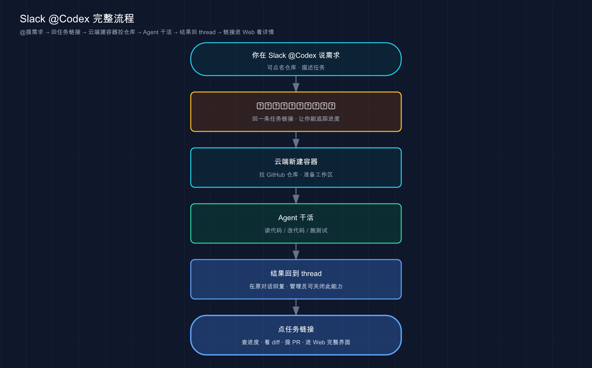

# 29 · Slack / Linear 与 SDK 集成：在别处召唤 Codex，把它嵌进你自己的产品

> 📚 **系列导航**：上一篇〔[28 非交互模式 codex exec](28-noninteractive.md) 〕讲的是「一句话丢进去、跑完吐结果就退」的无人值守跑法——那是把 Codex 接进脚本和 CI 的第一块拼图。这一篇再往外走两步：**一是不打开终端，在 Slack、Linear 里直接喊一声就让 Codex 干活；二是用官方 SDK / App Server，把 Codex 当成一个零件嵌进你自己写的程序和产品里。** 下一篇〔[30 怎么选模型](30-models.md) 〕回到本地，专门讲「同样一句话，到底该派哪个模型去跑」。

> ℹ️ **本篇是选读，面向进阶读者。** 如果你现在只是在终端、桌面 App、IDE 里用 Codex，这篇的东西你暂时用不上，跳过完全不影响后面。等你有了「想在团队 IM 里直接派活」或者「想把 Codex 塞进自己的产品」的念头，再回来看。

先放一段真事改的对话，你大概就懂这篇在讲啥了。

> 同事在 Slack 频道里贴了张报错截图，跟了一句：「这个登录接口又 500 了，谁看看？」
> 我没开电脑，直接在那条消息下面回：`@Codex 看看上面这个 500，在 openai/our-backend 里定位一下原因`。
> 几秒后 Codex 给那条消息点了个 👀，回了一条带任务链接的消息：「已开始，稍等」。
> 我接着去开会。散会回来，Codex 在 thread 里贴了定位结论和一份改动 diff，链接点进去就能提 PR。

整个过程我**一个字的代码没写、终端没开、电脑甚至没在手边**。这就是「在别处召唤 Codex」——把它从「你得坐在终端前」彻底解放出来，搬进你团队天天泡着的 Slack 和 Linear。而 SDK / App Server 是更进一步的玩法：**不光在别人的产品里用 Codex，而是把 Codex 装进你自己的产品里**。

**看完这一篇，你会拿到：**

- 一句话分清「召唤 Codex」的**两个层次**——零代码接进 Slack/Linear，还是写代码嵌进自己的程序
- 在 **Slack** 里 `@Codex` 派活的完整设置和用法，外加它怎么自己挑环境和仓库、Enterprise 怎么管数据
- 在 **Linear** 里把 issue 派给 Codex 的两种姿势（指派 / 评论 @），以及用 triage 规则**自动**派单
- **Codex SDK**（TypeScript / Python 两套）是什么、装哪个、最小代码长啥样，以及它和 `codex exec` 差在哪
- **App Server** 又是什么、什么时候才轮到它出场——以及一条「先用 SDK、别一上来碰 App Server」的判断线
- 一个能照着跑、给了预期输出的最小 SDK 程序

> ⚠️ 下文凡涉及具体命令、包名、配置项、默认行为，都以 Codex 官方文档（[Slack](https://developers.openai.com/codex/integrations/slack) / [Linear](https://developers.openai.com/codex/integrations/linear) / [SDK](https://developers.openai.com/codex/sdk) / [App Server](https://developers.openai.com/codex/app-server) ）为准；模型名、套餐这类随版本变的东西，看到时以你本地实际显示为准，本篇不写死。

---

## 01 先分清两个层次：零代码「召唤」，还是写代码「嵌入」

这篇看着杂——Slack、Linear、SDK、App Server 四样东西摆一起，新手容易眼花。其实它们干的是两类**根本不同**的事，先把这条线划清楚，后面就顺了。

**类比：找一个全能助理帮你干活，有两种方式。** 第一种，这个助理已经入驻了你常用的几个办公软件（Slack、Linear），你在群里 @ 他一声、把活派给他就行——**Slack / Linear 就是这个入口，OpenAI 替你搭好了，零代码、@ 一下就能用**。第二种，你想把这个助理请进你自己开的公司、嵌进自己的业务流程——这得签合同、对接系统（写代码调 SDK / App Server），让他成为你产品的一部分——**这就是「写代码嵌入」那条路**。

落到这四样东西上，分工是这样的：

| 这一层 | 具体是啥 | 你要做的 | 跑在哪 |
|--------|---------|---------|--------|
| **零代码召唤** | Slack 集成、Linear 集成 | 装好集成、`@Codex` 派活 | OpenAI 云端任务 |
| **写代码嵌入** | Codex SDK（TS / Python） | 写程序调用，控制 Codex 干活 | 你的进程 / CI / 服务 |
| **写代码嵌入（更底层）** | App Server | 用 JSON-RPC 对接，做深度集成 | 你的客户端 / 产品里 |

还有一条**关键的认知**得先钉住：**Slack 和 Linear 派出去的活，跑的是「云端任务」（Codex cloud，第 10 篇讲过的那个）。** 也就是说，你在 Slack 里 `@Codex`，本质是「让它在 OpenAI 云上新建一个容器、拉你的 GitHub 仓库、干完交 diff」——只不过派活的入口从浏览器换成了 Slack 消息。**所以第 10 篇云端版的那套前提（连 GitHub、配好环境、付费套餐），Slack/Linear 全都继承下来了**，这点后面会反复用到。

什么时候你会想起这篇的东西？三类信号：

- **「这个报错/需求我想顺手甩给 Codex，但不想专门打开电脑开终端」**——接 Slack/Linear
- **「我想把同一套 Codex 流程写成脚本，挂进 CI 自动跑」**——用 SDK
- **「我想给自己的产品做个深度集成，像 VS Code 扩展那样，要会话历史、要审批、要流式事件」**——才轮到 App Server

> 💡 一句话总结：这篇分两层——**Slack/Linear 是 OpenAI 替你接好的「零代码召唤」入口（底层跑的是云端任务），SDK/App Server 是让你「写代码把 Codex 嵌进自己产品」的通道**；先认准你属于哪一层，再往下看。

---

## 02 在 Slack 里召唤：`@Codex` 一句话派活

先讲最容易上手、也最常用的——**Slack 集成**。一句话：**在 Slack 频道或 thread 里 `@Codex` 加一句话，它就在云端建个任务、干完把结果回到 thread 里。**

**类比：往工作群里 @ 一个随叫随到的同事。** 你不会为了问同事一件事专门跑去他工位——群里 @ 一下、把事说清楚就行，他看到了自己去办，办完回群里告诉你结果。Codex 接进 Slack 之后就是这么个「群成员」：**你 @ 它、说需求，它去云端干，干完回 thread 汇报。** 而且它能读 thread 里前面的消息，所以很多上下文你不用重新说一遍。

### 设置：三步接上

按官方文档，接 Slack 就三步（都做不到的话它没法开工）：

1. **先把云端任务备好**。这是前提——你得有 **Plus、Pro、Business、Enterprise 或 Edu** 套餐（以官方 [ChatGPT pricing](https://chatgpt.com/pricing) 为准）、**连好 GitHub 账号**、并且**至少配了一个环境（environment）**。这三样正是第 10 篇云端版讲过的，这里直接复用。
2. **装 Slack app**。去 [Codex 设置的 connectors 页](https://chatgpt.com/codex/settings/connectors) 给你的工作区装上 Slack app。**注意**：看你们 Slack 工作区的策略，可能需要管理员先批准安装。
3. **把 `@Codex` 加进频道**。还没加的话，你在频道里 @ 它时 Slack 会提示你加。

### 用法：@ 它，说需求

接好之后，用起来特别直白：

1. 在频道或 thread 里 **`@Codex` 加上你的需求**。它能引用 thread 里更早的消息，所以常常不用重述上下文。
2. （可选）**在话里直接指定环境或仓库**，官方给的例子：`@Codex fix the above in openai/codex`。
3. 等它**反应 👀**、回一条带任务链接的消息；干完它会把结果贴回来，（看你的设置）还会在 thread 里给个答复。

### 它怎么自己挑环境和仓库

这是新手最容易懵的一点——你没指定仓库时，Codex 凭啥知道去哪个库干活？官方写得很清楚：

- Codex 会**看你有权限的那些环境，挑一个最匹配你需求的**；要是需求太含糊，它**回退到你最近一次用的环境**。
- 任务跑在**那个环境 repo map 里列的第一个仓库的默认分支**上。想换默认仓库或加仓库，去 Codex 里改 repo map。
- 要是**没有合适的环境或仓库**，Codex 会在 Slack 里直接回你「该怎么修」，让你弄好再重试。

所以**与其让它猜，不如直接点名**——我自己用下来，凡是涉及多个仓库的团队，我都会在消息里把仓库写死（`...in openai/our-backend` ），省得它挑错环境、白跑一趟。有一次我图省事没写仓库，它挑了个我最近用过、但跟这事八竿子打不着的环境，结果定位了半天答非所问，反而更费劲。

### Enterprise 数据管控：答复要不要带「干活内容」

这条对企业用户重要。**默认情况下，Codex 会在 thread 里回一条答复，这条答复可能包含它跑的那个环境里的信息。** 如果不想让这些信息出现在 Slack 里：

> Enterprise 管理员可以在 [ChatGPT 工作区设置](https://chatgpt.com/admin/settings) 里**取消勾选「Allow Codex Slack app to post answers on task completion」**。关掉之后，Codex 只回一个任务链接，不再把答复内容贴进 thread。

把 Slack 这套流程画成一张图：



这张图想说的是：**Slack 里 @ 一下，后面那条「建容器→拉仓库→Agent 干活→交结果」的链路，跟你在浏览器派云端任务一模一样**——入口变了，底层还是第 10 篇那条云端流水线。

### 动手：几分钟在 Slack 里跑通一次

> 前提：你得是某个 Slack 工作区的成员、有装 app 的权限（或管理员肯帮你装），并且 Codex 这边已经连好 GitHub、配了至少一个环境（没有的话回第 10 篇先把云端备好）。这套全连 `chatgpt.com` 域名，国内访问不通先开「魔法上网」。

**第一步：装 app**。去 [connectors 页](https://chatgpt.com/codex/settings/connectors) 装 Slack app，按提示授权（可能要等管理员批）。

**预期**：你的 Slack 工作区里出现 `Codex` 这个 app。

**第二步：把它加进一个频道**。随便找个你有权限的频道，@ 一下 `@Codex` ，Slack 提示加入就同意。

**第三步：派个一句话能验收的小活**（记住第 10 篇的教训——云端任务描述要具体到能验收）：

```text
@Codex 在 openai/你的练手仓库 里,把根目录的 README 顶部加一行 "Hello from Slack". 别动别的.
```

> 把 `openai/你的练手仓库` 换成你自己有写权限的仓库，拿练手库试，别拿生产库。

**预期**：Codex 先给你的消息点 👀，回一条带任务链接的消息；过一会儿在 thread 里贴出结果和 diff 链接。**看到 thread 里冒出 diff、点链接能提 PR = 这条链路通了。** 如果它回你「找不到合适的环境/仓库」，按它给的提示去把环境和 repo map 配好再 @ 一次。

> 💡 一句话总结：Slack 集成 = 在频道/thread 里 `@Codex` 加需求，它在云端干完把结果回 thread；**前提沿用云端版那三样（套餐+GitHub+环境），仓库最好直接点名别让它猜，Enterprise 可关掉答复内容只留任务链接**。

---

## 03 在 Linear 里召唤：把 issue 直接派给 Codex

Slack 是「聊天里召唤」，**Linear** 则是「在项目管理工具里召唤」。Linear（一款主打轻快的 issue / 项目管理工具）接上 Codex 之后，你可以**直接把一个 issue 当成活派给它**，就像派给团队里的某个人一样。

**类比：把任务卡片直接拖给某个执行人。** 团队看板上一张张 issue 卡片，平时你把卡片指派给负责的同事，他认领后开干、在卡片下更新进度。Codex 接进 Linear 后就多了个「可指派的执行人」——**你把 issue 指给它，它认领、开干、把进度和结果回贴到 issue 上**，完事给你个链接去开 PR。

它在**付费套餐**上可用（以官方 [Pricing](https://developers.openai.com/codex/pricing) 为准）。Enterprise 套餐还得让管理员在工作区设置里开启云端任务、并在 connector 设置里启用 **Codex for Linear**。

### 设置：三步

1. **备好云端任务**：在 [Codex](https://chatgpt.com/codex) 里连 GitHub、给你想让它干活的仓库建好环境（还是那套云端前提）。
2. **装 Codex for Linear**：去 [connectors 页](https://chatgpt.com/codex/settings/connectors) 给工作区装上。
3. **绑定 Linear 账号**：在某个 Linear issue 的评论里 `@Codex` 一下，走一遍绑定。

### 两种派活姿势

官方给了两条路，任你挑：

**姿势一：把 issue 指派给 Codex。** 装好集成后，你像指派给同事那样把 issue 指给 Codex，它开始干、把更新回贴到 issue。

**姿势二：在评论里 `@Codex`。** 在 issue 的评论 thread 里 @ 它，既能派活也能问问题。它回复之后，你在同一个 thread 里追问，就能**接着同一个会话往下聊**。

跟 Slack 一样，Codex 开工后会**自己挑环境和仓库**（逻辑也几乎一致：Linear 会根据 issue 上下文推荐一个仓库，Codex 挑最匹配的环境；含糊就回退到最近用过的）。**想钉死某个仓库，在评论里写明白**，例如：`@Codex fix this in openai/codex`。

跟进进度有两个地方：打开 issue 的 **Activity** 看进度更新；点**任务链接**看更细的过程。干完，Codex 在 issue 上贴一份总结和任务链接，你点进去就能开 PR。

### 自动派单：triage 规则

这是 Linear 集成里我觉得**最有想象空间**的一块——**让符合条件的新 issue 自动派给 Codex**，不用人工一张张指。官方给的配法：

1. Linear 里进 **Settings**。
2. 在 **Your teams** 下选你的团队。
3. workflow 设置里打开 **Triage** 并启用。
4. 在 **Triage rules** 里新建一条规则，选 **Delegate** → **Codex**（以及你想设的其他属性）。

设好之后，新进入 triage 的 issue 就自动派给 Codex 了。**有一个细节官方专门点了，容易忽略**：用 triage 规则时，**Codex 是用「issue 创建者」的账号来跑任务的**——也就是说额度算在建 issue 的人头上，团队里配这条规则前最好打声招呼。

### 还有一条岔路：Linear MCP（给本地 Codex 用）

前面讲的 Slack/Linear 都是「云端任务」那条线。但如果你想让**本地的 Codex（App、CLI、IDE 扩展）直接读 Linear 的 issue**——比如在终端里让 Codex「照着 ENG-123 这个 issue 改代码」——那走的是另一条路：**Linear 的 MCP server**（第 20 篇讲过 MCP 是啥）。

官方推荐用 CLI 一句话接上：

```bash
codex mcp add linear --url https://mcp.linear.app/mcp
```

这条命令会提示你登录 Linear 账号、把它连到 Codex。也可以手写进 `~/.codex/config.toml` ：

```toml
[mcp_servers.linear]
url = "https://mcp.linear.app/mcp"
```

写完跑 `codex mcp login linear` 登录。**IDE 扩展和 CLI 共用这份配置，配一次两边都有**（这点和第 20 篇说的一致）。

**别把这两条线搞混**：在 Linear 网站上 `@Codex` 派活 = 云端任务；接 Linear MCP = 让本地 Codex 能读 Linear 数据。一个是「Codex 去 Linear 里干活」，一个是「本地 Codex 把 Linear 当数据源」。

把 Slack 和 Linear 两种「云端召唤」入口放一起对比：

| 维度 | Slack 集成 | Linear 集成 |
|------|-----------|------------|
| 召唤方式 | thread 里 `@Codex` | 指派 issue / 评论 `@Codex` |
| 自动派单 | —— | ✅ triage 规则可自动指派 |
| 上下文来源 | thread 历史消息 | issue 内容 + 评论 |
| 干完结果回哪 | 回 thread + 任务链接 | 回 issue（Activity / 评论）+ 任务链接 |
| 底层 | 都是云端任务（建容器→拉仓库→交 diff） | 同左 |
| 另有本地玩法 | —— | ✅ Linear MCP（给本地 Codex 读 issue） |

我自己的体感：**Slack 适合「临时起意、随手甩」的活**（看到个报错顺手 @ 一下），**Linear 适合「本来就在工单系统里走流程」的活**——尤其是 triage 自动派单，挂上之后那些「一看就知道怎么修的小 bug 工单」能自动流给 Codex 先跑一版，人只管 review，这对团队提速是实打实的。

> 💡 一句话总结：Linear 集成支持**指派 issue 或评论 `@Codex` 两种派活**，还能用 **triage 规则自动派单**（注意用建 issue 者的账号跑）；它和 Slack 一样底层走云端任务，**另有一条 Linear MCP 给本地 Codex 读 issue 用，别和云端召唤搞混**。

---

## 04 Codex SDK：写代码把 Codex 嵌进自己的程序

讲完「用别人搭好的入口」（Slack/Linear），现在进「自己搭入口」——**Codex SDK**（软件开发工具包，让你在程序里编程控制 Codex 干活的一套库）。

先说它解决什么问题。第 28 篇的 `codex exec` 已经能让你在脚本里调 Codex 了，但 `exec` 本质是「敲一条命令、解析它的输出」，**想在程序里精细控制——开个会话、连着追问几轮、拿到结构化结果——就有点别扭**。SDK 就是为这个来的。官方原话点明了它的定位：

> TypeScript library 提供了一种在你的应用里控制 Codex 的方式，比非交互模式更全面、更灵活。

什么时候该用 SDK？官方列了四条，中一条就值得上：

- 把 Codex 接进你的 **CI/CD 流水线**
- 造一个**能调用 Codex 干复杂工程活的 agent**
- 把 Codex 嵌进你自己的**内部工具和工作流**
- 把 Codex **集成进你自己的应用**

**类比：从「用遥控器按按钮」升级到「拿到了万能钥匙和说明书」。** `codex exec` 像一个固定功能的遥控器——按一下跑一次，能干的就那几下。SDK 是直接把 Codex 这台机器的「控制接口」交到你手里：**你可以用代码开一个对话线程（thread）、跑一轮、拿到结果、接着在同一个线程上跑下一轮、甚至改它这一轮的沙箱权限**——粒度细多了，因为你是在程序里直接驱动它。

### 两套语言：TypeScript 和 Python

Codex SDK 官方提供两套，按你的项目语言挑。但**两套有重要差别，别想当然**（全部照官方文档，没编造）：

| | TypeScript | Python |
|---|-----------|--------|
| 安装命令 | `npm install @openai/codex-sdk` | `pip install openai-codex` |
| 前置环境 | **Node.js 18+** | **Python 3.10+** |
| 跑在哪 | **服务端**（server-side） | 驱动本地 app-server |
| 底层机制 | —— | **通过 JSON-RPC 控制本地的 Codex app-server** |
| 成熟度 | —— | **beta 阶段**（下面有坑） |

几个**官方明确写了、容易栽**的点，拎出来：

**TypeScript 这套要在服务端用，要求 Node.js 18 或更高。** 别拿它在浏览器里跑。

**Python 这套是 beta，装的时候有讲究。** 官方写得很清楚：beta 期间，`pip install openai-codex` 装的是**最新的已发布 beta 版**；等将来有了稳定版之后，想继续尝鲜更新的预发布版，得用 `pip install --pre openai-codex`。另外，**已发布的 SDK 包会自带一个钉死版本的 Codex CLI 运行时**——一般你不用管，只有当你**故意**想让它跑某个特定的本地 Codex 可执行文件时，才传 `CodexConfig(codex_bin=...)`。

> 我第一次装 Python 这套时差点踩坑——下意识以为包名跟 SDK 名一样叫 `codex-sdk` 之类，结果 `pip` 装的就是 `openai-codex` 这个名。**包名以官方为准、别照 TS 那套猜**，这俩名字是不对称的（TS 是 `@openai/codex-sdk` ，Python 是 `openai-codex` ）。

### 最小代码长啥样

**TypeScript 版**——开个线程、跑一句、拿结果（官方示例，导入那行按官方包补上）：

```ts
import { Codex } from "@openai/codex-sdk";

const codex = new Codex();
const thread = codex.startThread();
const result = await thread.run(
  "Make a plan to diagnose and fix the CI failures"
);

console.log(result);
```

想在同一个线程上接着干，再调一次 `run()` ；想接着之前某个线程聊，用线程 ID 恢复：

```ts
// 同一个线程上继续
const result = await thread.run("Implement the plan");
console.log(result);

// 恢复一个过去的线程
const threadId = "<thread-id>";
const thread2 = codex.resumeThread(threadId);
const result2 = await thread2.run("Pick up where you left off");
console.log(result2);
```

**Python 版**——结构类似，用 `with` 管理生命周期：

```python
from openai_codex import Codex, Sandbox

with Codex() as codex:
    thread = codex.thread_start(
        model="gpt-5.4",
        sandbox=Sandbox.workspace_write,
    )
    result = thread.run("Make a plan to diagnose and fix the CI failures")
    print(result.final_response)
```

> 上面 `model="gpt-5.4"` 只是官方示例里的写法，**具体模型名随版本变，以官方为准**，别照抄写死。

应用本身已经是异步的，就用 `AsyncCodex` ：

```python
import asyncio
from openai_codex import AsyncCodex

async def main() -> None:
    async with AsyncCodex() as codex:
        thread = await codex.thread_start(model="gpt-5.4")
        result = await thread.run("Implement the plan")
        print(result.final_response)

asyncio.run(main())
```

### 沙箱：用 preset 控制它能动多大

跟 CLI/云端一脉相承（第 15 篇讲过沙箱），Python SDK 用 `Sandbox` preset 控制 Codex 的文件系统权限，**开线程时设，也能在后面某一轮临时改**：

```python
from openai_codex import Codex, Sandbox

with Codex() as codex:
    thread = codex.thread_start(sandbox=Sandbox.workspace_write)
    thread.run("Make the requested change.")
    review = thread.run("Review the diff only.", sandbox=Sandbox.read_only)
```

三个 preset（照官方）：

| preset | 它能干啥 |
|--------|---------|
| `Sandbox.read_only` | 只读文件，不许写 |
| `Sandbox.workspace_write` | 读文件 + 在工作区和配置的可写目录里写 |
| `Sandbox.full_access` | 不受文件系统访问限制地跑 |

这里有个**官方明确、值得记的默认行为**：**你不传 `sandbox=` 时，app-server 用它自己配的默认值**（不是某个硬编码档位）。而且一旦你在某一轮的 `run(...)` 里传了个沙箱，**它会应用到这一轮以及这个线程后面的轮次**——不是只管这一次。上面那个例子就是先 `workspace_write` 改东西、再切 `read_only` 只审 diff，正好演示了「按轮调权限」。

### SDK 和 `codex exec` 到底差在哪

这是从第 28 篇过来最该理清的一点。一句话：**`exec` 是「跑一次性命令、解析输出」，SDK 是「在程序里持有一个会话、多轮驱动、按需调权限」。**

| 对比维度 | `codex exec`（第 28 篇） | Codex SDK |
|---------|----------------------|-----------|
| 形态 | 一条命令行 | 程序里的库 |
| 怎么用 | 敲命令、读 stdout | `import` 后写代码调 |
| 会话连续性 | 靠 `resume` 等接续 | 一个 thread 对象，`run()` 多轮 |
| 拿结果 | 解析文本 / `--json` 事件 | 直接拿返回对象（如 `final_response` ） |
| 调权限 | 命令行 flag | 代码里传 `sandbox` preset，可按轮改 |
| 适合 | 简单的「丢进去跑完」 | 要在程序里精细控制、做 agent、嵌产品 |

判断口诀：**只是想在脚本里「让 Codex 跑一下、把结果捞出来」——`codex exec` 够了；要在程序里开会话、连着追问、按业务逻辑控制它每一步——上 SDK。**

> 💡 一句话总结：Codex SDK 让你**用代码开线程、多轮驱动 Codex、按轮控制沙箱**——TS 是 `@openai/codex-sdk`（Node 18+、服务端）、Python 是 `openai-codex`（3.10+、beta、底层走 app-server）；它比 `codex exec` 控制粒度细得多，**包名两套不对称、模型名以官方为准**。

---

## 05 App Server：做深度集成才轮到它

最后一样，也是这篇里**最底层、最少人会直接碰**的——**App Server**。一句话先把它的定位钉死：**App Server 是 Codex 用来驱动「富客户端」（比如官方那个 Codex VS Code 扩展）的接口，你想在自己的产品里做深度集成时才用它。**

它能给你什么？官方原话：认证、对话历史、审批、流式的 agent 事件——**这些正是一个像样的 IDE 扩展或 GUI 客户端需要的东西**。

**类比：SDK 是「装好的发动机」，App Server 是「发动机的全套接线端子」。** 大多数人要的是一台能直接用的发动机（SDK）——接上、给指令、它跑。但如果你要造的是一辆完整的车，得自己接线、连仪表盘、装控制系统（对话历史、审批弹窗、实时事件流），那你要的就是**底层那一排接线端子**——App Server 把 Codex 内部的每个信号都用 JSON-RPC 暴露出来，让你自己拼装一个完整的客户端体验。

技术上，它跟 [MCP](https://modelcontextprotocol.io/) 类似——**用 JSON-RPC 2.0 消息做双向通信**，默认走 `stdio`（标准输入输出）。启动也简单：

```bash
codex app-server
```

它的几个核心概念，跟前面是连贯的：

- **Thread（线程）**：用户和 Codex agent 的一次对话，里面装着若干 turn。
- **Turn（轮次）**：一次用户请求 + agent 随后的工作，会流式吐出增量更新。
- **Item（条目）**：一个输入/输出单元（用户消息、agent 消息、命令执行、文件改动、工具调用……）。

整个生命周期是「**每条连接先 initialize 一次 → 开/恢复一个 thread → 起一个 turn → 持续读流式通知（item 开始/完成、消息增量、工具进度……）→ turn 完成**」。说白了，**你得自己处理这一整套 JSON-RPC 的来回**——这也是为什么它「最底层、最费劲」。

那到底什么时候用 App Server、什么时候用 SDK?**官方给了一句特别明确的话，直接定了边界**：

> 如果你是在自动化任务或者在 CI 里跑 Codex，用 Codex SDK，而不是 App Server。

所以这条判断线很清楚：

| 你要做的事 | 用哪个 |
|-----------|--------|
| 自动化任务、CI、写脚本调 Codex | **SDK** |
| 造一个 agent 让它调 Codex 干活 | **SDK** |
| 做 IDE 扩展 / GUI 客户端这种**深度集成**（要会话历史、审批 UI、实时事件流） | **App Server** |

**给绝大多数人的结论：你大概率用不到 App Server，SDK 就够了。** 它是给「做产品级深度集成」的团队准备的（比如你要做一个自己的 Codex 图形客户端）。**别一上来就奔着 App Server 去**，那是在给自己上没必要的复杂度；先用 SDK 把想法跑通，真到了「SDK 满足不了、必须自己掌控每一个事件」那一步，再考虑它。

它的实现是**开源**的（在 Codex 的 [GitHub 仓库](https://github.com/openai/codex/tree/main/codex-rs/app-server) ），真要深挖可以去翻源码——但那是另一个量级的活了，这篇点到为止。

> 💡 一句话总结：App Server 是 Codex 驱动富客户端（如 VS Code 扩展）的**底层 JSON-RPC 接口**，给「做产品级深度集成」用；**官方明确说自动化/CI 用 SDK 而不是它**，绝大多数人用不到——先用 SDK 跑通，别一上来碰这个。

---

## 06 动手：5 分钟跑一个最小 SDK 程序

光看不练没体感。这一节带你**亲手跑通一个最小的 Codex SDK 程序**——让它读一下当前目录、给你一句总结。用 TypeScript 演示（它是服务端跑、流程最干净）。全程不依赖你已有的任何复杂项目。

> 前提：**Node.js 18+**（`node -v` 能打出版本号），以及你已经能正常用 Codex（装好、登录过，见第 03 篇）。SDK 调用会触发 Codex 干活、要联网，国内不通先开「魔法上网」。

**第一步：建个空目录，初始化**

```bash
mkdir codex-sdk-demo
cd codex-sdk-demo
npm init -y
```

**第二步：装 SDK**

```bash
npm install @openai/codex-sdk
```

**预期**：`npm` 末尾打印 `added ... package(s)` ，`node_modules` 里出现 `@openai/codex-sdk` 。**看到它装进去 = SDK 就位。**

**第三步：在目录里造一个给它读的文件**

新建一个 `hello.txt`，随便写一行，比如：

```text
This project is a tiny demo for the Codex SDK.
```

**第四步：写那个最小程序**

新建 `run.mjs`（用 `.mjs` 后缀好支持顶层 `await`），粘进这段：

```js
import { Codex } from "@openai/codex-sdk";

const codex = new Codex();
const thread = codex.startThread();
const result = await thread.run(
  "Read hello.txt in the current directory and summarize it in one sentence."
);

console.log(result);
```

这段就是第 04 节那个骨架：`new Codex()` 起一个、`startThread()` 开个线程、`thread.run(...)` 跑一句、拿结果打印。

**第五步：跑起来**

```bash
node run.mjs
```

**预期**：终端会跑一会儿（Codex 在云端/本地干活），最后打印出 `run()` 返回的结果——里面应该包含它对 `hello.txt` 那行的**一句话总结**。**看到它输出了对文件内容的总结 = 整条链路通了。**

> 如果报登录/认证相关的错，说明 Codex 本体还没登录好——回第 03 篇把 `codex login` 走通；如果卡在网络，先排查「魔法上网」。**具体返回对象长啥样、有哪些字段，以官方文档和 SDK 类型定义为准**，本篇只验证「能跑通、能拿到结果」这条主链路。

跑通这一趟，你就把「装 SDK → 开线程 → `run()` 跑一句 → 拿结果」这条骨架亲手走了一遍。**以后做任何 SDK 集成，核心都是这套**——无非换 prompt、多调几轮 `run()`、按需配沙箱、把结果接进你自己的业务逻辑。要做成连续多轮的（比如先让它出计划、再让它实现），就在同一个 `thread` 上接着 `run()` ，跟第 04 节示例一样。

> 💡 一句话总结：跑通最小 SDK 程序就五步——**建目录初始化、装 `@openai/codex-sdk`、造个给它读的文件、写 `new Codex()→startThread()→run()`、`node` 跑**；亲手走一遍，比记十个 API 都管用。

---

## 07 这几样到底该用哪个：对号入座

最后掏心窝子帮你对号入座，省得学错方向。这篇四样东西，**绝大多数人真正会用到的就一两样**，别贪多。

判断特别简单，就问自己两个问题：**① 我要不要写代码？② 如果写，是简单调一下还是做深度集成？**

| 你的需求 | 该用啥 | 为啥 |
|---------|-------|------|
| 「想在团队聊天里随手把活甩给 Codex」 | **Slack 集成** | 零代码，@ 一下就行 |
| 「想让工单系统里的活流给 Codex，甚至自动派单」 | **Linear 集成** | 零代码，还能 triage 自动派 |
| 「想让本地 Codex 直接读 Linear issue 干活」 | **Linear MCP** | 这是本地玩法，不是云端召唤 |
| 「想把 Codex 写进脚本/CI，简单跑完拿结果」 | **`codex exec`（第 28 篇）** | 最轻，一条命令 |
| 「想在程序里精细控制 Codex、做 agent、嵌产品」 | **Codex SDK** | 能开会话、多轮、按轮调权限 |
| 「想做 IDE 扩展/GUI 客户端那种深度集成」 | **App Server** | 底层 JSON-RPC，自己拼装客户端 |

有几条经验我得专门点一下：

**别用 SDK 干 `exec` 能干的活。** 见过有人就想「在 CI 里让 Codex 跑个检查」，结果上来就引 SDK、写一堆异步代码——其实一句 `codex exec` 配 `--json` 就完事了（第 28 篇）。**需求越简单，越往轻量的工具靠。**

**也别用 App Server 干 SDK 能干的活。** 官方都明说了「自动化/CI 用 SDK 而不是 App Server」，你非要下沉到 JSON-RPC 自己处理一整套生命周期，纯属给自己找罪受。

**Slack/Linear 和 SDK/App Server 不是一个维度的选择。** 前两个是「在别人的产品里用 Codex」（零代码），后两个是「把 Codex 装进自己的产品」（写代码）。**你完全可以两边都用**——团队日常在 Slack 里 @Codex 随手派活，同时你给自己的内部工具用 SDK 接了个 Codex 能力。它们不冲突。

我自己这一年的真实分布是这样的：**Slack 里 @Codex 用得最勤**（随手甩活实在太方便），`codex exec` 写进过几个 CI 脚本，SDK 在做一个内部小工具时用过一回，**App Server 一次没碰过**——它确实是给做深度产品集成的团队准备的。如果你是小白或个人开发者，**先把 Slack/Linear 这种零代码的用起来，有写代码的需求了再上 `exec` 和 SDK**，这条路最省心。

> 💡 一句话总结：**零代码召唤用 Slack/Linear，本地读 Linear 用 Linear MCP，脚本简单跑用 `exec`，程序里精细控制用 SDK，产品级深度集成才用 App Server**；需求越简单越往轻量靠，绝大多数人 App Server 一辈子用不到。

---

## 08 小结

这一篇把「在别处召唤 Codex」和「把 Codex 嵌进自己产品」这两件事讲透了——**Codex 不再只能待在你的终端里，而是能进你团队的聊天和工单系统、也能进你自己写的程序。**

把核心要点串起来：

| 你想搞清的事 | 答案 | 一句话关键点 |
|------------|------|-------------|
| Slack 怎么用 | thread 里 `@Codex` 派活 | 底层是云端任务，沿用套餐+GitHub+环境 |
| Linear 怎么用 | 指派 issue / 评论 `@Codex` | 能 triage 自动派单，用建 issue 者账号跑 |
| 让本地 Codex 读 Linear | Linear MCP | `codex mcp add linear --url ...`，别和云端召唤混 |
| SDK 是什么 | 编程控制 Codex 的库 | TS `@openai/codex-sdk` / Python `openai-codex`（beta） |
| SDK 和 `exec` 差别 | 会话连续性 + 控制粒度 | exec 跑一次，SDK 开会话多轮、按轮调沙箱 |
| App Server 是什么 | 底层 JSON-RPC 接口 | 做深度集成才用，自动化/CI 官方说用 SDK |

**你现在应该能**：分清「零代码召唤（Slack/Linear）」和「写代码嵌入（SDK/App Server）」这两个层次；在 Slack 和 Linear 里把活派给 Codex，知道 Linear 还能 triage 自动派单、也能走 MCP 给本地用。看懂 Codex SDK 两套语言怎么选、最小代码长啥样，说清它和 `codex exec` 差在哪；以及知道 App Server 是给深度集成准备的，绝大多数人先用 SDK 就够。**更重要的是，你对号入座清楚了自己该用哪样——这比一股脑全学一遍重要得多。**

到这儿，Codex 在你眼里已经从「一个命令行工具」彻底变成了「一套能在任何地方被召唤、也能被装进任何产品的代理能力」。

> 💡 一句话总结：**零代码召唤用 Slack/Linear，写代码嵌入用 SDK，产品级深度集成才用 App Server**——认准自己在哪一层，别学错方向。

---

下一篇 **〔[30 怎么选模型](30-models.md) 〕**——这一篇你不管是在 Slack 里 @Codex、还是用 SDK 写程序，有个绕不开的问题一直没细讲：**到底该让哪个模型去干这活？** 你大概注意到了，SDK 示例里要填 `model=...`、CLI 里有 `--model`、`/model` 能当场切——但「这活该派强模型还是快模型、推理强度调多高」，一直没说清。下一篇就专门掰开：**Codex 背后这几个模型各有什么脾气、什么活该用哪个、怎么在「又快又省」和「又强又准」之间拿捏。** 先想想：你最近让 Codex 干的活里，有哪几件其实用个更快更便宜的模型就够了？
