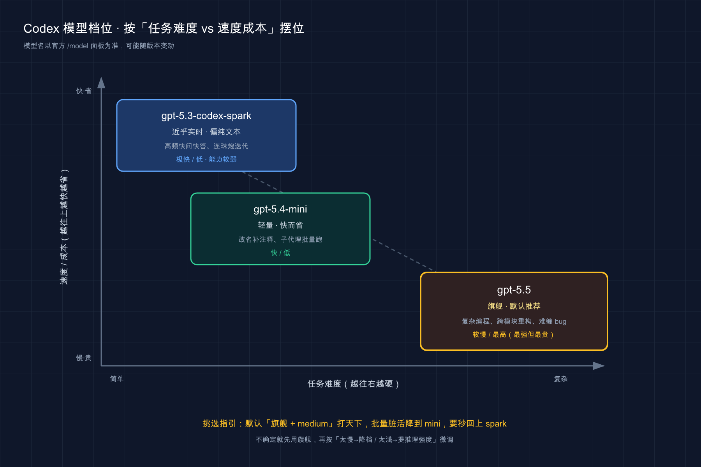

# 30 · 怎么选模型：同一句话，到底该派哪个模型去跑

> 📚 **系列导航**：上一篇〔[29 Slack / Linear 与 SDK 集成](29-integrations.md)〕讲的是「在别处召唤 Codex、把它嵌进自己产品」的进阶玩法。这一篇把镜头拉回本地最日常的一个决定——**你敲下回车那一刻，背后到底是哪个模型、用多大力气在帮你干活**。下一篇〔[31 进阶技巧与提速](31-speed.md)〕再讲怎么让整条流程更快更省。

都说「选最强的模型准没错」，我信了挺久。

有段时间我把默认模型锁死 `gpt-5.5`、推理强度直接拉满到 `xhigh`，图个「一步到位、再不折腾」。直到有天我让它帮我把一个变量名从 `data` 改成 `payload`——一个三十秒的体力活。它「深思熟虑」了将近一分钟才肯动手，我盯着那个转圈的推理动画，第一次觉得「最强」有点蠢。

**说白了，模型不是越强越好，是越合适越好。** 一个改 typo 的活儿用旗舰 + 顶格推理，跟开着挖掘机去拔棵草没区别——慢、费、还显得你不会用。反过来，真碰上要重构一整个模块的硬骨头，你图快用了轻量模型，它给你一份看着能跑、实则埋了三个坑的方案，返工的时间够你用好模型跑五遍。

这一篇就把「派谁去」这件事讲透：**Codex 现在有哪几个模型、一个比换模型更立竿见影的旋钮（推理强度）、以及一张我自己天天在用的「场景 → 模型 + 强度」对照表。** 看完，以后打开 `/model` 面板就不会发懵。

**看完这一篇，你会拿到：**

- 一套不用背参数的判断框架：选模型本质是拿「任务有多难」去匹配「该花多少算力」
- Codex 当前能选的几个模型分别是什么定位、哪个是默认、哪两个已经被淘汰
- 一个新手最容易忽略、却比换模型更立竿见影的旋钮——**推理强度（reasoning effort）**
- 一张能直接抄走的「什么活派什么模型 + 配多大推理强度」对照表
- 四种切换姿势：改默认、启动指定、会话里临时切、给子代理单独配
- 一套能照做的动手流程，亲手感受「同一句话、不同档位」差在哪

> ⚠️ 模型名称、可用范围会随版本和套餐变动（比如哪个是最新旗舰、你的账号能选哪些）。本篇讲的是**「怎么判断、怎么切」的方法**，具体有哪些模型，一律以你本地 `/model` 面板实际列出的为准，别背名字。涉及命令和配置项以 Codex [官方文档](https://developers.openai.com/codex/models) 为准。

---

## 01 先想清楚：选模型不是「选最贵的那个」

先给结论：**选模型的本质，是拿「这个任务有多难」去匹配「该投多少算力」——多一分是浪费，少一分会翻车。**

很多人（包括当年的我）默认「反正选最强的，能力封顶总不会错」。这个想法的漏洞在于：它只算了「能不能做对」，没算「等多久」和「花多少」。而在真实开发里，后两者天天咬你——

- 你一天要跟 Codex 来回几十轮，每轮多等三十秒，一天就是小半个钟头耗在转圈上。
- 用订阅套餐有额度、用 API key 直接烧钱，旗舰模型的 token 单价是轻量模型的好几倍。

所以选模型前，先在脑子里过三个变量：

**这活儿有多复杂？我能等多久？我在乎这点成本吗？** 三者一权衡，该派谁基本就有数了。

| 你的处境 | 该往哪个方向选 |
| --- | --- |
| 活儿难（架构、跨模块重构、难缠的 bug） | 上旗舰、给足推理强度，准确性第一 |
| 活儿简单（改名、补注释、写个小函数） | 用轻量模型、低推理强度，图快图省 |
| 要秒回（实时结对、连珠炮式问答） | 用专为即时响应优化的模型，别让它「想太久」 |

> 💡 一句话总结：选模型不是挑最强的，是让「算力」对上「任务难度」。

---

## 02 Codex 现在能选哪些模型

打开 `/model` 面板，你会看到一串名字，新手第一反应往往是「这都啥跟啥」。别慌，记定位不记参数。

**类比：选模型像给一件活儿派人。** 啃硬骨头的架构活儿，你派经验最老、想得最深的那位（旗舰）；跑腿改小东西，派手脚麻利的实习生就够了（轻量）；需要你问一句它秒答一句的现场结对，派反应最快的那个（实时型）。派对了人，事半功倍；派错了，要么大材小用、要么力不从心。

当前 Codex 的几个模型，定位大致是这样：

| 模型 | 定位 | 最适合 | 速度 / 成本 |
| --- | --- | --- | --- |
| **`gpt-5.5`** | 旗舰、默认推荐 | 复杂编程、计算机操作、知识工作、研究类工作流 | 较慢 / 最高 |
| **`gpt-5.4-mini`** | 轻量、快而省 | 轻量编程任务、给子代理用 | 快 / 低 |
| **`gpt-5.3-codex-spark`** | 即时型（研究预览） | 近乎实时的高频编程迭代（偏纯文本、能力较弱） | 极快 / 低 |

几个要点，记下来少踩坑：

- **不指定就走默认。** 你要是从没设过，Codex（App / CLI / IDE 扩展）会自动用推荐的旗舰模型，多数情况这就够用。
- **`gpt-5.3-codex-spark` 是研究预览（research preview），目前只对 ChatGPT Pro 订阅开放。** 没看到它很正常，不是你装错了。
- **有两个名字你可能在老教程里见过，现在别用了**：`gpt-5.2` 和 `gpt-5.3-codex`，在 ChatGPT 登录方式下已经被官方标为弃用（deprecated）。如果你的脚本、`config.toml` 或 `codex exec --model` 里还写着它们，趁早换成最新的。少数弃用模型在 API 侧可能还能调，那得用 API key 登录，且以官方 API 模型页为准。

我自己最常用的一个组合是：**主力会话挂旗舰，批量脏活交给子代理 + `gpt-5.4-mini`。** 上个月清理一个项目里二十多个文件的过期 import，我让主代理拆活、十几个子代理并行用 mini 去改，几分钟全收工——这种「又多又简单」的活儿，mini 的速度和成本优势就出来了，换旗舰纯属烧钱等结果。

> 💡 一句话总结：记定位别记参数——旗舰啃硬活、mini 跑快省、spark 求秒回，弃用的两个名字别再写进配置。



把三个模型摆到「任务难度 × 速度成本」这张图上一看就清楚：越往右下角任务越硬、模型越强但越慢越贵（旗舰 `gpt-5.5`），越往左上角越快越省（mini、spark）——挑模型就是拿手头这活儿的位置去对号入座。

---

## 03 比换模型更立竿见影的旋钮：推理强度

新手盯着「换哪个模型」，老手还会拧另一个旋钮——**推理强度（reasoning effort）**。这东西很多人压根没注意，但它对体验的影响，常常比换模型还直接。

**类比：推理强度像答题前给它多少思考时间。** 同一个学霸（同一个模型），你让他扫一眼就答，跟让他先打草稿、反复验算再答，交出来的东西质量天差地别——但后者明显更慢。推理强度，调的就是「让它想多久再动手」。

Codex 的推理强度分五档（仅对支持的模型、Responses API 生效）：

| 档位 | 含义 | 适合 |
| --- | --- | --- |
| `minimal` | 几乎不额外思考，秒答 | 极简任务、高频问答 |
| `low` | 稍作分析 | 简单改动、快速迭代 |
| `medium` | 速度与深度平衡（常见默认档） | 日常大多数编程 |
| `high` | 深度推理 | 复杂重构、难缠 bug |
| `xhigh` | 顶格推理（取决于模型是否支持） | 最硬的架构与调试 |

注意两点：**`medium` 一般是默认起点**（具体默认值以你本地版本为准）；**`xhigh` 不是所有模型都吃**——能不能用，直接在 `/model` 面板里选一下试试，选了无效或报错，面板通常会有提示；也可以查当前模型的官方说明页确认。

这就是开篇那个「改变量名等一分钟」的真相——**不是模型笨，是我把推理强度顶到了 `xhigh`，它在为一个根本不需要思考的活儿拼命「深呼吸」。** 反过来，真有一回我追一个偶发的并发 bug，普通档位它绕了半天没头绪，我把强度提到 `high` 重跑，它这才沉下去把竞态条件的来龙去脉理清楚。

**所以遇到结果不满意，先别急着换更强的模型——很多时候，把推理强度往上提一档就解决了；嫌慢，就往下降一档。** 这个旋钮比换模型更轻、更快见效。

> 💡 一句话总结：换模型之前先想想推理强度——嫌它笨往上提一档，嫌它慢往下降一档，常常一拧就好。

---

## 04 实战对照表：什么活，派什么模型 + 什么强度

光讲原理不如直接给配方。下面这张表是我自己日常在用的「场景 → 模型 + 推理强度」对照，照着抄、再按你的习惯微调：

| 场景 | 推荐模型 | 推理强度 |
| --- | --- | --- |
| 架构设计、技术选型 | `gpt-5.5` | `high` / `xhigh` |
| 跨模块重构、复杂改造 | `gpt-5.5` | `high` |
| 难缠 / 偶发 bug 调试 | `gpt-5.5` | `high` |
| 日常写功能、补逻辑 | `gpt-5.5` | `medium` |
| 改小 bug、调格式、补注释 | `gpt-5.4-mini` | `low` |
| 子代理批量处理简单任务 | `gpt-5.4-mini` | `low` / `medium` |
| 实时结对、高频快问快答 | `gpt-5.3-codex-spark` | `minimal` |

怎么用这张表？**别一开始就纠结，先按「日常档」（旗舰 + `medium`）干着，碰到具体卡点再针对性调**：

- 它给的方案太浅、漏了边界情况 → 把强度提到 `high`。
- 一堆又多又简单的体力活拖慢了你 → 换 `gpt-5.4-mini` 降档批量跑。
- 你只是想连珠炮式问几个小问题、等不及它思考 → 上即时型模型、`minimal`。

我的真实习惯是：**默认配置就是「旗舰 + `medium`」，绝大多数活儿不用动；只有进入「啃硬骨头」或「批量跑脏活」这两种模式时，我才会手动切一下。** 把切换当成工具箱里按需取用的螺丝刀，不是时刻握在手里的锤子——想起来才拿，不用每次都纠结。

> 💡 一句话总结：默认「旗舰 + medium」打天下，只在「啃硬活」和「批脏活」两种时刻才手动切档。

---

## 05 四种切换姿势：默认、启动、会话、子代理

知道选哪个，还得会切。Codex 给了四种姿势，覆盖从「一劳永逸」到「就这一次」的所有需求。

**① 设默认模型（一劳永逸）。** 在配置文件 `~/.codex/config.toml` 里写一行，之后启动就用它：

```toml
# ~/.codex/config.toml
model = "gpt-5.5"
model_reasoning_effort = "medium"
```

**② 启动时临时指定（这一次会话）。** 用 `-m` / `--model` 标志：

```bash
# 用指定模型起一个新会话
codex -m gpt-5.5

# codex exec 非交互模式同样适用
codex exec -m gpt-5.4-mini "把这个文件里的过期 import 清理掉"
```

**③ 会话进行中切换（中途换人）。** 在 Codex 会话里直接敲斜杠命令，弹出选择器，挑一个就切过去：

```text
/model
```

新版的 `/model` 面板里，通常能在选模型的同时一并选推理强度，具体长什么样以你本地面板为准。

**④ 给子代理单独配（分工干活）。** 主代理用旗舰统筹，把简单的批量活儿派给挂着 `gpt-5.4-mini` 的子代理——这是性价比最高的打法，细节见〔[21 子代理（Subagents）](21-subagents.md) 〕。

四种姿势对照着记：

| 方式 | 怎么做 | 作用范围 | 什么时候用 |
| --- | --- | --- | --- |
| 改默认 | `config.toml` 写 `model` | 之后所有会话 | 你有稳定的主力模型 |
| 启动指定 | `codex -m <模型>` | 当前这一个会话 | 临时换个模型起活 |
| 会话内切 | `/model` | 切换点之后 | 中途发现该换人了 |
| 子代理配 | 子代理配置里指定 | 那个子代理 | 主力统筹、杂活外包 |

> ⚠️ 一个例外：**云端 Codex Cloud 任务目前不能改默认模型**，这一条以官方说明为准。

> 💡 一句话总结：一劳永逸改 config、临时起活用 `-m`、中途换人敲 `/model`、杂活外包给 mini 子代理。

---

## 06 两个锦上添花的小开关

模型和强度定了，还有两个小开关能让体验更顺手，知道有就行，不用一开始就折腾。

**① 推理摘要（`model_reasoning_summary`）——你想看多少它的「思考过程」。** 取值 `auto` / `concise` / `detailed` / `none`。想看它怎么一步步想的，调 `detailed`；觉得刷屏碍事，调 `none` 直接关掉：

```toml
# ~/.codex/config.toml
model_reasoning_summary = "concise"
```

**② 服务层级（`service_tier`）——给你的请求排个优先级。** 内置 `flex`（弹性，优化成本，可能稍慢）和 `fast`（优先速度）。赶时间且不在乎那点成本，可以试 `fast`——注意官方要求同时加一个 feature flag 才生效：

```toml
# ~/.codex/config.toml
# 弹性模式（默认）
service_tier = "flex"

# 快速模式：需同时开启 feature flag，否则不生效
service_tier = "fast"
[features]
fast_mode = true
```

这俩都属于「用顺手了再去碰」的细节，新手保持默认完全没问题。

> 💡 一句话总结：推理摘要管「看不看它怎么想」，服务层级管「排不排队优先」，新手默认即可。

---

## 07 动手环节：亲手感受「同一句话，不同档位」

光看表没用，自己拧一遍旋钮，你才会记住差别。下面三步，五分钟走完。

**第一步：看看你的账号能选哪些模型。**

进一个 Codex 会话，敲：

```text
/model
```

预期输出：弹出一个模型选择器，列出**你当前账号 / 套餐可用**的模型（每人看到的不一定一样，这正常）。先认认有哪些、当前选中的是哪个。

**第二步：设一份默认配置。**

打开 `~/.codex/config.toml`（没有就新建），写入：

```toml
model = "gpt-5.5"
model_reasoning_effort = "medium"
```

保存后重开一个会话，敲 `/model` 确认当前模型和强度，就是你刚设的这套。

**第三步：同一句话，跑两个推理强度，对比差别。**

挑一个略有难度的需求，比如「帮我把这个函数重构成更易测的写法，并说明你的取舍」。

1. 先用默认的 `medium` 跑一遍，留意：**它等了多久、方案考虑得多周全。**
2. 把配置里的 `model_reasoning_effort` 改成 `high`，重开会话，同一句话再跑一遍。

预期你会观察到：**`high` 那次明显更慢，但方案往往想得更深**——比如多考虑了边界情况、给了备选方案或权衡说明。亲手感受过这个「慢一点、深一些」的取舍，你以后调档就有手感了，不用死记表格。

> 💡 一句话总结：选择器看清能用啥、配置文件定下默认、再用一句话跑两档对比——手感比记参数管用。

---

## 小结

这一篇把「派谁去干活」拆成了两层旋钮和一套打法：

- **选模型的本质**：拿任务难度去匹配算力，不是越强越好，是越合适越好。
- **认识当前模型**：旗舰 `gpt-5.5` 啃硬活、`gpt-5.4-mini` 快省跑杂活、`gpt-5.3-codex-spark` 求秒回；`gpt-5.2`、`gpt-5.3-codex` 已弃用别再写进配置。
- **推理强度是隐藏王牌**：嫌笨往上提一档、嫌慢往下降一档，常比换模型更快见效。
- **一张对照表 + 一个习惯**：默认「旗舰 + `medium`」打天下，只在「啃硬活」「批脏活」时手动切。
- **四种切换姿势**：改默认、启动指定、会话内切、子代理单配，按需取用。

**你现在应该能**：打开 `/model` 不再发懵，看一眼任务就知道该派哪个模型、配多大强度，并且会用四种方式把它切过去。

---

下一篇〔[31 进阶技巧与提速](31-speed.md) 〕，咱们从「派谁、用多大力」往前再走一步：聊聊那些能让整条工作流更快、更省、更少返工的进阶技巧。留个小思考——你有没有发现，**很多时候拖慢你的不是模型不够强，而是你给的上下文太乱、让它走了冤枉路**？这恰恰是下一篇要解的题。
